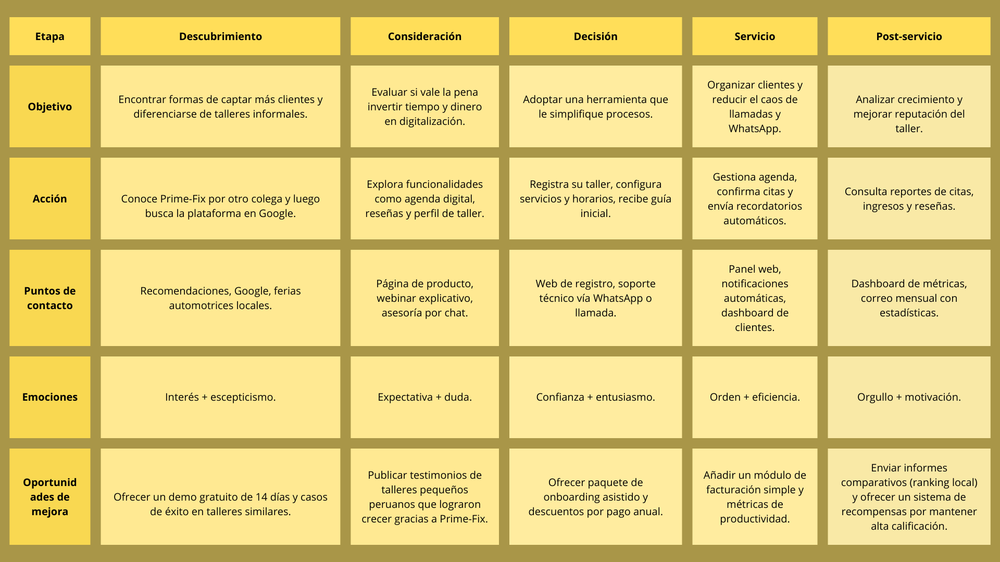

<h2 align="center">
  
</h2>

<h1 align="center">Universidad Peruana de Ciencias Aplicadas</h1>

<h3 align="center">
  Ingeniería de Software
    
  Curso: Desarrollo de Aplicaciones Open Source
    
  Sección: 7385
    
  Profesor: Juan Antonio Flores Moroco
    
  Semestre: 2025-20
    
  Informe del Trabajo Final
    
  Startup: FixTech
    
  Producto: Prime-Fix
</h3>

| 
Alumno
 | 
Código
 |
|:-------------------------------------------:|:-------------------------------------------:|
|       Cesar Augusto Arostegui Alzamora      |            u202114548                       |
|       Gianmarco Fabian Jiménez Guerra       |            u202123843                       |
|       Alexander Gabriel Montoya Torres      |            u20231b424                       |
|       Alicia Avril Navarro Chang            |            u20231d637                       |
|       Piero Francesco Tenorio Medina        |            u202318731                       |

 Setiembre 2025 

# Registro de Versiones del Informe  
---

| Versión | Fecha       | Autor(es)                                                                 | Descripción de modificación |
|---------|-------------|---------------------------------------------------------------------------|------------------------------|
|   TB1   | XX/09/2025  | Gianmarco Fabian Jiménez Guerra                                           | Realicé ... |
|   TB1   | XX/09/2025  | Cesar Augusto Arostegui Alzamora                                          | Realicé ... |
|   TB1   | XX/09/2025  | Alexander Gabriel Montoya Torres                                          | Realicé ... |
|   TB1   | XX/09/2025  | Alicia Avril Navarro Chang                                                | Realicé ... |
|   TB1   | XX/09/2025  | Piero Francesco Tenorio Medina                                            | Realicé ... |

# Project Report Collaboration Insights  

---

# Contenido
- [Registro de Versiones del Informe](#registro-de-versiones-del-informe)
- [Project Report Collaboration Insights](#project-report-collaboration-insights)
- [Contenido](#contenido)
- [Student Outcome](#student-outcome)
- [Capítulo I: Introducción](#capítulo-i-introducción)
  - [1.1. Startup Profile](#11-startup-profile)
    - [1.1.1. Descripción de la Startup](#111-descripción-de-la-startup)
    - [1.1.2. Perfiles de integrantes del equipo](#112-perfiles-de-integrantes-del-equipo)
  - [1.2. Solution Profile](#12-solution-profile)
    - [1.2.1. Antecedentes y problemática](#121-antecedentes-y-problemática)
    - [1.2.2. Lean UX Process](#122-lean-ux-process)
      - [1.2.2.1. Lean UX Problem Statements](#1221-lean-ux-problem-statements)
      - [1.2.2.2. Lean UX Assumptions](#1222-lean-ux-assumptions)
      - [1.2.2.3. Lean UX Hypothesis Statements](#1223-lean-ux-hypothesis-statements)
      - [1.2.2.4. Lean UX Canvas](#1224-lean-ux-canvas)
  - [1.3. Segmentos objetivo](#13-segmentos-objetivo)
- [Capítulo II: Requirements Elicitation \& Analysis](#capítulo-ii-requirements-elicitation--analysis)
  - [2.1. Competidores](#21-competidores)
    - [2.1.1. Análisis competitivo](#211-análisis-competitivo)
    - [2.1.2. Estrategias y tácticas frente a competidores](#212-estrategias-y-tácticas-frente-a-competidores)
  - [2.2. Entrevistas](#22-entrevistas)
    - [2.2.1. Diseño de entrevistas](#221-diseño-de-entrevistas)
    - [2.2.2. Registro de entrevistas](#222-registro-de-entrevistas)
    - [2.2.3. Análisis de entrevistas](#223-análisis-de-entrevistas)
  - [2.3. Needfinding](#23-needfinding)
    - [2.3.1. User Personas](#231-user-personas)
    - [2.3.2. User Task Matrix](#232-user-task-matrix)
    - [2.3.3. User Journey Mapping](#233-user-journey-mapping)
    - [2.3.4. Empathy Mapping](#234-empathy-mapping)
  - [2.4. Big Picture Event Storming](#24-big-picture-event-storming)
  - [2.5. Ubiquitous Language](#25-ubiquitous-language)
- [Capítulo III: Requirements Specification](#capítulo-iii-requirements-specification)
  - [3.1. User Stories](#31-user-stories)
  - [3.2. Impact Mapping](#32-impact-mapping)
  - [3.3. Product Backlog](#33-product-backlog)
- [Capítulo IV: Product Design](#capítulo-iv-product-design)
  - [4.1. Style Guidelines](#41-style-guidelines)
    - [4.1.1. General Style Guidelines](#411-general-style-guidelines)
    - [4.1.2. Web Style Guidelines](#412-web-style-guidelines)
  - [4.2. Information Architecture](#42-information-architecture)
    - [4.2.1. Organization Systems](#421-organization-systems)
    - [4.2.2. Labeling Systems](#422-labeling-systems)
    - [4.2.3. SEO Tags and Meta Tags](#423-seo-tags-and-meta-tags)
    - [4.2.4. Searching Systems](#424-searching-systems)
    - [4.2.5. Navigation Systems](#425-navigation-systems)
  - [4.3. Landing Page UI Design](#43-landing-page-ui-design)
    - [4.3.1. Landing Page Wireframe](#431-landing-page-wireframe)
    - [4.3.2. Landing Page Mock-up](#432-landing-page-mock-up)
  - [4.4. Web Applications UX/UI Design](#44-web-applications-uxui-design)
    - [4.4.1. Web Applications Wireframes](#441-web-applications-wireframes)
    - [4.4.2. Web Applications Wireflow Diagrams](#442-web-applications-wireflow-diagrams)
    - [4.4.2. Web Applications Mock-ups](#442-web-applications-mock-ups)
    - [4.4.3. Web Applications User Flow Diagrams](#443-web-applications-user-flow-diagrams)
  - [4.5. Web Applications Prototyping](#45-web-applications-prototyping)
  - [4.6. Domain-Driven Software Architecture](#46-domain-driven-software-architecture)
    - [4.6.1. Design-Level Event Storming](#461-design-level-event-storming)
    - [4.6.2. Software Architecture Context Diagram](#462-software-architecture-context-diagram)
    - [4.6.3. Software Architecture Container Diagrams](#463-software-architecture-container-diagrams)
    - [4.6.4. Software Architecture Components Diagrams](#464-software-architecture-components-diagrams)
  - [4.7. Software Object-Oriented Design](#47-software-object-oriented-design)
    - [4.7.1. Class Diagrams](#471-class-diagrams)
  - [4.8. Database Design](#48-database-design)
    - [4.8.1. Database Diagrams](#481-database-diagrams)
- [Capítulo V: Product Implementation, Validation \& Deployment](#capítulo-v-product-implementation-validation--deployment)
  - [5.1. Software Configuration Management](#51-software-configuration-management)
    - [5.1.1. Software Development Environment Configuration](#511-software-development-environment-configuration)
    - [5.1.2. Source Code Management](#512-source-code-management)
    - [5.1.3. Source Code Style Guide \& Conventions](#513-source-code-style-guide--conventions)
    - [5.1.4. Software Deployment Configuration](#514-software-deployment-configuration)
  - [5.2. Landing Page, Services \& Applications Implementation](#52-landing-page-services--applications-implementation)
    - [5.2.1. Sprint 1](#521-sprint-1)
      - [5.2.1.1. Sprint Planning 1](#5211-sprint-planning-1)
      - [5.2.1.2. Aspect Leaders and Collaborators](#5212-aspect-leaders-and-collaborators)
      - [5.2.1.3. Sprint Backlog 1](#5213-sprint-backlog-1)
      - [5.2.1.4. Development Evidence for Sprint Review](#5214-development-evidence-for-sprint-review)
      - [5.2.1.5. Execution Evidence for Sprint Review](#5215-execution-evidence-for-sprint-review)
      - [5.2.1.6. Services Documentation Evidence for Sprint Review](#5216-services-documentation-evidence-for-sprint-review)
      - [5.2.1.7. Software Deployment Evidence for Sprint Review](#5217-software-deployment-evidence-for-sprint-review)
      - [5.2.1.8. Team Collaboration Insights during Sprint](#5218-team-collaboration-insights-during-sprint)
  - [5.3. Validation Interviews](#53-validation-interviews)
    - [5.3.1. Diseño de Entrevistas](#531-diseño-de-entrevistas)
    - [5.3.2. Registro de Entrevistas](#532-registro-de-entrevistas)
    - [5.3.3. Evaluaciones según heurísticas](#533-evaluaciones-según-heurísticas)
  - [5.4. Video About-the-Product](#54-video-about-the-product)
- [Conclusiones](#conclusiones)
- [Conclusiones y recomendaciones](#conclusiones-y-recomendaciones)
- [Video About-the-Team](#video-about-the-team)
- [Bibliografía](#bibliografía)
- [Anexos](#anexos)

# Student Outcome  
| Criterio específico                                                   | Acciones realizadas                                                                                     | Conclusiones |
| --------------------------------------------------------------------- | ------------------------------------------------------------------------------------------------------- | ------------ |
| Comunica oralmente con efectividad a diferentes rangos de audiencia   | Jiménez Guerra, Gianmarco Fabian TB1 Texto  Aróstegui Alzamora, Cesar Augusto TB1 Texto  Tenorio Medina, Piero Francesco TB1   Dentro de esta parte del trabajo, he planteado distintas ideas de como se podria desarrollar el trabajo con los demás integrantes de mi equipo.Estas ideas considerando las dimensiones y el alcnace del trabajo. Se ha desarrollado secciones como Entrevistas a Uusarios, donde sse ha llegado a plasmar de manera correcta la idea de nuestro proyecto. Montoya Torres, Alexander Gabriel TB1 Texto  Navarro Chang, Alicia Avril TB1 Texto| TB1: Texto   |
| Comunica por escrito con efectividad a diferentes rangos de audiencia | Jiménez Guerra, Gianmarco Fabian TB1 Texto  Aróstegui Alzamora, Cesar Augusto TB1 Texto  Tenorio Medina, Piero Francesco TB1 Dentro de esta parte del trabajo, he desarrollado y planteado ideas que sean de acordes a los distintos segmentos objetivos. Estas ideas se basan en la experiencia y el malestar de cada uno de los usuarios, como por ejemplo: el planteamiento de facilidades al usuario a la hora de utilizar la plataforma, brindandole distintas herramientas que mejoren su experiencia a la hora de utilizar nuestro Servicio.   Montoya Torres, Alexander Gabriel TB1 Texto  Navarro Chang, Alicia Avril TB1 Texto| TB1: Texto   |

---

# Capítulo I: Introducción
## 1.1. Startup Profile
### 1.1.1. Descripción de la Startup
FixTech es una startup especializada en el desarrollo de soluciones tecnológicas aplicadas a la web, cuyo propósito es transofrmar la forma en que los usuarios acceden a servicios de mantenimiento y reparación automotriz.
Con FixTech nace Prime-Fix, una plataforma digital cuyo objetivo es facilitar el contacto entre talleres de vehículos y dueños de los mismos implementando una serie de funcionalidades que permitirán a ambos usuarios, obtener una experiencia de gestión clara.

<b>Misión: </b> Nuestra misión es acercar a los dueños de vehículos a talleres confiables por medio de una plataforma accesible y amigable. De esta manera, modernizamos el sector automotriz y optimizamos de toda la experiencia de este tipo de  servicios.

<b>Visión: </b> Tenemos como objetivo posicionarnos como la plataforma líder en Perú para la gestión digital de servicios automotrices, considerando una posible expansión hacia toda América Latina. A su vez, en el futuro se buscará integrar a este proyecto aplicaciones móviles y dispositivos IoT que permitan un mantenmiento inteligente para los vehículos.

### 1.1.2. Perfiles de integrantes del equipo

| Perfil del integrante | Código de alumno | Descripción                                                                                                                                                                                                                                                                                                                                                                                               |
| --------------------- | ---------------- | --------------------------------------------------------------------------------------------------------------------------------------------------------------------------------------------------------------------------------------------------------------------------------------------------------------------------------------------------------------------------------------------------------- |
| Foto                  | U202318731       | Soy Piero Tenorio, estudio en la sede San Miguel de la UPC estudiando la carrera de Ingeniería de Software . Soy una persona colaborativa, responsable y comprometida con los trabajos en los que estoy implicado, tratando de ser lo más eficiente posible.Conocimientos en HTML, CSS, Java, C++, JavaScript y Python. Cada día trato de mejorar como persona y si llego a cometer algún error, tratar de aprender de ello. |
| Foto                  | U202123843       | Soy Gianmarco Jiménez alumno de Ingeniería de Software. Me gusta trabajar en equipo pues me permite aprender sobre las ideas que tienen los participantes y contrastarlas con las mías. He utilizado lenguajes como C++, Python, SQL y Java. Estoy muy interesado en aprender todo sobre el desarrollo de aplicaciones web con frameworks.                                                                |
| Foto                 |  U20231b424         | Soy Alexander Gabriel Montoya, estudiante de la carrera de Ingenieria de Sofware en la UPC, tengo 20 años actualmente, con respecto a mi carrera he aprendido a manejar lenguajes de programación como C++, MySQL, Python, HTML y CSS. Con respecto a lo personal, me gusta dedicar tiempo y esfuerzo a todo lo que hago ya sean actividades academicas o mis hobbies     |
| Foto                  | UXXXXXXX         | Texto de descripción                                                                                                                                                                                                                                                                                                                                                                                      |
| Foto                  | UXXXXXXX         | Texto de descripción                                                                                                                                                                                                                                                                                                                                                                                      |

## 1.2. Solution Profile
### 1.2.1. Antecedentes y problemática
El sector automotriz en el Perú y en gran parte de Latinoamérica aún se encuentra rezagado en términos de digitalización de servicios, debido a que, la mayoria de talleres funcionan con procesos manuales, tales como agendas físicas, llamadas telefonicas y mensajeria web afectando la trazabilidad de reparaciones y la atención que reciben los dueños de vehiculos generando dificultades sobre ellos al obstaculizar la busqueda de talleres confiables hoy en día.

A nivel global, ya existen plataformas que conectan a usuarios con talleres y servicios automotrices, lo que demuestra que hay una tendencia hacia la digitalización dentro de este sector, sin embargo en el Perú este modelo no ha sido consolidado y por ende se ha retrasado la modernización del servicio al cliente dentro de este sector y se ha aumentando la desorganización en la gestion de talleres, debido a que no se cuenta con sistemas digitales de registro de citas ni sistemas para facilitar el seguimiento de las reparaciones.

En este contexto,Fixtech surge como una startup de base tecnológica que busca cerrar la brecha entre talleres y clientes mediante mediante la creación de nuestro aplicativo PrimeFix, el cual tiene como objetivo centralizar la oferta de talleres en un entorno digital que otorgue transparencia, accesibilidad y confianza a los usuarios

### 1.2.2. Lean UX Process
#### 1.2.2.1. Lean UX Problem Statements
#### Dueños de vehículos
* Nuestro contexto demanda una solución digital que facilite a los propietarios de vehículos el acceso a talleres confiables y eficientes en ciudades con alto tráfico. Con esta solución, los usuarios podrán gestionar mantenimientos y reparaciones de manera rápida, contando con información clara sobre costos, tiempos y calidad del servicio, lo que reduce la duda y las pérdidas de tiempo.
* Hemos observado un factor crítico que afecta a este segmento: la falta de transparencia y organización en los talleres genera desconfianza y frustración en los dueños, quienes suelen enfrentarse a largas esperas, cobros inesperados o servicios de baja calidad.
* ¿Cómo brindar a los dueños de vehículos una plataforma digital que les permita encontrar talleres confiables, reservar citas con facilidad y monitorear el servicio en tiempo real para asegurar transparencia, eficacia y satisfacción?

#### Asesores de servicios de taller automotriz
* Nuestro contexto demanda una solución tecnológica que permita a los asesores de talleres optimizar la gestión de clientes y servicios. Con esta solución, los asesores podrán organizar citas de forma eficiente, llevar un control ordenado de mantenimientos y reparaciones, y ofrecer un servicio más rápido y transparente, generando confianza y fidelización.
* Hemos observado un factor crítico que afecta a este segmento: la falta de herramientas digitales integradas ocasiona errores en la programación de citas, retrasos en la atención y pérdida de oportunidades de fidelización, lo que impacta directamente en la reputación del taller.
* ¿Cómo implementar una plataforma digital que permita a los asesores gestionar eficientemente citas, clientes y servicios, reduciendo errores y mejorando la experiencia general del usuario?

#### 1.2.2.2. Lean UX Assumptions
1. Consideramos que nuestros clientes, tanto dueños de vehículos como asesores de servicios de talleres automotrices, tienen la necesidad de gestionar de manera eficiente los servicios de mantenimiento y reparación automotriz.
2. Esta necesidad se puede resolver mediante una plataforma digital que facilite el contacto entre propietarios de vehículos y asesores de talleres, proporcionando funciones como reserva de citas, cotización, seguimiento de servicios y calificación mutua.
3. Nuestros clientes iniciales son dueños de vehículos particulares y asesores de servicios de talleres automotrices en Lima, que buscan digitalizar y simplificar la gestión y el acceso a servicios automotrices.
4. La mayoría de los clientes se obtendrá por registros en la plataforma generados a través de campañas digitales, alianzas con talleres y recomendaciones entre usuarios y asesores.
5. Los beneficios económicos provendrán de comisiones por servicios concretados, suscripciones premium para talleres que deseen mayor visibilidad y publicidad segmentada dirigida tanto a propietarios como a asesores.
6. La competencia la constituyen directorios online, marketplaces automotrices, apps de gestión de talleres y métodos tradicionales de búsqueda y contacto.
7. Resaltaremos frente a la competencia gracias a la confiabilidad de los talleres aliados, la digitalización del proceso de contacto y gestión, y las futuras integraciones tecnológicas para ambos tipos de usuarios.
8. El mayor riesgo es la resistencia de asesores tradicionales a la adopción digital y la desconfianza de los propietarios respecto a la calidad del servicio ofrecido.
9. Esto se resolverá con validación rigurosa de talleres, capacitación a asesores, sistemas de reputación digital y soporte técnico constante para ambos segmentos.
#### User outcomes
* Los dueños de vehículos acceden fácilmente a talleres confiables y gestionan sus servicios automotrices de manera clara y transparente.
* Los asesores de talleres automotrices optimizan la captación y gestión de clientes usando herramientas digitales, incrementando eficiencia y reputación.
* Ambos segmentos encuentran valor en la digitalización de procesos, la comunicación clara y la gestión centralizada del historial de servicios.
#### Business outcomes
* Aumentar la adopción de Prime-Fix entre propietarios de vehículos y asesores de talleres en Lima y expandirse nacionalmente.
* Generar acuerdos estratégicos con talleres y marcas automotrices para fortalecer la base de usuarios.
* Lograr ingresos recurrentes por comisiones, suscripciones y publicidad dirigida a ambos segmentos.
* Posicionar a FixTech como referente tecnológico en gestión automotriz y mantener alta retención en ambas audiencias.
#### 1.2.2.3. Lean UX Hypothesis Statements
1. Creemos que al ofrecer una plataforma digital para agendar y gestionar servicios de mantenimiento automotriz, los dueños de vehículos podrán encontrar talleres confiables y realizar reservas en menos tiempo. Sabremos que hemos tenido éxito cuando al menos el 80% de los usuarios completen una reserva y califiquen positivamente la experiencia en la plataforma durante el primer mes de uso.
2. Creemos que al proporcionar a los asesores de talleres automotrices herramientas de gestión digital (notificaciones, seguimiento, historial de servicios y organización de citas), podrán aumentar la eficiencia en la atención y captar más clientes. Sabremos que hemos tenido éxito cuando al menos el 70% de los asesores registrados reporten un incremento en la cantidad de clientes atendidos en el primer trimestre tras adoptar la plataforma.
3. Creemos que, si integramos funciones de transparencia en cotizaciones, reseñas verificadas y soporte en tiempo real, tanto dueños de vehículos como talleres confiarán más en la plataforma y repetirán su uso. Sabremos que hemos tenido éxito cuando el índice de uso recurrente (clientes y asesores que repiten servicios) supere el 60% al cabo de seis meses.
4. Creemos que si diseñamos una interfaz intuitiva, con funcionalidades accesibles para ambos tipos de usuario (dueños y asesores), lograremos que tanto talleres tradicionales como nuevos usuarios adopten la plataforma sin necesidad de capacitación extensiva. Sabremos que hemos tenido éxito cuando al menos el 65% de los asesores encuestados indiquen sentirse cómodos gestionando sus servicios en la aplicación sin soporte adicional después de un mes de uso continuo.
#### 1.2.2.4. Lean UX Canvas
| **Business Problem** | **Business Outcomes** |
|-----------------------|------------------------|
| - El sector automotriz en Perú carece de digitalización. - Dueños de vehículos no encuentran talleres confiables ni transparentes. - Talleres tienen procesos manuales e ineficientes. | - Incrementar talleres afiliados. - Reducir tiempo de búsqueda y agendamiento. - Aumentar confianza con transparencia en precios y reseñas. - Posicionar a FixTech como líder en Perú y LATAM. |

| **Users** | **User Outcomes & Benefits** |
|-----------|------------------------------|
| - Dueños de vehículos: buscan confianza, transparencia y facilidad. - Talleres: necesitan digitalizar su gestión, captar clientes y mejorar organización. | - Dueños de vehículos: mayor confianza, ahorro de tiempo, historial de mantenimientos. - Talleres: más visibilidad, captación de clientes y mejor gestión. |

| **Hypotheses** | **Solutions** |
|----------------|---------------|
| - Creemos que los **dueños de vehículos** usarán Prime-Fix porque encontrarán confianza y transparencia. - Creemos que los **talleres** se afiliarán para captar más clientes y organizar su gestión. - Creemos que digitalizar procesos reducirá tiempos y aumentará satisfacción. | - Plataforma digital que conecte dueños de vehículos con talleres. - Agenda en línea con recordatorios. - Perfiles de talleres con reseñas y catálogo. - Historial digital de mantenimientos. - Futuras integraciones con app móvil e IoT. |

| **What’s the most important thing we need to learn first?** | **What’s the least amount of work we need to do to learn the next most important thing?** |
|-------------------------------------------------------------|------------------------------------------------------------------------------------------------|
| - Validar si los usuarios confían en la plataforma para agendar servicios. - Verificar si los talleres están dispuestos a afiliarse y pagar por visibilidad. | - Entrevistar a un grupo reducido de talleres y usuarios. - Recoger feedback y medir uso real. |

## 1.3. Segmentos objetivo

**Segmento 1: Dueños de vehículos**
**Aspectos Demográficos:**

* Sexo: Masculino y Femenino
* Edades: Entre 22 y 50 años

**Aspectos Geográficos:**

* Zona Geográfica en la que viven: Urbana, ciudad altamente transitada por vehículos.

**Aspectos Psicográficos:**

* Valoran el buen servicio y la eficacia.
* Tienen interés en la calidad del servicio que se le brinda a su vehiculo. 

**Segmento 2: Asesor de servicios de taller automotriz**
**Aspectos Demográficos:**

* Sexo: Masculino y Femenino
* Edades: Entre 21 y 50 años
* Ocupación: Dueño, administrador o asesor de servicios de un taller automotriz

**Aspectos Geográficos:**

* Zona Geográfica en la que viven: Urbana, ciudad altamente transitada por vehículos.
* Ubicacion del taller: Cercana a avenidas transitadas, zonas industriales o barrios con alta circulación vehicular.

**Aspectos Psicográficos:**

* Valoran la organizacion y eficiencia en la gestión de clientes.
* Interés en fidelizar clientes y mejroar la reputación de su taller.
* Buscan soluciones tecnológicas que les permitan optimizar el tiempo y reducir errores dentro del taller.

---

# Capítulo II: Requirements Elicitation & Analysis
## 2.1. Competidores
### 2.1.1. Análisis competitivo
<table>
  <tr>
    <th>Sección</th>
    <th>Criterio</th>
    <th>FixTech (Prime-Fix)</th>
    <th>Autolab</th>
    <th>TallerActual</th>
    <th>Drivana</th>
  </tr>
  <tr>
    <td rowspan="2"><b>Perfil</b></td>
    <td>Overview</td>
    <td>Startup peruana que conecta dueños de vehículos con talleres de confianza, centralizando citas e historial de servicios.</td>
    <td>Startup colombiana que ofrece diagnóstico, agenda y marketplace de talleres certificados.</td>
    <td>Portal español con red de talleres y formación técnica.</td>
    <td>SaaS mexicano para digitalizar talleres + marketplace.</td>
  </tr>
  <tr>
    <td>Ventaja Competitiva</td>
    <td>Foco local (Perú), apoyo a talleres medianos/pequeños aún no digitalizados, confianza y transparencia.</td>
    <td>Marca reconocida en LatAm, fuerte inversión y alianzas con aseguradoras/marcas.</td>
    <td>Amplia base de contenido técnico y visibilidad internacional.</td>
    <td>Modelo integral (software + marketplace), experiencia en IoT.</td>
  </tr>
  <tr>
    <td rowspan="2"><b>Marketing</b></td>
    <td>Mercado objetivo</td>
    <td>Dueños de autos en Lima y talleres pequeños/medianos sin digitalización.</td>
    <td>Usuarios urbanos en LatAm con alta adopción digital.</td>
    <td>Talleres y mecánicos interesados en visibilidad y formación.</td>
    <td>Talleres medianos/grandes que buscan digitalización avanzada.</td>
  </tr>
  <tr>
    <td>Estrategia</td>
    <td>Marketing digital local, alianzas con talleres, campañas centradas en confianza/transparencia.</td>
    <td>Campañas masivas, acuerdos con aseguradoras y marcas de autos.</td>
    <td>Generación de contenidos y publicidad técnica.</td>
    <td>Ventas B2B, modelo SaaS + marketplace, enfoque en tecnología.</td>
  </tr>
  <tr>
    <td rowspan="3"><b>Producto</b></td>
    <td>Servicios</td>
    <td>Marketplace de talleres, gestión de citas, historial de servicios.</td>
    <td>Agenda de citas, diagnósticos, talleres certificados, garantías.</td>
    <td>Directorio de talleres, contenidos técnicos y formación.</td>
    <td>SaaS de gestión, marketplace, reportes IoT, pagos digitales.</td>
  </tr>
  <tr>
    <td>Precios & Costos</td>
    <td>Comisiones por transacción + suscripciones + publicidad segmentada.</td>
    <td>Comisiones + tarifas premium por visibilidad + alianzas.</td>
    <td>Membresías de talleres + publicidad.</td>
    <td>Modelo SaaS (mensualidades) + comisiones.</td>
  </tr>
  <tr>
    <td>Canales de distribución</td>
    <td>Plataforma web (futuro: app móvil).</td>
    <td>App móvil + web.</td>
    <td>Web.</td>
    <td>Web + app móvil.</td>
  </tr>
  <tr>
    <td rowspan="4"><b>SWOT</b></td>
    <td>Fortalezas</td>
    <td>Enfoque local con conocimiento del mercado peruano.</td>
    <td>Startup joven sin marca consolidada.</td>
    <td>Mercado peruano rezagado en digitalización, espacio libre para crecer.</td>
    <td>Ingreso de competidores regionales con más capital (Autolab, Drivana).</td>
  </tr>
  <tr>
    <td>Debilidades</td>
    <td>Primeros en digitalizar talleres pequeños y medianos.</td>
    <td>Escalabilidad limitada frente a competidores con capital extranjero.</td>
    <td>Expansión nacional y regional en LatAm.</td>
    <td>Reticencia de talleres tradicionales a digitalizarse.</td>
  </tr>
  <tr>
    <td>Oportunidades</td>
    <td>Plataforma amigable e intuitiva.</td>
    <td>Falta de app móvil en la primera etapa.</td>
    <td>Posibles alianzas con aseguradoras, marcas y grifos.</td>
    <td>Preferencia cultural por el trato directo (llamadas/visitas).</td>
  </tr>
  <tr>
    <td>Amenazas</td>
    <td>Estrategia basada en confianza y transparencia.</td>
    <td>Dependencia inicial del mercado limeño.</td>
    <td>Futuro con IoT y mantenimiento predictivo.</td>
    <td>Riesgo de bajo financiamiento frente a competidores.</td>
  </tr>
</table>

### 2.1.2. Estrategias y tácticas frente a competidores
FixTech se posiciona como una solución tecnológica que responde a una necesidad aún insatisfecha en el Perú: la digitalización de talleres pequeños y medianos. Su mayor beneficio radica en la cercanía con el mercado local y el conocimiento profundo de la realidad automotriz peruana, donde la mayoría de procesos aún son manuales. A través de Prime-Fix, los dueños de vehículos acceden a talleres confiables, gestionan citas y mantienen un historial transparente de servicios, mientras los talleres optimizan su captación de clientes y su reputación en el mercado.

Dentro del mercado regional, existen actores que ya han dado pasos hacia la digitalización de servicios automotrices. Autolab en Colombia ha crecido con el respaldo de alianzas con aseguradoras y marcas, consolidándose como un referente en varios países de Latinoamérica. TallerActual, desde España, combina red de talleres con formación y contenidos técnicos, ganando visibilidad internacional. Por otro lado, Drivana en México ha apostado por un modelo integral de SaaS y marketplace con un componente tecnológico más avanzado, incluso incorporando IoT. Aunque cada uno de estos competidores presenta fortalezas, ninguno ha logrado consolidar el espacio peruano, lo que deja una ventana clara de oportunidad para FixTech.

Para competir con estos actores, FixTech debe desplegar tácticas adaptadas a cada rival. Frente a Autolab, resulta clave diferenciarse mediante alianzas con aseguradoras locales y un modelo accesible para talleres pequeños que la competencia internacional no suele priorizar. Contra TallerActual, el foco debe ponerse en generar contenidos prácticos y educativos dirigidos al mercado peruano, ocupando el vacío de información contextualizada que existe en el país. Y frente a Drivana, la estrategia más efectiva será ofrecer un producto más simple y económico, pensado para talleres tradicionales que aún no pueden implementar soluciones de alta tecnología.
## 2.2. Entrevistas
### 2.2.1. Diseño de entrevistas

Segmento #1: Dueños de vehículos 
"Buenos días/tardes/noches 'Nombre del entrevistado'. Mi nombre es 'Nombre del entrevistador' de la startup FixTech. Nos encontramos desarrollando una plataforma para que los dueños de vehículos tengan la facilidad de programar sus visitas a talleres de reparación de autos, hacer seguimiento al servicio y ver el diagnóstico de la falla detectada. En base a ello, tengo preparadas una lista de preguntas para conocer su punto de vista sobre algunos temas importantes para nuestra plataforma."

Preguntas:
1. ¿Ha realizado la búsqueda de algún taller durante los últimos meses? De ser así, ¿Podría comentarnos su experiencia?
2. ¿Qué plataformas o medios utiliza para realizar la búsqueda de talleres cuando su vehículo necesita reparación?
3. ¿Qué aspectos valora más en un servicio de taller? (distancia, disponibilidad, costo)
4. ¿Ha tenido experiencias negativas con talleres? De ser así, ¿Le hubiera gustado registrar dichas experiencias de manera pública?
5. ¿Usted mantiene un registro de su vehículo y del mantenimiento que le ha brindado durante todo este tiempo?
6. ¿Ha dejado su vehículo en un taller durante días u horas? ¿Cómo se le avisa que su vehículo ya está listo?
7. ¿Con qué dispositivo suele solicitar el servicio de mantenimiento?
8. ¿Qué herramientas o software utiliza para encontrar algún taller cerca de una ubicación específica?
9. Una vez terminado el servicio ¿Qué medios de pago utiliza? (efectivo, transferencia, etc)
11. ¿Estaría interesado en usar una plataforma que le permita agendar visita en talleres de su zona? ¿Por qué?
12. ¿Qué funcionalidades cree que harían que esta plataforma sea útil para el día a día?
13. ¿Se sentiría cómodo recibiendo algunos recordatorios de mantenimiento preventivo desde una app?
14. ¿Estaría de acuerdo con utilizar un aplicativo web para agilizar la programación de sus visitas?
15. ¿Le gustaría hacer seguimiento al estado de su vehículo mientras este se encuentra en mantenimiento?

Segmento #2: Asesor de servicios de un taller automotriz 
"Buenos días/tardes/noches 'Nombre del entrevistado'. Mi nombre es 'Nombre del entrevistador' de la startup FixTech. Nos encontramos desarrollando una plataforma para que los talleres tengan la facilidad de agendar y hacer seguimiento a las visitas de posibles clientes que solicitan la reparación de sus autos. En base a ello, tengo preparadas una lista de preguntas para conocer su punto de vista sobre algunos temas importantes para nuestra plataforma."

Preguntas:
1. Actualmente, ¿Cómo consigue clientes para el taller?
2. ¿En qué medio promociona sus servicios?
3. ¿Qué dispositivo se suele utilzar en la empresa para la programación de visitas de clientes? (celular, computadora de escritorio, laptop, etc)
4. ¿Encuentra dificultades al competir con talleres más grandes? De ser así ¿Podrías describirlas?
5. ¿Cómo gestiona los pedidos o solicitudes de servicios de reparación? (ej. llamadas, WhatsApp o visitas directas)
6. ¿Ha tenido algún reclamo sobre el desempeño de los técnicos? ¿Podría detallar más la experiencia? ¿Por qué medios se presentaron estos reclamos?
7. ¿Cómo maneja la información sobre los técnicos? ¿Cuenta con una base de datos?
8. ¿Qué tan importante consideraría mostrar la disponibilidad de sus técnicos en tiempo real?
9. ¿Qué tanto te ayudaría una plataforma donde puedas registrar tu taller, los técnicos y mostrar reseñas de clientes?
10. ¿Qué funcionalidades le añadirías a la plataforma?
11. ¿Le parece importante que el cliente sepa en qué estado se encuentra su vehículo y cuál es su diagnóstico final?
12. ¿Estaría interesado en una plataforma que notifique al cliente el momento en que puede recoger su vehículo?

### 2.2.2. Registro de entrevistas

En esta sección, el equipo hace entrevistas a personas pertenecientes a los segmentos respectivos.

### Segmento #1: Dueños de Vehiculos

**Entrevista N°1: Marcos Contreras**

- Sexo: Masculino
- Edad: 24
- Link: [Enlace](https://upcedupe-my.sharepoint.com/:v:/g/personal/u202318731_upc_edu_pe/EU-OfAcUkxlLsrpkalhCNRQBkang9sWzDtFzbJ4EEzaXvQ?e=Rq6OAR&nav=eyJyZWZlcnJhbEluZm8iOnsicmVmZXJyYWxBcHAiOiJTdHJlYW1XZWJBcHAiLCJyZWZlcnJhbFZpZXciOiJTaGFyZURpYWxvZy1MaW5rIiwicmVmZXJyYWxBcHBQbGF0Zm9ybSI6IldlYiIsInJlZmVycmFsTW9kZSI6InZpZXcifX0%3D)
- Inicia en: 0:01
- Duración: 5:40

**Resumen de la entrevista**

Marcos Contreras es un joven qde 24 años quien trabaja y estudia de manera paralela. Marcos nos cuenta que el tiene un vehiculo por la cual facilita movilizarse dentro de la ciudad. Marcos nos comenta que a la hora de encontrar un buen servicio que pueda atender a su vehículo, más que nada resalta que no llega a encontrar un lugar accesible. Marcos tambien nos cuenta que utiliza Google Maps,WhastApp e incluso Fcaebook para poder encontrar un taller que sea recomendado. Nos dice que valora la confianza y la calidad sobre el precio dentro de un servicio. Dentro de las experiencia negativas nos cuenta que si llego a presentar alguna, en la entrega de su vehículo. Finalmente, Marcos resalta que una aplicación que le ayude a gestionar los talleres a los que va, le puede hacer de mucha utilidad en su día a día. Que implemente funcionalidades que sean pertinentes para él como las agendas y las ubicaciones en mapas.

**Entrevista N°2: Anyelo Alejos**

- Sexo: Masculino
- Edad: 23
- Link: [Enlace](https://upcedupe-my.sharepoint.com/:v:/g/personal/u202318731_upc_edu_pe/EbUouuLCEqlGvWQEGCCiPf4B8TQJNZIvqrxVh6ufl-rZQQ?e=zp4nf9&nav=eyJyZWZlcnJhbEluZm8iOnsicmVmZXJyYWxBcHAiOiJTdHJlYW1XZWJBcHAiLCJyZWZlcnJhbFZpZXciOiJTaGFyZURpYWxvZy1MaW5rIiwicmVmZXJyYWxBcHBQbGF0Zm9ybSI6IldlYiIsInJlZmVycmFsTW9kZSI6InZpZXcifX0%3D)
- Inicia en: 0:01
- Duración: 6:45

**Resumen de la entrevista**

Anyelo Alejos es un chico de 23 años de edad, el solo estudia pero cuenta con un Vehiculo para movilizarse a su centro de estudios. El comenta que utiliza apliaciones como Google Maps para poder encontrar un taller que le sea pertinente, pero tambien lo busca de manera manual. Él valora aspectos como la confiabilidad dentro de un taller. Además, cuenta que no tuvo problemas con los talleres. El suele solicitar servicios por un móvil y raras veces de manera manual. Anyelo comenta que le gustaría tener una aplicación que le ayude a a gendar citas en talleres para su vehículo, teniendo funcionalidades como reseña, precios y calificaciones de talleres.

**Entrevista N°3: Michael Montoya**

- Sexo: Masculino
- Edad: 21
- Link: [Enlace](https://www.youtube.com/watch?v=ntdm1xhTE1c)
- Inicia en: 0:01
- Duración: 6:31

Michael Montoya es propietario de un automóvil, comenta que por la zona por donde reside hay varios talleres y no sabe a cual ir , por lo que suele pedir recomendaciones a sus conocidos para poder elegir un taller en especifico. Señala que el único aplicativo que utiliza para lograr localizar talleres cerca de su zona es Google Maps, sumado a esto nos cuenta que dentro de un servicio de taller lo que más valora es la disponibilidad y experiencia de un taller. 
Michael comparte que ha tenido malas experiencias en algunos talleres: en ocasiones no lograron reparar su vehículo de manera adecuada y los precios cobrados le parecieron injustos. También menciona que no lleva un registro de los mantenimientos realizados a su auto, por lo que suele preguntar directamente en los talleres las fechas de las reparaciones pasadas. Asimismo, comenta que en varias ocasiones ha tenido que dejar su vehículo por varios días en un taller, y únicamente recibió la notificación de que estaba listo mediante mensajes por WhatsApp. El unico dispositivo que utiliza para solicitar un mantenimiento es por medio de su celular y desconoce si existe algun software que simplifique la comunicación entre talleres en Perú.
El entrevistador utiliza como método de pago su tarjeta de credito. Nos comenta que le interesaria mucho una plataforma que le ayude a agendar citas para el mantenimiento de su vehiculo, asimismo nos cuenta que le gustaria que una plataforma de esta índole que tenga la función de educar a los propietarios de coches acerca del funcionamiento de su propio auto. Finalmente, expresa que le interesaría contar con una plataforma digital que le permita agendar citas de mantenimiento, recibir recordatorios sobre el estado de su vehículo y acceder a un seguimiento en tiempo real del servicio en el taller. Además, considera valioso que una aplicación de este tipo incluya funciones educativas que ayuden a los propietarios de autos a comprender mejor el funcionamiento de sus vehículos.

### Segmento #2: Asesor de servicios de un taller automotriz

**Entrevista N°1:**

- Sexo: Masculino
- Edad: 21
- Link: [Enlace](https://youtu.be/Xq5C-dh-AVA)
- Inicia en: 0:05
- Duración: 6:31

  

Jesús Valenzuela es un joven asesor de servicios de reparación del taller Alvillantas, nos comenta que para atraer clientes, utiliza las redes sociales como Facebook y TikTok y una landing page. El entrevistado comenta que no siente que el taller donde trabaja sea afectado por la competencia dada su ubicación estratégica junto con la de sus otras sedes. Jesús menciona que la gestión de las solicitudes de servicios se realizan principalmente mediante WhatsApp, también reciben llamadas telefónicas y visitas directas al taller. En cuanto al desempeño de los técnicos y los servicios brindados, sí han recibido cierta retroalimentación. 
Se menciona que la gestión de los técnicos y de su información es un poco desordenada; sin embargo, considera interesante la idea de digitalizar ello y permitir que los clientes puedan conocer la disponibilidad de los trabajadores en tiempo real.
El asesor menciona que en su taller se hace uso de un software llamado Qumpa para la gestión de su inventario de llantas de manera organizada, pero le parece interesante una plataforma que pueda ser utilizada por el cliente para la gestión de visitas con el fin de agilizar el proceso. Jesús menciona que este aplicativo puede ser de gran utilidad si cuenta con notificaciones para que el cliente pueda estar atento al estado de su vehículo.
El diagnóstico de las fallas que ofrecen en Alvillantas se realiza mediante un documento físico, por lo que Jesús considera que podría ser buena idea virtualizar esta función para que el cliente pueda obtener esta información en sus dispositivos.
Para finalizar, recalcó lo importante que es tener una plataforma con todas las funcionalidades mencionadas para garatizarle un buen servicio al cliente.

**Entrevista N°2:**

- Sexo: Masculino
- Edad: 47
- Link: [Enlace](https://upcedupe-my.sharepoint.com/:v:/g/personal/u202114548_upc_edu_pe/EYKmpMYFGk5BnxR4GI37EcsBrQaCB2q7n-PhGydUdeJAvg?nav=eyJyZWZlcnJhbEluZm8iOnsicmVmZXJyYWxBcHAiOiJPbmVEcml2ZUZvckJ1c2luZXNzIiwicmVmZXJyYWxBcHBQbGF0Zm9ybSI6IldlYiIsInJlZmVycmFsTW9kZSI6InZpZXciLCJyZWZlcnJhbFZpZXciOiJNeUZpbGVzTGlua0NvcHkifX0&e=zfkZrQ)
- Inicia en: 0:01
- Duración: 3:53

  

William Espinoza se desempeña en el área de almacén, repuestos y mantenimiento de un taller automotriz. Comenta que la captación de clientes se realiza principalmente a través de redes sociales y avisos publicitarios en la puerta del local. Para la programación de visitas utilizan una computadora con Excel. Señala que no perciben dificultades frente a talleres más grandes, ya que la atención depende más de la capacidad instalada que de la competencia.
La gestión de pedidos se lleva a cabo mediante un diagnóstico inicial, tras el cual se presenta al cliente una cotización del repuesto y del servicio requerido. Ha recibido algunos reclamos relacionados con la actitud o comunicación de los técnicos, normalmente de forma presencial. Explica que cuentan con una base de datos para evaluar la trayectoria de los técnicos y destaca la importancia de mostrar la disponibilidad de los mismos en tiempo real, pues considera que esto transmite confianza y rapidez al cliente.
Respecto a la posibilidad de digitalizar procesos, considera útil una plataforma que permita registrar el taller, técnicos y reseñas de clientes, resaltando que dicha información debería estar disponible también para los usuarios externos. Actualmente, la comunicación del estado del vehículo y los diagnósticos finales se realiza mediante WhatsApp, enviando fotos o videos desde el área técnica al área administrativa y de allí al cliente. Valora positivamente la idea de una plataforma que notifique cuándo el vehículo está listo para ser recogido y que permita al técnico subir directamente la información para que el cliente la consulte en línea. En conclusión, William considera que una herramienta digital con estas funcionalidades resultaría de gran utilidad para mejorar la transparencia y la experiencia del cliente.

**Entrevista N°3:**

- Sexo: Masculino
- Edad: 35
- Link: [Enlace](https://upcedupe-my.sharepoint.com/:v:/g/personal/u202114548_upc_edu_pe/EWUY_frgM_RKtA929ZLKHA0Bd6suNWEVHuj-_ofQHR_Ecg?e=1yRvjo&nav=eyJyZWZlcnJhbEluZm8iOnsicmVmZXJyYWxBcHAiOiJTdHJlYW1XZWJBcHAiLCJyZWZlcnJhbFZpZXciOiJTaGFyZURpYWxvZy1MaW5rIiwicmVmZXJyYWxBcHBQbGF0Zm9ybSI6IldlYiIsInJlZmVycmFsTW9kZSI6InZpZXcifX0%3D)
- Inicia en: 0:01
- Duración: 5:26

  

Héctor Cárdenas, jefe de taller, señala que la captación de clientes se realiza principalmente mediante plataformas digitales como Facebook e Instagram, aprovechando los medios virtuales y redes sociales. Para la programación de visitas utilizan tanto computadoras como celulares, apoyándose en canales como WhatsApp y Messenger. Reconoce que sí enfrentan dificultades frente a talleres más grandes debido a que estos cuentan con mejores implementaciones y ubicaciones estratégicas. En cuanto a la gestión de pedidos, explica que los clientes solicitan cotizaciones virtualmente (por WhatsApp o correo), tras lo cual se procede con la atención. Hasta el momento no han recibido reclamos significativos, ya que cuentan con un control de calidad antes de la entrega de cada unidad. La información sobre los técnicos se administra en una bitácora donde se registran horas-hombre, asignación de trabajos y avances, lo que también sirve para organizar pagos. Considera que mostrar la disponibilidad de técnicos en tiempo real depende de la magnitud y tipo de reparación, aunque reconoce que esta información es importante para la planificación. En relación con plataformas digitales, menciona que en el sector se utilizan programas como SAT que permiten gestionar órdenes de trabajo y técnicos asignados. Héctor resalta la importancia de mantener al cliente informado en todo momento y considera valiosa una plataforma que notifique sobre avances y disponibilidad del vehículo para recogerlo. En conclusión dice que estas herramientas fortalecen la confianza y mejoran la experiencia del cliente.

### 2.2.3. Análisis de entrevistas

En este apartado se procederá a analizar las entrevistas realizadas a ambos segmentos objetivos:

**Segmento #2**

Total de entrevistados: 3

Datos sobre las preguntas:
  - 100% usa las redes sociales para promocionarse
  - 33% tiene dificultades al momento de competir con talleres más grandes
  - 67% no maneja una base de datos para la gestión de técnicos
  - 100% opina que la plataforma es buena idea

En resumen, la información brindada por este segmento es muy similar a lo previsto. Todos los talleres tienen algunas dificultados para mejorar la calidad de su servicio y todos consideran que Prime-Fix podría ser una muy buena plataforma que implementarían en sus talleres.

A continuación se mostrará de manera gráfica el análisis de las preguntas más relevantes:

**Redes sociales para promoción**

**Competencia con talleres más grandes**

**Base de datos para los técnicos**

**Opinión de Prime-Fix**

## 2.3. Needfinding
### 2.3.1. User Personas
#### Segmento 1 - Dueño de vehículo

#### Segmento 2 - Asesor de taller automotriz

### 2.3.2. User Task Matrix
#### Segmento 1 - Dueño de vehículo
User Task Matrix - José Paredes

#### Segmento 2 - Asesor de taller automotriz
User Task Matrix - Luis Chávez

### 2.3.3. User Journey Mapping
**Segmento 1 - Dueño de vehículo** 

User Journey Mapping - José Paredes

**Segmento 2 - Asesor de taller automotriz**

User Journey Mapping - Luis Chávez

### 2.3.4. Empathy Mapping

**Segmento 1 - Dueño de vehículo** 

Empathy Mapping - José Paredes

**Segmento 2 - Asesor de taller automotriz**

Empathy Mapping - Luis Chávez

## 2.4. Big Picture Event Storming
## 2.5. Ubiquitous Language

---

# Capítulo III: Requirements Specification
## 3.1. User Stories
### 3.1.1 Epics

| Epic ID | Título                                       | Descripción                                                                                                                                                                                  |
| ------- | -------------------------------------------- | -------------------------------------------------------------------------------------------------------------------------------------------------------------------------------------------- |
| EP-01   | Acceso de Usuarios                           | Como usuario del aplicativo, quiero un sistema de registro y acceso específico y completo para poder ingresar mediante mis credenciales.                                                     |
| EP-02   | Claridad Durante la Autenticación de Usuario | Como usuario, quiero brindar la información solicitada de manera clara para autorizar mi acceso al aplicativo sin confusiones.                                                               |
| EP-03   | Planes de Pago                               | Como usuario, quiero conocer los planes de pago para conocer las funcionalidades a las cuales no podré acceder                                                                               |
| EP-04   | Configuración de la Información de la Cuenta | Como usuario, quiero poder modificar la información previamente brindada para actualizar estos datos cuando corresponda.                                                                     |
| EP-05   | Personalización del Aplicativo               | Como usuario, quiero personalizar algunas funciones del aplicativo para mejorar mi experiencia de usuario según lo necesite.                                                                 |
| EP-06   | Navegación Inmediata                         | Como usuario, quiero tener a simple vista el acceso a diferentes funcionalidades del aplicativo, para agilizar la navegación y poder realizar mis tareas de manera rápida y sencilla.        |
| EP-07   | Notificaciones y Avisos                      | Como usuario, quiero recibir notificaciones o avisos de los procesos que esté realizando en la aplicación, para mantenerme informado en tiempo real sobre lo que está sucediendo.            |
| EP-08-  | Página Informativa                           | Como usuario, quiero tener acceso a una Landing Page que me informe sobre los servicios ofrecidos por Prime-Fix para saber a qué funcionalidades tendré acceso cuando adquiera el producto.  |
| EP-09   | Contacto desde la Landing Page               | Como usuario, quiero que la Landing Page me permita conocer los medios de contacto de Prime-Fix para poder realizar las preguntar pertinentes sobre el producto.                             |
| EP-10   | Información del Taller                       | Como asesor de servicios de un taller, quiero registrar datos relevante sobre el negocio y los trabajadores para que el cliente pueda estar informado sobre el negocio durante la búsqueda.  |
| EP-11   | Búsqueda de Talleres                         | Como dueño de coche, quiero buscar talleres según parámetros de ubicación para poder llevar el coche a lugares cercanos.                                                                     |
| EP-12   | Programación de Visita                       | Como dueño de coche, quiero programar mi visita al taller para un determinado momento brindando la información necesaria sobre mi visita, para que el taller pueda prepararse adecuadamente. |
| EP-13   | Gestión de Visita                            | Como asesor de servicios de un taller, quiero tener control e información de la solicitud de visitas para poder tomar la decisión de agendarla.                                              |
| EP-14   | Proceso y Avance del Servicio                | Como usuario, quiero formar parte del proceso de reparación del vehículo para poder realizar el seguimiento correcto.                                                                        |
| EP-15   | Finalización del Servicio                    | Como dueño de coche, quiero pagar y calificar el servicio para culminar con la atención de forma correcta.                                                                                    |

### 3.1.2 User Stories

| Epic/StoryID | Título | Descripción | Criterios de aceptación | Relacionado con epica |
| ------------ | ------ | ----------- | ----------------------- | --------------------- |
| US-01        | Ingreso con nombre de usuario  | Como usuario del aplicativo, quiero iniciar sesión con mi nombre de usuario elegido para facilitar el acceso a mi cuenta       | Scenario 1:Ingreso exitoso Given tengo un nombre de usuario definido para el aplicativo When inicio sesiòn con la información de usuario correspondiente Then se produce un inicio de sesión de manera exitosa Scenario 2: Ingreso fallido Given tengo entendido que puedo ingresar con el correo electrónico When inicio sesión con el correo electrónico en lugar del nombre de usuario Then se muestra un mensaje de error y no se realiza el inicio de sesión.| EP-01                 |
| US-02        | Seleccionar el departamento de residencia  | Como dueño de vehículo, quiero seleccionar un departamento de residencia como referencia geográfica, para centralizar los talleres en una zona/distrito específico.       | Scenario 1: Seleccionar departamento de manera escrita Given estoy dentro del apartado de buscar Taller When me dirijo al apartado de departamento And selecciono esa opción Then la página me deja escribir el departamento en donde me ubico. Scenario 2: Seleccionar departamento de manera visual Given estoy dentro del apartado de buscar Taller When me dirijo al apartado de departamento And selecciono esa opción Then la página me deja elegir los distintos departamentos disponibles.| EP-01                 |
| US-03        | Seleccionar el distrito de residencia  | Como dueño de vehículo, quiero seleccionar el distrito en donde me encuentro, para garantizar encontrar talleres cercanos a mi ubicación       | Scenario 1: Seleccionar distrito de manera escrita Given estoy dentro del apartado de buscar Taller When me dirijo al apartado de distrito And selecciono esa opción Then la página me deja escribir el distrito en donde me ubico. Scenario 2: Seleccionar distrito de manera visual Given estoy dentro del apartado de buscar Taller When me dirijo al apartado de distrito And selecciono esa opción Then la página me deja elegir los distintos distritos disponibles.                   | EP-01                 |
| US-04        | Recuperar Contraseña  | Como usuario, quiero recuperar mi clave para poder acceder si la olvido.       | Scenario 1: Solicitud de link de recuperación Given olvido mi contraseña When ingreso mi correo Then recibo un link para restablecer clave Scenario 2: Correo no registrado Given ingreso correo no registrado When solicito recuperación Then recibo un mensaje de error| EP-01                 |
| US-05        | Registro de cuenta con campos comprensibles  | Como usuario, quiero que los campos del registro de cuenta sean completamente entendibles para poder inscribirme de manera correcta.       | Scenario 1: Registro exitoso Given quiero crear mi cuenta para dueño de coche en Prime-Fix When ingreso cada campo de manera correcta Then se concreta el registro y aparece el mensaje de “Registro Exitoso” Scenario 2: Registro erróneo Given quiero crear mi cuenta para taller en Prime-Fix When aparece el apartado de correo electrónico Y lo lleno con mi correo personal Then se ha realizado un registro equivocado del taller, por lo que debo editar esta información.| EP-02                 |
| US-06        | Visualización planes de pago disponibles  | Como usuario, quiero visualizar los diferentes planes de pago disponibles con sus precios y funcionalidades, para entender los beneficios que puedo obtener con cada plan y las funciones que no estarán disponibles en otros planes       | Scenario 1: Visualización de planes de pago Given que el usuario accede a la sección “Planes de Pago” en la aplicación When el sistema carga la página con los planes Then se deben mostrar tres planes distintos: Básico, Estándar, Premium And cada plan debe incluir el precio y la lista de funcionalidades disponibles Scenario 2: Selección de un plan Given que el usuario se encuentra en la sección ”Planes de Pago” When el usuario selecciona el botón “Elegir plan” en el plan estándar Then el sistema debe registrar la elección And mostrar un mensaje de confirmación con los detalles del plan.| EP-03                 |
| US-07        | Cambio de contraseña  | Como usuario, quiero cambiar mi contraseña desde la sección configuración para mantener la seguridad de mi cuenta y evitar accesos no autorizados       | Scenario 1: Cambio exitoso de contraseña Given que el usuario está en la sección de configuración de la cuenta And ha validado correctamente la contraseña actual When hacer clic en el botón “Guardar cambios” Then el sistema debe mostrar el mensaje “Tu contraseña se ha actualizado correctamente” And actualizar la contraseña Scenario 2: Error por contraseña actual incorrecta Given que el usuario está en la sección de configuración de la cuenta And ha ingresado la contraseña actual de manera incorrecta When hace clic en “Guardar cambios” Then se muestra el mensaje “La contraseña actual no es correcta| EP-04                 |
| US-08        | Editar perfil  | Como usuario, quiero modificar mi información para mantener mi perfil actualizado.       | Scenario 1: Actualización exitosa Given acceso a mi perfil When modifico datos y guardo Then se actualizan correctamente| EP-04                 |
| US-09        | Agregar Vehiculo del usuario  | Como dueño de un vehículo, quiero agregar un nuevo auto a mi Lista de Vehículos, para agregar los distintos vehículos que puedan necesitar un mantenimiento.       | Scenario 1: Agregar un vehículo Given me encuentro en la sección de agregar vehículo And deseo agregar mi vehículo que necesita reparación When selecciono la opcion de agregar vehículo Then me redirecciona a la sección Agregar Coches| EP-04                 |
| US-10        | Registrar modelo de Vehículo  | Como dueño de vehículo, quiero agregar el modelo de vehículos en la sección de Registrar Vehículos, para ejemplificar o dar una idea del tipo de vehículo que se está registrando.       | Scenario 1: Añadir modelo de vehículo manualmente Given estoy en la sección de Agregar Coches And quiero especificar el modelo de mi vehículo When me dirija a la opción de Modelo de Vehículo Then la página me daría la opción de escribir un modelo específico de modelo de Auto. Scenario 2: Saltar la opción de modelo de vehículo Given me encuentro en la sección de Agregar Coches When seleccione la opción de Modelo de Vehículo And no ingrese nada Then la pagina me dice que la información es necesaria.                   | EP-04                 |
| US-11        | Registrar placa de vehículo  | Como dueño de vehículo, quiero registrar la placa de un nuevo vehículo, para manejar un identificador único de mi vehículo que sea reconocible para mí.       | Scenario 1: Añadir placa de vehículo Given estoy en la sección de Agregar Coches And quiero agregar la placa de mi vehículo When me dirija a la opción de Agregar Placa Then la página me daría la opción de escribir la placa de mi vehículo. Scenario 2: Saltar la opción de placa de vehículo Given me encuentro en la sección de Agregar Coches When seleccione la opción de Agregar Placa And no ingrese nada Then la pagina me dice que la información es necesaria.| EP-04                 |
| US-12        | Cambio de idioma  | Como usuario del aplicativo, quiero ver las funcionalidades en español para no equivocarme al utilizar el aplicativo.       | Scenario 1: Aplicativo en español Given accedo al aplicativo, When leo las etiquetas Then todas estan en español por lo que comprendo todo Scenario 2: Aplicativo en inglés Given accedo al aplicativo When leo las etiquetas, noto que todo está en inglés Then no me siento seguro de utilizar el aplicativo ya que puedo reservar una cita por equivocación| EP-05                 |
| US-13        | Cambio de tema de la interfaz  | Como usuario registrado quiero poder elegir entre un tema claro u oscuro en el aplicativo para personalizar mi experiencia visual y mejorar la comodidad al usarlo       | Scenario 1: Cambio al tema oscuro Given que el usuario está en la sección “Configuración de Personalización” And está usando el tema claro When selecciona la opción “Tema oscuro” Then el sistema debe actualizar la interfaz al tema oscuro de inmediato Scenario 2: persistencia de la preferencia de tema Given que el usuario ha seleccionado el tema oscuro en una sesión anterior  When inicia sesión nuevamente en el aplicativo Then el sistema debe cargar la interfaz automáticamente en el tema oscuro| EP-05                 |
| US-14        | Cancelación de Reserva  | Como dueño de vehículo, quiero poder cancelar una reserva en caso de imprevisto, para reorganizar mi agenda con facilidad.       | Scenario 1: Cancelar reserva válidamente Given tengo una reserva activa When selecciono cancelar Then la reserva queda eliminada y el taller es notificado Scenario 2: Intentar cancelar reserva ya pasada Given la cita ya ocurrió When intento cancelar Then recibo un mensaje de error indicando que no es posible cancelar| EP-06                 |
| US-15        | Acceso rápido desde la pantalla principal  | Como usuario del aplicativo quiero tener accesos directos a las funcionalidades más utilizadas para poder navegar rápidamente       | Scenario 1: Visualización de funcionalidades Given que el usuario accede al aplicativo desde la pantalla principal When se carga la sección de navegación inmediata Then el sistema debe mostrar las funcionalidades principales Scenario 2: Acceso rápido a agendar cita Given que el usuario está en la pantalla principal del aplicativo When selecciona el acceso rápido “Agendar cita” Then el sistema debe llevarlo directamente al formulario de agendamiento de citas| EP-06                 |
| US-16        | Notificación de Promociones  | Como usuario, quiero recibir avisos sobre promociones activas para aprovechar descuentos.       | Scenario 1: Recibir notificación al registrarme a promos Given estoy suscrito When se activa una promoción nueva Then recibo aviso en la app| EP-07                 |
| US-17        | Notificaciones próxima cita  | Como dueño de vehículo, quiero recibir notificaciones cuando se acerque la fecha de mi cita en el taller, para no olvidar el mantenimiento.       | Scenario 1: Recibir notificación 24 horas antes Given tengo una cita agendada When falten 24 horas para la cita Then recibo una notificación recordatoria Scenario 2: No recibir notificación si la cita es cancelada Given cancelé mi cita When se acerque la fecha original de la cita Then no recibo ninguna notificación| EP-07                 |
| US-18        | Información general del producto  | Como usuario, quiero ver un resumen claro de qué es Prime-Fix para entender la plataforma y sus funcionalidades       | Scenario 1: Información clara Given entro a la landing page de Prime-Fix When busco una sección donde se explique el producto Then puedo comprender de una mejor manera el producto Scenario 2: Información ambigüa Given entro a la landing page de Prime-Fix para conocer el producto When busco una sección donde me brinde explicaciones Then no encuentro nada por lo que opto por no suscribirme al servicio| EP-08                 |
| US-19        | Visualización de información de contacto  | Como usuario, quiero ver los medios de contacto (correo, teléfono, redes), para saber cómo comunicarme con Prime-Fix.       | Scenario 1: Contacto por red social Given el usuario necesita contactarse con Prime-Fix When llega a la sección de Contactos Then busca la cuenta de Instagram que ofrece Prime-Fix Scenario 2: Contacto por número Given el usuario necesita contactarse con Prime-Fix When llega a la sección de Contactos Then busca el número de  Prime-Fix y procede a realizar una llamada| EP-09                 |
| US-20        | Registro de la información general del taller  | Como asesor de servicios de un taller quiero registrar la información básica en mi taller para que los clientes puedan conocer mejor mi negocio       | Scenario 1: Registro exitoso de la información del taller Given que el asesor de servicios accede a la sección “Información del taller” And relleno los campos nombre, dirección, teléfono, horario y servicios When hace clic en “Guardar” Then el sistema mostrará el mensaje “La información del taller ha sido registrada correctamente” Scenario 2: Error por campos incompletos Given que el asesor de servicios accede a la sección “Información del taller” And no ha rellenado los campos When hace clic en “Guardar” Then el sistema muestra el mensaje: “Por favor completa todos los campos obligatorios”| EP-10                 |
| US-21        | Registro de trabajadores del taller  | Como dueño de un taller de autos quiero registrar la información de los trabajadores para que los clientes puedan conocer a mi equipo y confiar en nuestro taller       | Scenario 1: Registro exitoso de un trabajador Given que el asesor accede a la sección “Trabajadores del taller” And ha ingresado el nombre, especialidad y experiencia del trabajador When hace clic en “Guardar” Then el sistema mostrará el mensaje “El trabajador ha sido registrado correctamente” Scenario 2: Given que el asesor accede a la sección “Trabajadores del taller” And ha dejado vacío el campo de nombre y especialidad When hace clic en “Guardar” Then el sistema debe mostrar el mensaje “Por favor completa los campos obligatorios”| EP-10                 |
| US-22        | Buscar los talleres con los distintos requerimientos  | Como dueño del vehículo quiero visualizar los distintos talleres recomendados por la aplicación para decidir cuál taller se adecua a mis posibilidades como usuario.     | Scenario 1: Visualizar los talleres una vez completado los filtros Given me encuentro en la sección de Talleres When completo todas los requisitos de búsqueda Then la pagina me recomienda distintos talleres que tengan esos atributos| EP-11                 |
| US-23        | Buscar talleres dentro de la sección de Búsqueda  | Como dueño de vehiculos quiero dirigirme a la sección de Búsqueda de Talleres para encontrar el taller necesario y adecuado para mi vehículo       | Scenario 1: Ingresar a la sección de Búsqueda Given quiero buscar un taller adecuado para mi vehículo When me muevo por los distintos apartados de la página Then seleccionar la opción de Taller And me redirige al apartado que sirve para la búsqueda de talleres.| EP-11                 |
| US-24        | Ver reseñas de Talleres  | Como dueño de vehículo, quiero ver calificaciones y comentarios para elegir un taller confiable.       | Scenario 1: Visualizar reseñas existentes Given ingreso al perfil de un taller When solicito ver reseñas Then se muestra la lista de reseñas con puntajes Scenario 2: No hay reseñas aún Given el taller no tiene reseñas When intento ver reseñas Then el sistema muestra “No hay reseñas disponibles”| EP-11                 |
| US-25        | Seleccionar el vehículo registrado en la sección de Agendar Visita  | Como dueño de vehículo, quiero seleccionar uno de los vehículos anteriormente registrados, para agendar una visita en el taller con el vehículo que presenta fallas       | Scenario 1: Seleccionar el vehículo registrado de manera manual Given estoy dentro de la sección Programación de Visita When me dirijo a la sección de Modelo de Coche Then selecciono el vehículo a reparar Scenario 2: Seleccionar el vehículo registrado de automática Given estoy dentro de la sección Programación de Visita When me dirijo a la sección de Modelo de Coche And no selecciono un modelo en especifico And solo hay un modelo registrado Then se selecciona el modelo de manguera automáticamente.Scenario 3: No se selecciona ningún modelo Given estoy dentro de la sección Programación de Visita When me dirijo a la sección de Modelo de Coche And no selecciono ningun coche Then la página me recomienda seleccionar alguno.| EP-12                 |
| US-26        | Selección de fecha y hora  | Como dueño de coche, quiero seleccionar la fecha y hora de mi visita al taller, para ajustar la atención de mi vehículo a mi disponibilidad.       | Scenario 1: Selección de fecha y hora correcta Given el dueño del coche quiere agendar una visita When programa su visita, selecciona las fechas que tenía previstas Then agenda la visita de manera correcta. Scenario 2: Selección de fecha y hora erróneas Given el dueño del coche quiere agendar una visita When programa su visita, selecciona una fecha distinta a la que planeaba Then agenda la visita de manera incorrecta y luego tendrá que cancelar la visita.| EP-12                 |
| US-27        | Completar registro de fallas  | Como dueño de vehículo,quiero registrar las fallas de mi vehículo en un espacio determinado para detallar al técnico del taller que está fallando dentro de mi vehículo       | Scenario 1: Registrar fallas del vehículo Given me encuentro en la sección de Programación de Visita When me dirijo a la sección de Fallas Then escribo las fallas registradas en mi vehiculos| EP-12                 |
| US-28        | Visualizar Solicitudes disponibles  | Como asesor de taller, quiero visualizar las distintas solicitudes pendientes de nuestro taller,para tener un control general de las distintas visitas.       | Scenario 1: Visualizar las solicitudes pendientes Given deseo visualizar las solicitudes del taller When me dirijo a la sección de Solicitudes Then se mostrarán las solicitudes pendientes del taller| EP-13                 |
| US-29        | Revisión de solicitudes de visita  | Como asesor de servicios de un taller quiero poder visualizar las solicitudes de visita que envían los clientes para evaluar la disponibilidad y decidir si agendarlas o no       | Scenario 1: Visualización de solicitudes pendientes Given que el asesor accede al módulo “Gestión de visitas” When consulta la lista de solicitudes then el sistema debe mostrar todas las solicitudes con estado “pendiente” And despegar la información básica como cliente, vehículo, fecha y motivo de la visita Scenario 2: Aceptación de una solicitud Given que el asesor accede al módulo “Gestión de Visitas” And selecciona una solicitud pendiente When hace clic en aceptar Then el sistema debe actualizar el estado de la solicitud a “Aceptada” And enviar una notificación al cliente confirmando la cita| EP-13                 |
| US-30        | Consultar Historial de Servicios  | Como dueño de vehículo, quiero revisar las visitas pasadas para controlar el mantenimiento.       | Scenario 1: Listar historial completo Given tengo servicios registrados When accedo a historial Then se presentan fechas, talleres y tipos de servicio Scenario 2: No hay historial registrado Given no he realizado servicios When accedo a historial Then aparece mensaje “No hay registros”| EP-14                 |
| US-31        | Visualización de estado y avance  | Como dueño de vehículo, quiero ver el estado actual de mi orden de servicio y el porcentaje de avance con la hora de la última actualización y el responsable, para conocer con precisión cómo progresa el trabajo.       | Scenario 1: Given una orden activa, When abro Seguimiento, Then veo estado, porcentaje de avance, hora de última actualización y responsable. Scenario 2: Given un cambio de estado, When permanezco en Seguimiento, Then la información se actualiza automáticamente sin recargar.| EP-14                 |
| US-32        | Línea de tiempo con hitos y evidencias  | Como dueño de vehículo, quiero consultar una línea de tiempo con hitos, fotografías, documentos digitales y notas del taller.       | Scenario 1: Given una orden, When abro la línea de tiempo, Then veo hitos en orden cronológico con autor y fecha. Scenario 2: Given una evidencia, When la selecciono, Then puedo visualizarla y descargarla.| EP-14                 |
| US-33        | Inquietudes desde el seguimiento  | Como dueño de vehículo, quiero registrar una inquietud con texto y fotografías desde el seguimiento, para resolver dudas sobre mi servicio.       | Scenario 1: Dado que envío una inquietud, When se registra, Then se crea un caso vinculado y el asesor es notificado. Scenario 2: Given una respuesta del asesor, When abro la inquietud, Then veo el estado y el historial de mensajes.| EP-14                 |
| US-34        | Programación entrega del vehículo  | Como dueño de vehículo, quiero seleccionar y confirmar una franja horaria disponible para la entrega, para coordinar el retiro de manera conveniente.       | Scenario 1: Dado una orden en Listo para entrega, cuando abro el agendamiento, entonces selecciono y confirmo una franja disponible. Scenario 2: Given una reprogramación del taller, When proponga una nueva franja, Then confirmo y ambos recibimos notificación.| EP-14                 |
| US-35        | Pago completo del mantenimiento  | Como dueño de vehículo, quiero pagar el monto total del mantenimiento de mi vehículo desde la aplicación con el medio de pago de mi preferencia, para finalizar el servicio y recibir el comprobante de pago de manera inmediata.       | Scenario 1: Given que la orden de servicio tiene un monto total aprobado, When confirmo el medio de pago y autorizo la operación, Then el pago se registra como aprobado y la orden de servicio cambia a estado pagado. Scenario 2: Given que el pago fue aprobado, When finaliza la transacción, Then recibo el comprobante digital y puedo descargarlo y consultarlo en mi historial; si el pago es rechazado, entonces se muestra el motivo y se ofrece reintentar o cambiar el medio de pago.| EP-15                 |
| US-36        | Encuesta de satisfacción y calificación  | Como dueño de vehículo, quiero responder una encuesta de satisfacción y calificar el servicio, para contribuir a la mejora continua.       | Scenario 1: Given una orden entregada, When abro la encuesta, Then puedo calificar y dejar comentarios. Given una calificación baja según el umbral de la empresa, When envío la encuesta, Then se crea una alerta interna para seguimientos.| EP-15                 |

## 3.2. Impact Mapping
## 3.3. Product Backlog

| StoryID | Título | Descripción | Story Points (1/3/5/8) |
| ------- | ------ | ----------- | ---------------------- |
| US-18   | Información general del producto  | Como usuario, quiero ver un resumen claro de qué es Prime-Fix para entender la plataforma y sus funcionalidades       | 1                  |
| US-19   | Visualización de información de contacto  | Como usuario, quiero ver los medios de contacto (correo, teléfono, redes), para saber cómo comunicarme con Prime-Fix.       | 1                  |
| US-12   | Cambio de idioma  | Como usuario del aplicativo, quiero ver las funcionalidades en español para no equivocarme al utilizar el aplicativo.       | 3                  |
| US-13   | Cambio de tema de la interfaz  | Como usuario registrado quiero poder elegir entre un tema claro u oscuro en el aplicativo para personalizar mi experiencia visual y mejorar la comodidad al usarlo       | 3                  |
| US-01   | Ingreso con nombre de usuario  | Como usuario del aplicativo, quiero iniciar sesión con mi nombre de usuario elegido para facilitar el acceso a mi cuenta       | 1                  |
| US-02   | Seleccionar el departamento de residencia  | Como dueño de vehículo, quiero seleccionar un departamento de residencia como referencia geográfica, para centralizar los talleres en una zona/distrito específico.       | 2                  |
| US-03   | Seleccionar el distrito de residencia  | Como dueño de vehículo, quiero seleccionar el distrito en donde me encuentro, para garantizar encontrar talleres cercanos a mi ubicación       | 2                  |
| US-04   | Recuperar Contraseña  | Como usuario, quiero recuperar mi clave para poder acceder si la olvido.       | 5                  |
| US-05   | Registro de cuenta con campos comprensibles  | Como usuario, quiero que los campos del registro de cuenta sean completamente entendibles para poder inscribirme de manera correcta.       | 1                  |
| US-06   | Visualización planes de pago disponibles  | Como usuario, quiero visualizar los diferentes planes de pago disponibles con sus precios y funcionalidades, para entender los beneficios que puedo obtener con cada plan y las funciones que no estarán disponibles en otros planes       | 2                  |
| US-07   | Cambio de contraseña  | Como usuario, quiero cambiar mi contraseña desde la sección configuración para mantener la seguridad de mi cuenta y evitar accesos no autorizados       | 2                  |
| US-08   | Editar perfil  | Como usuario, quiero modificar mi información para mantener mi perfil actualizado.       | 2                  |
| US-09   | Agregar Vehiculo del usuario  | Como dueño de un vehículo, quiero agregar un nuevo auto a mi Lista de Vehículos, para agregar los distintos vehículos que puedan necesitar un mantenimiento.       | 3                  |
| US-10   | Registrar modelo de Vehículo  | Como dueño de vehículo, quiero agregar el modelo de vehículos en la sección de Registrar Vehículos, para ejemplificar o dar una idea del tipo de vehículo que se está registrando.       | 3                  |
| US-11   | Registrar placa de vehículo  | Como dueño de vehículo, quiero registrar la placa de un nuevo vehículo, para manejar un identificador único de mi vehículo que sea reconocible para mí.       | 2                  |
| US-14   | Cancelación de Reserva  | Como dueño de vehículo, quiero poder cancelar una reserva en caso de imprevisto, para reorganizar mi agenda con facilidad.       | 5                  |
| US-15   | Acceso rápido desde la pantalla principal  | Como usuario del aplicativo quiero tener accesos directos a las funcionalidades más utilizadas para poder navegar rápidamente       | 2                  |
| US-16   | Notificación de Promociones  | Como usuario, quiero recibir avisos sobre promociones activas para aprovechar descuentos.       | 3                  |
| US-17   | Notificaciones próxima cita  | Como dueño de vehículo, quiero recibir notificaciones cuando se acerque la fecha de mi cita en el taller, para no olvidar el mantenimiento.       | 5                  |
| US-20   | Registro de la información general del taller  | Como asesor de servicios de un taller quiero registrar la información básica en mi taller para que los clientes puedan conocer mejor mi negocio       | 2                  |
| US-21   | Registro de trabajadores del taller  | Como dueño de un taller de autos quiero registrar la información de los trabajadores para que los clientes puedan conocer a mi equipo y confiar en nuestro taller       | 5                  |
| US-22   | Buscar los talleres con los distintos requerimientos  | Como dueño del vehículo quiero visualizar los distintos talleres recomendados por la aplicación para decidir cuál taller se adecua a mis posibilidades como usuario.       | 5                  |
| US-23   | Buscar talleres dentro de la sección de Búsqueda  | Como dueño de vehiculos quiero dirigirme a la sección de Búsqueda de Talleres para encontrar el taller necesario y adecuado para mi vehículo       | 5                  |
| US-24   | Ver reseñas de Talleres  | Como dueño de vehículo, quiero ver calificaciones y comentarios para elegir un taller confiable.       | 5                  |
| US-25   | Seleccionar el vehículo registrado en la sección de Agendar Visita  | Como dueño de vehículo, quiero seleccionar uno de los vehículos anteriormente registrados, para agendar una visita en el taller con el vehículo que presenta fallas       | 3                  |
| US-26   | Selección de fecha y hora  | Como dueño de coche, quiero seleccionar la fecha y hora de mi visita al taller, para ajustar la atención de mi vehículo a mi disponibilidad.       | 5                  |
| US-27   | Completar registro de fallas  | Como dueño de vehículo,quiero registrar las fallas de mi vehículo en un espacio determinado para detallar al técnico del taller que está fallando dentro de mi vehículo       | 3                  |
| US-28   | Visualizar Solicitudes disponibles  | Como asesor de taller, quiero visualizar las distintas solicitudes pendientes de nuestro taller,para tener un control general de las distintas visitas.	       | 3                  |
| US-29   | Revisión de solicitudes de visita  | Como asesor de servicios de un taller quiero poder visualizar las solicitudes de visita que envían los clientes para evaluar la disponibilidad y decidir si agendarlas o no       | 3                  |
| US-30   | Consultar Historial de Servicios  | Como dueño de vehículo, quiero revisar las visitas pasadas para controlar el mantenimiento.       | 4                  |
| US-31   | Visualización de estado y avance  | Como dueño de vehículo, quiero ver el estado actual de mi orden de servicio y el porcentaje de avance con la hora de la última actualización y el responsable, para conocer con precisión cómo progresa el trabajo.       | 5                  |
| US-32   | Línea de tiempo con hitos y evidencias  | Como dueño de vehículo, quiero consultar una línea de tiempo con hitos, fotografías, documentos digitales y notas del taller.       | 5                  |
| US-33   | Inquietudes desde el seguimiento  | Como dueño de vehículo, quiero registrar una inquietud con texto y fotografías desde el seguimiento, para resolver dudas sobre mi servicio.       | 5                  |
| US-34   | Programación entrega del vehículo  | Como dueño de vehículo, quiero seleccionar y confirmar una franja horaria disponible para la entrega, para coordinar el retiro de manera conveniente.       | 5                  |
| US-35   | Pago completo del mantenimiento  | Como dueño de vehículo, quiero pagar el monto total del mantenimiento de mi vehículo desde la aplicación con el medio de pago de mi preferencia, para finalizar el servicio y recibir el comprobante de pago de manera inmediata.       | 7                  |
| US-36   | Encuesta de satisfacción y calificación  | Como dueño de vehículo, quiero responder una encuesta de satisfacción y calificar el servicio, para contribuir a la mejora continua.       | 4                  |

---

# Capítulo IV: Product Design
## 4.1. Style Guidelines

En esta sección el equipo presenta la Guía de Estilos de Prime-Fix.

### 4.1.1. General Style Guidelines

**Branding**

El logo de FixTech representa el mensaje que nosotros queremos dar con nuestra StarUp que es una búsqueda de calidad en lo que talleres mecánicos se refiere. El logo se compone de un ícono de ubicación utilizado para referenciar el lugar en el que se encutran los talleres. Asimismo, se tiene un check dentro de este ícono, con esto queremos dar a entender que los vehiculos que son atendidos gracias al servicio de Prime-Fix, serán agendados a un mantenimiento vehicular que sea pertinente para el vehiculo. Los colores que hemos elegido para nuestro proyecto,transmiten una sensación de estar en un servicio que es enfocado en lo vehicular confiable y eficaz.

**Variantes del Logo**

<h3>Logo original</h3>

<h3>Logo transparente sin letras</h3>

<h3>Logo transparente con letras</h3>

**Typography**

Nuestra tipografía Exo proyecta una imagen de profesionalidad y confianza que se alinea con la misión de FixTech. Con su estilo moderno y geométrico, transmite una sensación de tecnología e innovación, mostrando que estamos al día con las últimas herramientas del mundo automotriz. Además, su claridad y legibilidad refuerzan la transparencia de nuestro servicio. Utilizaremos Exo en sus variantes más gruesas para títulos y llamadas a la acción, aportando un dinamismo que capta la atención. Para el cuerpo del texto, optaremos por un estilo más ligero, garantizando que toda la información sea fácil de leer, lo que contribuye a una experiencia de usuario que se percibe como limpia, ordenada y fiable. Todo esto se ve reforzado con los colores que impulsan y agilizan la lectura dentro de la página web. 

**Colors**

La paleta de colores elegida para la web de Prime-Fix fue diseñada para transmitir un mensaje dirigidos a los consumidores. El azul petróleo se asocia con la seguridad, la profesionalidad y la fiabilidad convirtiéndose en el color principal de la marca. El amarillo mostaza tiene la función de resaltar acciones importantes y de aportar energia al logo. El beige claro y el blanco se transmiten limpieza, simplicidad y frescura, con estos colores nuestra página es más ligera a la hora de navegar en ella. El color negro refuerza la seriedad a la sofisticación, al elegancia y la seriedad mientras que el gris medio aporta equilibrio. Finalmente, el azul grisáceo actúa como tono de apoyo.

<h3>Estilos</h3>

**Paleta de colores**
| **Color**        | **Código Hex** | **Descripción de uso** |
|------------------|----------------|-------------------------|
| Azul petróleo     | `#114358`      | Color principal de la marca, se usa en fondos, sidebar, y elementos que transmiten confianza y profesionalidad. |
| Amarillo mostaza  | `#F2AA1F`      | Color complementario y de acción; destaca botones principales y enlaces. |
| Beige claro       | `#F1ECE7`      | Color de soporte; aplicado en tarjetas, fondos de secciones (landing page) y formularios para dar claridad y frescura. |
| Blanco            | `#FFFFFF`      | Neutro principal para contraste; usado en textos que requieren limpieza visual. |
| Negro             | `#090909`      | Neutro fuerte; aplicado en textos principales para dar sensación de seriedad y sofisticación. |
| Gris medio        | `#B1B1B1`      | Secundario; usado para el trackeo de estados inactivos y elementos que requieren menor jerarquía. |
| Azul grisáceo     | `#6491A4`      | Color adicional; utilizado en iconografía secundaria y visualización de pestañas activas|

### 4.1.2. Web Style Guidelines

Respecto al estilo de la estructura de la web, se ha empleado el patrón Persistent Navigation, con una barra de navegación mediante la cual el usuario podrá tener acceso a las secciones principales sin perderse en el flujo y con la posibilidad de volver. Con este patrón se puede cumplir la heurística de visibilidad del estado del sistema donde el menú ne navegación resaltará la sección activa en todo momento.
(imagen)

El patrón de diseño Card Layout es visible en algunas secciones, este se encarga de organizar información relevante en bloques.
(imagen)

En la web de Prime-Fix se puede visualizar el uso de la huerística de brindar retroalimentación del usuario mediante la barra de progreso que permite rastrear el estado actual del vehículo.
(imagen)

En cuanto a los botones, destaca el patrón Primary Call to Action, con el que se permite destacar lo importante mediante un contraste y se guía al usuario hacia acciones críticas. 
(imagen)

## 4.2. Information Architecture

En esta sección se detallará parte importante de la estructura y etiquetado del aplicativo

### 4.2.1. Organization Systems

### 4.2.2. Labeling Systems

| Sección            | Etiqueta                 | Descripción                                                                                                                                                                                                                      |
| ------------------ | ------------------------ | -------------------------------------------------------------------------------------------------------------------------------------------------------------------------------------------------------------------------------- |
| Menú principal     | Visitas agendadas        | Apartado que muestra las visitas que el dueño del coche tenga programadas con el taller. Este se mostrará tanto para el dueño del vehículo como para el asesor de servicios que use el aplicativo en representación de un taller |
|                    | Calificaciones recibidas | Muestra información sobre calificaciones realizadas por parte de algunos clientes al servicio brindado por el taller.                                                                                                            |
| Perfil             | Editar perfil            | Botón que permitirá que el usuario pueda cambiar información de su perfil                                                                                                                                                        |
| Coches             | Agregar coche            | Permite que un usuario dueño de más de un coche los pueda registrar según sus necesidades                                                                                                                                        |
| Buscar taller      | Departamento             | El usuario que requiera una reparación deberá registrar el departamento en que se encuentra para realizar la búsqueda                                                                                                            |
|                    | Distrito                 | El usuario que requiera una reparación deberá registrar el distrito en que se encuentra para realizar la búsqueda                                                                                                                |
|                    | Programación de visita   | Es un apartado diseñado para que el usuario pueda programar su vida de manera correcta                                                                                                                                           |
| Historial          | Historial de visitas     | Contiene información relevante sobre visitas ya realizadas por el usuario                                                                                                                                                        |
| Seguir estado      | Estado                   | Muestra el estado actual del vehículo que ha sido dejado en el taller y cuya información será modificada por parte del propio taller                                                                                             |
| Configuración      | Cambiar contraseña       | Se le brinda a ambos tipos de usuario la posibilidad de cambiar las contraseñas que correspondan a la cuenta.                                                                                                                    |
|                    | Métodos de pago          | Apartado que le brinda la posibilidad de eliminar o agregar un nuevo método de pago.                                                                                                                                             |
|                    | Suscripción              | Muestra el plan de suscripciones adquirido por el momento                                                                                                                                                                        |
|                    | Ajustes                  | Permite que el usuario pueda  realizar ajustes de uso de aplicativo                                                                                                                                                              |
| Taller             | Nombre                   | Se ve el nombre del taller registrado                                                                                                                                                                                            |
|                    | Dirección                | Se muestra en escrito la dirección del taller registrada                                                                                                                                                                         |
|                    | Ubicación                | Se muestra en un mapa marcado la ubicación exacta del taller y sus alrededores                                                                                                                                                   |
| Gestionar técnicos | Agregar técnico          | Botón que permite agregar un nuevo técnico                                                                                                                                                                                       |
| Estado de coches   | Modificar estado         | Permite que el taller pueda cambiar el estado del vehículo que está siendo reparado en tiempo real                                                                                                                               |

### 4.2.3. SEO Tags and Meta Tags

**Landing Page Title:** Prime-Fix

**Description:** Prime-Fix es una startup que se especializa en el desarrollo de soluciones tecnológicas para web. Con FixTech, facilitamos el acceso a los usuarios en los distintos servicios de mantenimiento y reparación automotriz, lo que facilita la conexión entre los talleres y dueños de vehículos.

**Meta Keywords:** Mantenimiento automotriz, reparación de vehiculos, talleres confiables, gestion digital, tecnología automotriz.

**Meta Author:** FixTech

**Meta Decription:** Facilitar la conexión entre los dueños de vehículos que necesiten un mantenimiento y los talleres automotrices.  

**Title:** FixTech

**Description:** FixTech, la plataforma digital de Prime-Fix, conecta a los dueños de vehiculos con talleres confiables, foreciendo servicios de mantenimiento y de reparación automotriz con una experiencia moderna, clara y de manera eficiente.

**Meta Author:** FixTech

### 4.2.4. Searching Systems

PrimeFix cuenta con un sistema de búqueda que permite que el usuario poder buscar los talleres que sean más aptos para su vehiculo, esto a través de múltiples filtros:

| Filtros | Descripción |
| --- | --- |
| Departamento | Filtro geográfico que ayuda a ecnontrar los talleres disponibles en una zona específica. |
| Cantidad de Técnicos | Filtra los talleres según la cantidad de técnicos registrados en el taler. |
| Técnicos Disponibles | Filtra la cantidad de técnicos disponibles en el taller. |
| Reseñas  | Filtro que muestra los talleres que tienen mejor/pero reseña por parte de los usuarios. |
| Distrito | Filtro que selecciona a los talleres que se encuentran en un rango limitado por distrito. |

### 4.2.5. Navigation Systems

Los sistemas de navegación de PrimeFix han sido diseñados para poder guiar de forma intuitiva a los usuarios a tráves de la Landing Page y dentro de la aplicación, facilitando la exploración del contenido y el acceso a las distintas funcionalidades que la aplicación ofrece. PrimeFix sigue una estructura lógica clara que permite al usuario encontrar rápidamente lo que necesita mediante menús jerarquicos, enlaces destacados y botones de acción visibles para el usuario.

| Icono | Funcionalidad |
|---|---|
|  | Este ícono permite que el usuario pueda dirigirse a la pantalla inicial que brinda información vital sobre el funcionamiento de PrimeFix.  |N
|  | Este ícono, que pertenece al lado del dueños de vehiculos, permite visualizar los coches que el usuario ha registrado. |
|  | Este ícono permite buscar un taller que se adecue a la situación del usuario. |
|  | Este ícono dirige al usuario al apartado de Historial, donde podrá visualizar los mantenimientos anteriores de su vehículo. |
|  | Permite visualizar el estado de los distintos vehiculos registrados dentro de PrimeFix |
|  | Permite visualizar las solicitudes que están pednientes dentro del taller. |
|  | Permite gestionar y viualizar a los distintos técnicos dentro del taller registrado. |
|  | Permite al usuario visualizar el perfil con el que se ha registrado, brindado información pertinente como Nombres, contraseña, etc. |

## 4.3. Landing Page UI Design

A continuación se mostrarán los diseños realizados en Figma para la creación de la landing page de Prime-Fix

### 4.3.1. Landing Page Wireframe

### 4.3.2. Landing Page Mock-up

## 4.4. Web Applications UX/UI Design
### 4.4.1. Web Applications Wireframes

En este apartado se presentarán los Wireframes más relevantes del proyecto

**Formulario de registro de dueño de coche**

**Plan de pago para dueño de coche**

**Menú inicial para dueño de coche**

**Configuración para dueño de coche**

**Perfil de dueño de coche**

**Registro de coches del usuario dueño de coche**

**Búsqueda da taller y programación de visita**

**Historial de visitas realizadas**

**Seguimiento de estado de coche**

**Realizacion de pago del servicio**

**Formulario de registro del taller**

**Planes de pago para el taller**

**Menú inicial para el taller**

**Configuración para el taller**

**Perfil de taller**

**Información del taller**

**Solicitudes de servicio para el taller**

**Gestión de técnicos del taller**

**Estado de coches desde la vista del taller**

### 4.4.2. Web Applications Wireflow Diagrams

**En este apartado se mostrarán mediante los Wireframes los flujos de actividades a realizar para que el usuario pueda alcanzar sus respectivas metas**

**Ambos usuarios**

**User Goal 1: Registro, inicio de sesión y acceso al aplicativo** 
En esta meta, ambos usuarios deberán registrarse seleccionando su tipo de usuario correspondente, luego llenando el formulario de su información y finalmente realizando el pago del plan que van a comprar para poder tener acceso a las funcionalidades.

**Apartado de dueños de coches**

**User Goal 2: Reservar cita con taller** 
Para esta meta, el usuario comenzará desde el menú inicial para lugo dirigirse al apartado "Buscar taller", luego procede a llenar la información correspondiente a la ubicación donde querrá ser atendido. Posteriormente, se le muestra una lista de talleres disponibles con información útil para que el usuario pueda elegir entre lo que mejor le parezca. Finalmente, procede a llenar el formulario para la programación de visita y recibe las notificaciones correspondientes: si el taller no acepta la solicitud se muestra que no será posible agendar la visita; caso contrario, se comentará que la visita fue programada con éxito.

**User Goal 3: Seguir estado de coche en reparación** 
En esta meta, se procederá a acceder a "Seguir estado". Luego se selecciona el auto que está siendo reparado y a continuación se mostrará el estado actual del coche. Cada vez que se actualice el estado, se enviará una notificación. Esto sucede hasta que la reparación halla culminado.

**User Goal 4: Realizar pago** 
Luego de realizar el seguimiento debido, se le ofrece al usuario la posibilidad de pagar tanto con efectivo o por medio del aplicativo. En caso se opte por utilizar el aplicativo, el usuario deberá agregar/elegir su método para luego recibir la notificación de que el pago fue confirmado. Si opta por el pago en efectivo, la notificación de servicio pagado será enviada una vez el taller confirme el pago.

**User Goal 5: Calificar servicio** 
Este flujo se sigue luego del pago para que el usuario brinde una calificación del servicio voluntaria. Si el usuario decide calificarlo, tendrá un sistema de puntuación de 1 a 5 y la posibilidad de dejar un comentario opcional.

**User Goal 6: Configurar información** 
El usuario tendrá 3 apartados para configurar información privada:
 - En "Configuración" podrá modificar su contraseña, métodos de pago, suscripción y ajustes del sistema.
 - En "Perfil" podrá modificar su nombre de usuario, dirección y contraseña.
 - En "Coches", puede agregar, editar o eliminar los coches registrados

**Apartado de talleres**

**User Goal 7: Actualizar estado de coche** 
El usuario deberá cambiar el estado del coche en reparación desde "Estado de coches"

**User Goal 8: Gestionar técnicos** 
El usuario deberá dirigirse al apartado "Gestionar ténicos" y llenar el formulario correspondiente tanto para agregar a un nuevo técnico como para editar información de uno ya existente.

**User Goal 9: Gestionar solicitudes** 
El usuario deberá dirigirse al apartado "Gestionar solicitudes" y decidir si acepta o no alguna solicitud pendiente.

**User Goal 10: Configurar información** 
El usuario tendrá 3 apartados para configurar información privada:
 - En "Configuración" podrá modificar su contraseña, métodos de pago, suscripción y ajustes del sistema.
 - En "Perfil" podrá modificar su nombre de usuario, dirección y contraseña.
 - En "Taller", puede cambiar el nombre, la dirección y la ubicación en mapa con el marcador.

### 4.4.2. Web Applications Mock-ups

En este apartado se presentarán los Mock-ups más relevantes del proyecto

**Formulario de registro de dueño de coche**

**Plan de pago para dueño de coche**

**Menú inicial para dueño de coche**

**Configuración para dueño de coche**

**Perfil de dueño de coche**

**Registro de coches del usuario dueño de coche**

**Búsqueda da taller y programación de visita**

**Historial de visitas realizadas**

**Seguimiento de estado de coche**

**Realizacion de pago del servicio**

**Formulario de registro del taller**

**Planes de pago para el taller**

**Menú inicial para el taller**

**Configuración para el taller**

**Perfil de taller**

**Información del taller**

**Solicitudes de servicio para el taller**

**Gestión de técnicos del taller**

**Estado de coches desde la vista del taller**

### 4.4.3. Web Applications User Flow Diagrams

**En este apartado se mostrarán los flujos de actividades a realizar para que el usuario pueda alcanzar sus respectivas metas**

**Ambos usuarios**

**User Goal 1: Registro, inicio de sesión y acceso al aplicativo** 
En esta meta, ambos usuarios deberán registrarse seleccionando su tipo de usuario correspondente, luego llenando el formulario de su información y finalmente realizando el pago del plan que van a comprar para poder tener acceso a las funcionalidades.

**Apartado de dueños de coches**

**User Goal 2: Reservar cita con taller** 
Para esta meta, el usuario comenzará desde el menú inicial para lugo dirigirse al apartado "Buscar taller", luego procede a llenar la información correspondiente a la ubicación donde querrá ser atendido. Posteriormente, se le muestra una lista de talleres disponibles con información útil para que el usuario pueda elegir entre lo que mejor le parezca. Finalmente, procede a llenar el formulario para la programación de visita y recibe las notificaciones correspondientes: si el taller no acepta la solicitud se muestra que no será posible agendar la visita; caso contrario, se comentará que la visita fue programada con éxito.

**User Goal 3: Seguir estado de coche en reparación** 
En esta meta, se procederá a acceder a "Seguir estado". Luego se selecciona el auto que está siendo reparado y a continuación se mostrará el estado actual del coche. Cada vez que se actualice el estado, se enviará una notificación. Esto sucede hasta que la reparación halla culminado.

**User Goal 4: Realizar pago** 
Luego de realizar el seguimiento debido, se le ofrece al usuario la posibilidad de pagar tanto con efectivo o por medio del aplicativo. En caso se opte por utilizar el aplicativo, el usuario deberá agregar/elegir su método para luego recibir la notificación de que el pago fue confirmado. Si opta por el pago en efectivo, la notificación de servicio pagado será enviada una vez el taller confirme el pago.

**User Goal 5: Calificar servicio** 
Este flujo se sigue luego del pago para que el usuario brinde una calificación del servicio voluntaria. Si el usuario decide calificarlo, tendrá un sistema de puntuación de 1 a 5 y la posibilidad de dejar un comentario opcional.

**User Goal 6: Configurar información** 
El usuario tendrá 3 apartados para configurar información privada:
 - En "Configuración" podrá modificar su contraseña, métodos de pago, suscripción y ajustes del sistema.
 - En "Perfil" podrá modificar su nombre de usuario, dirección y contraseña.
 - En "Coches", puede agregar, editar o eliminar los coches registrados

**Apartado de talleres**

**User Goal 7: Actualizar estado de coche** 
El usuario deberá cambiar el estado del coche en reparación desde "Estado de coches"

**User Goal 8: Gestionar técnicos** 
El usuario deberá dirigirse al apartado "Gestionar ténicos" y llenar el formulario correspondiente tanto para agregar a un nuevo técnico como para editar información de uno ya existente.

**User Goal 9: Gestionar solicitudes** 
El usuario deberá dirigirse al apartado "Gestionar solicitudes" y decidir si acepta o no alguna solicitud pendiente.

**User Goal 10: Configurar información** 
El usuario tendrá 3 apartados para configurar información privada:
 - En "Configuración" podrá modificar su contraseña, métodos de pago, suscripción y ajustes del sistema.
 - En "Perfil" podrá modificar su nombre de usuario, dirección y contraseña.
 - En "Taller", puede cambiar el nombre, la dirección y la ubicación en mapa con el marcador.

## 4.5. Web Applications Prototyping

A continuación, se presentarán los prototipos de la aplicación web que cuentan con un flujo definido e interactividad para algunos botones. Este prototipo nos permitirá conocer un poco más sobre lo pensado para el desarrollo de Prime-Fix.

Link del prototipo: [Prototype](https://www.figma.com/proto/wf74HMrT48NvWY5Bq8MgZi/Prime-Fix?node-id=111-2886&t=MyqoCycGjMiKmrHp-1&scaling=contain&content-scaling=fixed&page-id=1%3A2)

## 4.6. Domain-Driven Software Architecture
### 4.6.1. Design-Level Event Storming
### 4.6.2. Software Architecture Context Diagram
Diagrama de Conexto de PrimeFix

### 4.6.3. Software Architecture Container Diagrams
Diagrama de Contenedores de PrimeFix

### 4.6.4. Software Architecture Components Diagrams

## 4.7. Software Object-Oriented Design
### 4.7.1. Class Diagrams

## 4.8. Database Design
### 4.8.1. Database Diagrams

---

# Capítulo V: Product Implementation, Validation & Deployment
## 5.1. Software Configuration Management
### 5.1.1. Software Development Environment Configuration
Para la creación de la landing page utilizamos principalmente Astro, combinado con HTML y CSS para construir una página rápida, limpia y bien estructurada. Esta elección nos permitió tener control total sobre el diseño y la organización del código, sin depender demasiado de frameworks externos.

Como entorno de desarrollo, trabajamos con Visual Studio Code, que nos brindó funciones útiles como resaltado de sintaxis, autocompletado y un terminal integrado para ejecutar comandos y manejar herramientas adicionales.

Para el control de versiones y colaboración, utilizamos Git junto con GitHub, lo cual nos facilitó mantener un historial de cambios claro, compartir el código con el equipo y llevar un buen manejo de ramas y solicitudes de incorporación.

En cuanto al diseño de experiencia de usuario, usamos UXPressia para crear y compartir documentos como user personas, mapas de empatía y journey maps, lo que ayudó a nuestro equipo a entender mejor a los usuarios y validar las ideas antes de empezar la implementación.

### 5.1.2. Source Code Management
Repositorio de github - Landing Page de Prime Fix

URL: https://github.com/prime-fix/landing-page

### 5.1.3. Source Code Style Guide & Conventions
En esta sección se detallan las convenciones de estilo y buenas prácticas que se deben seguir al momento de escribir código en los lenguajes y frameworks seleccionados para el proyecto.

| Tecnología    | Convenciones principales |
|---------------|--------------------------|
| **Tailwind CSS** | - Usar solo clases utilitarias de Tailwind.   - Ordenar clases en bloques: Layout → Box Model → Tipografía → Colores/Fondos → Otros.   - Mantener legibilidad en clases largas. |
| **HTML** | - Usar etiquetas semánticas (`header`, `main`, `section`, etc.).   - Indentación de **2 espacios**.   - Atributos entre comillas dobles `" "`.   - Orden de atributos: `id`, `class` → accesibilidad (`aria-*`) → funcionales (`src`, `href`, `alt`).   - Nombres en **kebab-case** (`main-section`). |
| **TypeScript** | - Variables/funciones en **camelCase**.   - Clases/interfaces en **PascalCase**.   - Constantes en **UPPER_SNAKE_CASE**.   - Tipado obligatorio en variables, parámetros y retornos.   - Ordenar imports de externos a internos.   - Evitar `any`. Usar `readonly` y `private` cuando corresponda. |
| **Astro** | - Archivos `.astro` en **PascalCase**.   - Orden del archivo: `frontmatter` → HTML/JSX → estilos `<style>`.   - Props siempre tipadas con TypeScript.   - Importaciones cortas y claras.   - Componentes pequeños y reutilizables. |
| **Gherkin** | - Los escenarios deben escribirse en **lenguaje claro y entendible**.   - Seguir la estructura: `Given`, `When`, `Then`, y opcionalmente `And`.   - Un escenario debe reflejar un caso de uso específico.   - Las historias de usuario deben agruparse en **Features**.   - Mantener consistencia en la redacción (tiempos verbales en presente). |

### 5.1.4. Software Deployment Configuration

## 5.2. Landing Page, Services & Applications Implementation
### 5.2.1. Sprint 1
#### 5.2.1.1. Sprint Planning 1
#### 5.2.1.2. Aspect Leaders and Collaborators
#### 5.2.1.3. Sprint Backlog 1
#### 5.2.1.4. Development Evidence for Sprint Review
#### 5.2.1.5. Execution Evidence for Sprint Review
#### 5.2.1.6. Services Documentation Evidence for Sprint Review
#### 5.2.1.7. Software Deployment Evidence for Sprint Review
#### 5.2.1.8. Team Collaboration Insights during Sprint

## 5.3. Validation Interviews
### 5.3.1. Diseño de Entrevistas
### 5.3.2. Registro de Entrevistas
### 5.3.3. Evaluaciones según heurísticas

## 5.4. Video About-the-Product

---

# Conclusiones
# Conclusiones y recomendaciones
# Video About-the-Team
# Bibliografía
# Anexos

