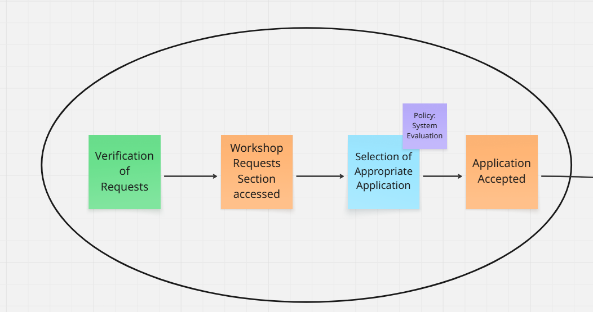
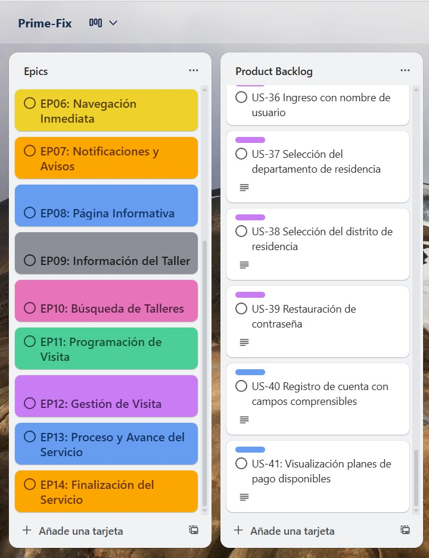
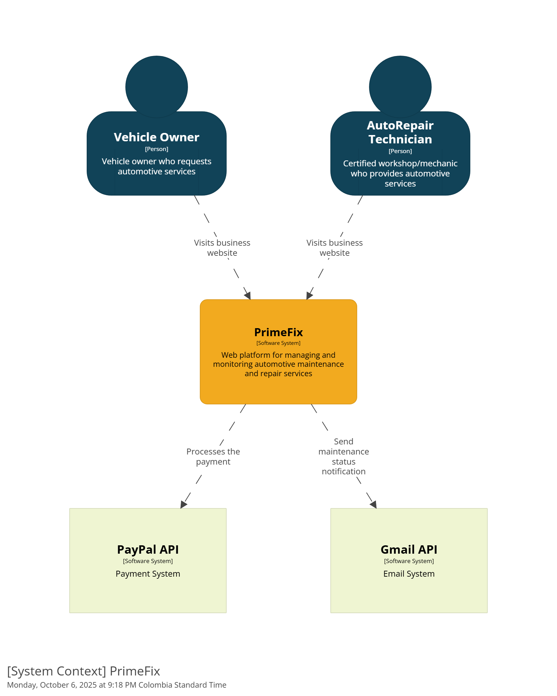
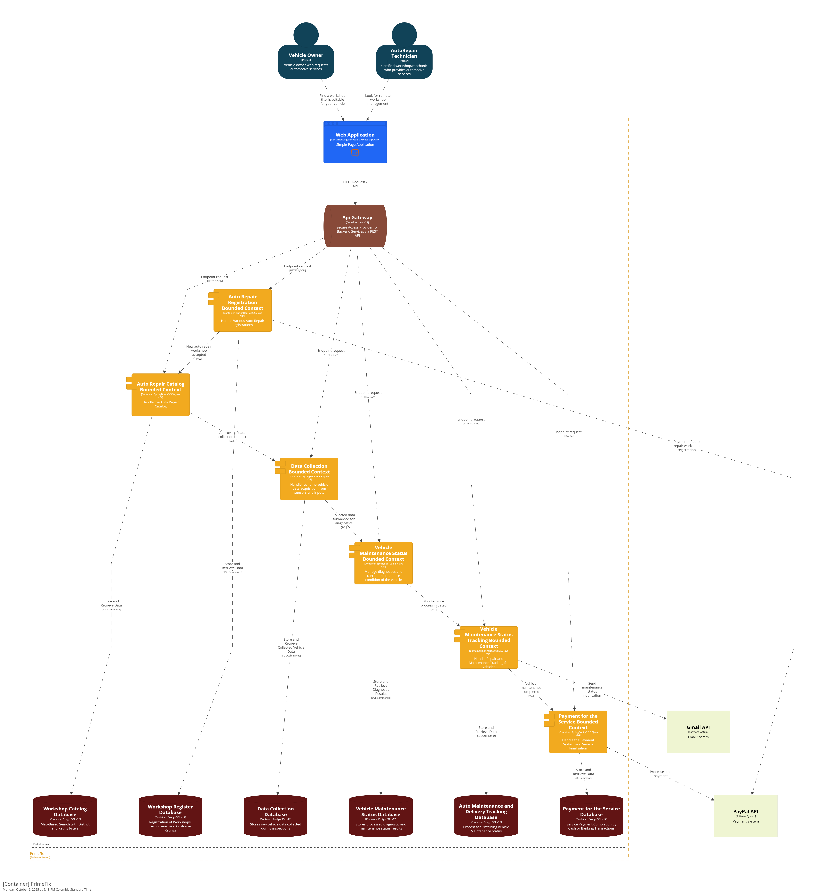
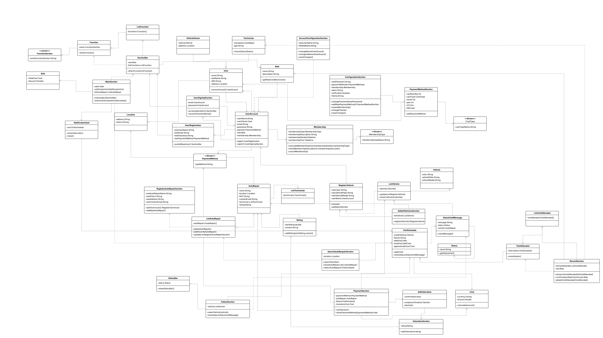
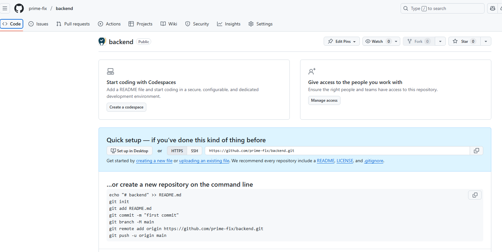
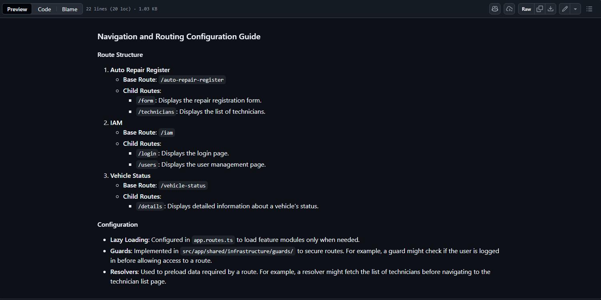

<h2 style="text-align:center">
  
</h2>

<h1 style="text-align:center">Universidad Peruana de Ciencias Aplicadas</h1>

<h3 style="text-align:center; margin-top:18px; margin-bottom:18px;">
  Ingeniería de Software
    
  Curso: Desarrollo de Aplicaciones Open Source
    
  Sección: 7385
    
  Profesor: Juan Antonio Flores Moroco
    
  Semestre: 2025-20
    
  Informe del Trabajo Final
    
  Startup: FixTech
    
  Producto: Prime-Fix
</h3>

<table style="margin: 0 auto; width: auto; display: table; border-collapse: collapse; font-size: 12pt;">
  <thead>
    <tr>
      <th style="border:1px solid #000; padding:6px 12px; text-align:center;">Alumno</th>
      <th style="border:1px solid #000; padding:6px 12px; text-align:center;">Código</th>
    </tr>
  </thead>
  <tbody>
    <tr><td style="border:1px solid #000; padding:6px 12px; text-align:center;">Cesar Augusto Arostegui Alzamora</td><td style="border:1px solid #000; padding:6px 12px; text-align:center;">u202114548</td></tr>
    <tr><td style="border:1px solid #000; padding:6px 12px; text-align:center;">Gianmarco Fabian Jiménez Guerra</td><td style="border:1px solid #000; padding:6px 12px; text-align:center;">u202123843</td></tr>
    <tr><td style="border:1px solid #000; padding:6px 12px; text-align:center;">Alexander Gabriel Montoya Torres</td><td style="border:1px solid #000; padding:6px 12px; text-align:center;">u20231b424</td></tr>
    <tr><td style="border:1px solid #000; padding:6px 12px; text-align:center;">Alicia Avril Navarro Chang</td><td style="border:1px solid #000; padding:6px 12px; text-align:center;">u20231d637</td></tr>
    <tr><td style="border:1px solid #000; padding:6px 12px; text-align:center;">Piero Francesco Tenorio Medina</td><td style="border:1px solid #000; padding:6px 12px; text-align:center;">u202318731</td></tr>
    <tr><td style="border:1px solid #000; padding:6px 12px; text-align:center;">Renso Anthony Julca Cruz</td><td style="border:1px solid #000; padding:6px 12px; text-align:center;">u202121579</td></tr>
  </tbody>
</table>

 Noviembre 2025 

# Registro de Versiones del Informe  
---

| Versión | Fecha       | Autor(es)                                                                 | Descripción de modificación |
|---------|-------------|---------------------------------------------------------------------------|------------------------------|
|   TB1   | 16/09/2025  | Gianmarco Fabian Jiménez Guerra                                           | Realicé la Descripción de la Startup, User Stories, Product Backlog, Organization Systems, Labeling Systems, Landing Page Wireframe, Landing Page Mock-up, Web Applications Wireframes, Web Applications Wireflow Diagrams, Web Applications Mock-ups, Web Applications User Flow Diagrams, Web Applications Prototyping|
|   TB1   | 16/09/2025  | Cesar Augusto Arostegui Alzamora                                          | Realicé el Ubiquitous Language, Web Applications UX/UI Design, Domain-Driven Software Architecture.Class Diagrams. Primera versión de la Landing Page, Services & Applications Implementation. |
|   TB1   | 16/09/2025  | Alexander Gabriel Montoya Torres                                          | Realicé los Antecedentes y problemática, Lean UX Canvas, Análisis competitivo, las Estrategias y tacticas frente a competidores, entrevistas, User Journey Mapping, Empathy Mapping, User Stories, Source Code Style Guide & Conventiones y Software Deployment & Conventions|
|   TB1   | 16/09/2025  | Alicia Avril Navarro Chang                                                | Realicé artefactos de Lean UX como lean ux problem statements, lean ux hyphotesis, lean ux assumptios. También desarrollé secciones del Needfinding como los user personas, impact mapping y user task matriz. Además del software development environment configuration y source code management. |
|   TB1   | 16/09/2025  | Piero Francesco Tenorio Medina                                            | Realicé la secciones de User Stories, evaluando cada escenario posible de cada funcionalidad.Tambien el Diagrama de Clase en una versión temprana. Además de hacer los segmentos objetivos del proyecto. Evaluando los posibles usuarios a los que va dirijido el trabajo.  |
|   TP1   | 07/10/2025  | Gianmarco Fabian Jiménez Guerra                                            | Realicé las correcciones pertinentes y desarrollé el Bounded Context de Payment Service, donde me encargué de codificar todas las capas de dicho BC.  |
|   TP1   | 07/10/2025  | Cesar Augusto Arostegui Alzamora                                          | Realicé la parte del Sprint 2, especifícamente el bounded context de IAM y Maintenance Status Tracking, donde realicé todo el código de dichas secciones |
|  TP1   | 07/10/2025  | Alexander Gabriel Montoya Torres                                          | Realicé el desarrollo del Bounded Context Auto Repair Registration, enfocándome en las funcionalidades de registro y gestión de talleres automotrices. Coordiné efectivamente con los demás integrantes para asegurar la coherencia en la implementación y comuniqué los avances técnicos durante las reuniones de equipo. |
|  TP1   | 07/10/2025  | Alicia Avril Navarro Chang                                                | Realicé el desarrollo del Bounded Context Auto Repair Catalog, implementando las funcionalidades relacionadas con la gestión del catálogo de servicios de reparación. Mantuve comunicación constante con el equipo para alinear los requerimientos funcionales y técnicos del sistema. |
|  TP1   | 07/10/2025  | Piero Francesco Tenorio Medina                                            | En esta entrega desarrollé el Bounded Context de Data Collection, donde implementé las funcionalidades para la recolección y gestión de datos del sistema. Coordiné con el equipo para asegurar la integración correcta con otros bounded contexts y comuniqué efectivamente los requisitos técnicos y las decisiones de diseño tomadas. |
|  TP1   | 07/10/2025  | Renso Anthony Julca Cruz                                                 | Realicé el desarrollo del Bounded Context Vehicle Diagnosis, implementando las funcionalidades para el diagnóstico y evaluación de vehículos. Mantuve comunicación efectiva con el equipo técnico para asegurar la integración correcta con los demás componentes del sistema. |
|  TB2   | 12/11/2025  | Gianmarco Fabian Jiménez Guerra | Realicé una entrevista de validación, el desarrollo del backend del Bounded Context Payment Service a partir del diagrama presentado. Me comuniqué constantemente con el grupo para asegurar la integración correcta con los demás componentes del sistema. Finalmente, registré las entrevistas y su contenido. |
|  TB2   | 12/11/2025  | César Augusto Aróstegui Alzamora | Realicé mi aporte en el backend del Bounded Context IAM y Maintenance Status Tracking. También realicé 2 entrevistas de validación del segmentos 2. |
  TB2   | 12/11/2025 | Piero Francesco Tenorio Medina | Realice las entrevistas de validaciones al segmento 1 y el avance del backend del Bounded Context Data Collection. Además de realizar validaciones con los demás integrantes del grupo sobre los distintos cambios en torno al diagrama de clases y su estructura. |

# Project Report Collaboration Insights  

---

# Contenido
- [Registro de Versiones del Informe](#registro-de-versiones-del-informe)
- [Project Report Collaboration Insights](#project-report-collaboration-insights)
- [Contenido](#contenido)
- [Student Outcome](#student-outcome)
- [Capítulo I: Introducción](#capítulo-i-introducción)
  - [1.1. Startup Profile](#11-startup-profile)
    - [1.1.1. Descripción de la Startup](#111-descripción-de-la-startup)
    - [1.1.2. Perfiles de integrantes del equipo](#112-perfiles-de-integrantes-del-equipo)
  - [1.2. Solution Profile](#12-solution-profile)
    - [1.2.1. Antecedentes y problemática](#121-antecedentes-y-problemática)
    - [1.2.2. Lean UX Process](#122-lean-ux-process)
      - [1.2.2.1. Lean UX Problem Statements](#1221-lean-ux-problem-statements)
      - [1.2.2.2. Lean UX Assumptions](#1222-lean-ux-assumptions)
      - [1.2.2.3. Lean UX Hypothesis Statements](#1223-lean-ux-hypothesis-statements)
      - [1.2.2.4. Lean UX Canvas](#1224-lean-ux-canvas)
  - [1.3. Segmentos objetivo](#13-segmentos-objetivo)
- [Capítulo II: Requirements Elicitation \& Analysis](#capítulo-ii-requirements-elicitation--analysis)
  - [2.1. Competidores](#21-competidores)
    - [2.1.1. Análisis competitivo](#211-análisis-competitivo)
    - [2.1.2. Estrategias y tácticas frente a competidores](#212-estrategias-y-tácticas-frente-a-competidores)
  - [2.2. Entrevistas](#22-entrevistas)
    - [2.2.1. Diseño de entrevistas](#221-diseño-de-entrevistas)
    - [2.2.2. Registro de entrevistas](#222-registro-de-entrevistas)
    - [2.2.3. Análisis de entrevistas](#223-análisis-de-entrevistas)
  - [2.3. Needfinding](#23-needfinding)
    - [2.3.1. User Personas](#231-user-personas)
    - [2.3.2. User Task Matrix](#232-user-task-matrix)
    - [2.3.3. User Journey Mapping](#233-user-journey-mapping)
    - [2.3.4. Empathy Mapping](#234-empathy-mapping)
  - [2.4. Big Picture Event Storming](#24-big-picture-event-storming)
  - [2.5. Ubiquitous Language](#25-ubiquitous-language)
- [Capítulo III: Requirements Specification](#capítulo-iii-requirements-specification)
  - [3.1. User Stories](#31-user-stories)
  - [3.2. Impact Mapping](#32-impact-mapping)
  - [3.3. Product Backlog](#33-product-backlog)
- [Capítulo IV: Product Design](#capítulo-iv-product-design)
  - [4.1. Style Guidelines](#41-style-guidelines)
    - [4.1.1. General Style Guidelines](#411-general-style-guidelines)
    - [4.1.2. Web Style Guidelines](#412-web-style-guidelines)
  - [4.2. Information Architecture](#42-information-architecture)
    - [4.2.1. Organization Systems](#421-organization-systems)
    - [4.2.2. Labeling Systems](#422-labeling-systems)
    - [4.2.3. SEO Tags and Meta Tags](#423-seo-tags-and-meta-tags)
    - [4.2.4. Searching Systems](#424-searching-systems)
    - [4.2.5. Navigation Systems](#425-navigation-systems)
  - [4.3. Landing Page UI Design](#43-landing-page-ui-design)
    - [4.3.1. Landing Page Wireframe](#431-landing-page-wireframe)
    - [4.3.2. Landing Page Mock-up](#432-landing-page-mock-up)
  - [4.4. Web Applications UX/UI Design](#44-web-applications-uxui-design)
    - [4.4.1. Web Applications Wireframes](#441-web-applications-wireframes)
    - [4.4.2. Web Applications Wireflow Diagrams](#442-web-applications-wireflow-diagrams)
    - [4.4.2. Web Applications Mock-ups](#442-web-applications-mock-ups)
    - [4.4.3. Web Applications User Flow Diagrams](#443-web-applications-user-flow-diagrams)
  - [4.5. Web Applications Prototyping](#45-web-applications-prototyping)
  - [4.6. Domain-Driven Software Architecture](#46-domain-driven-software-architecture)
    - [4.6.1. Design-Level Event Storming](#461-design-level-event-storming)
    - [4.6.2. Software Architecture Context Diagram](#462-software-architecture-context-diagram)
    - [4.6.3. Software Architecture Container Diagrams](#463-software-architecture-container-diagrams)
    - [4.6.4. Software Architecture Components Diagrams](#464-software-architecture-components-diagrams)
  - [4.7. Software Object-Oriented Design](#47-software-object-oriented-design)
    - [4.7.1. Class Diagrams](#471-class-diagrams)
  - [4.8. Database Design](#48-database-design)
    - [4.8.1. Database Diagrams](#481-database-diagrams)
- [Capítulo V: Product Implementation, Validation \& Deployment](#capítulo-v-product-implementation-validation--deployment)
  - [5.1. Software Configuration Management](#51-software-configuration-management)
    - [5.1.1. Software Development Environment Configuration](#511-software-development-environment-configuration)
    - [5.1.2. Source Code Management](#512-source-code-management)
    - [5.1.3. Source Code Style Guide \& Conventions](#513-source-code-style-guide--conventions)
    - [5.1.4. Software Deployment Configuration](#514-software-deployment-configuration)
  - [5.2. Landing Page, Services \& Applications Implementation](#52-landing-page-services--applications-implementation)
    - [5.2.1. Sprint 1](#521-sprint-1)
      - [5.2.1.1. Sprint Planning 1](#5211-sprint-planning-1)
      - [5.2.1.2. Aspect Leaders and Collaborators](#5212-aspect-leaders-and-collaborators)
      - [5.2.1.3. Sprint Backlog 1](#5213-sprint-backlog-1)
      - [5.2.1.4. Development Evidence for Sprint Review](#5214-development-evidence-for-sprint-review)
      - [5.2.1.5. Execution Evidence for Sprint Review](#5215-execution-evidence-for-sprint-review)
      - [5.2.1.6. Services Documentation Evidence for Sprint Review](#5216-services-documentation-evidence-for-sprint-review)
      - [5.2.1.7. Software Deployment Evidence for Sprint Review](#5217-software-deployment-evidence-for-sprint-review)
      - [5.2.1.8. Team Collaboration Insights during Sprint](#5218-team-collaboration-insights-during-sprint)
    - [5.2.2. Sprint 2](#522-sprint-2)
      - [5.2.2.1. Sprint Planning 2](#5221-sprint-planning-2)
      - [5.2.2.2. Aspect Leaders and Collaborators](#5222-aspect-leaders-and-collaborators)
      - [5.2.2.3. Sprint Backlog 2](#5223-sprint-backlog-2)
      - [5.2.2.4. Development Evidence for Sprint Review](#5224-development-evidence-for-sprint-review)
      - [5.2.2.5. Execution Evidence for Sprint Review](#5225-execution-evidence-for-sprint-review)
      - [5.2.2.6. Services Documentation Evidence for Sprint Review](#5226-services-documentation-evidence-for-sprint-review)
      - [5.2.2.7. Software Deployment Evidence for Sprint Review](#5227-software-deployment-evidence-for-sprint-review)
      - [5.2.2.8. Team Collaboration Insights during Sprint](#5228-team-collaboration-insights-during-sprint)
    - [5.2.3. Sprint 3](#523-sprint-3)
      - [5.2.3.1. Sprint Planning 3](#5231-sprint-planning-3)
      - [5.2.3.2. Aspect Leaders and Collaborators](#5232-aspect-leaders-and-collaborators)
      - [5.2.3.3. Sprint Backlog 3](#5233-sprint-backlog-3)
      - [5.2.3.4. Development Evidence for Sprint Review](#5234-development-evidence-for-sprint-review)
      - [5.2.3.5. Execution Evidence for Sprint Review](#5235-execution-evidence-for-sprint-review)
      - [5.2.3.6. Services Documentation Evidence for Sprint Review](#5236-services-documentation-evidence-for-sprint-review)
      - [5.2.3.7. Software Deployment Evidence for Sprint Review](#5237-software-deployment-evidence-for-sprint-review)
      - [5.2.3.8. Team Collaboration Insights during Sprint](#5238-team-collaboration-insights-during-sprint)
  - [5.3. Validation Interviews](#53-validation-interviews)
    - [5.3.1. Diseño de Entrevistas](#531-diseño-de-entrevistas)
    - [5.3.2. Registro de Entrevistas](#532-registro-de-entrevistas)
    - [5.3.3. Evaluaciones según heurísticas](#533-evaluaciones-según-heurísticas)
  - [5.4. Video About-the-Product](#54-video-about-the-product)
- [Conclusiones](#conclusiones)
- [Conclusiones y recomendaciones](#conclusiones-y-recomendaciones)
- [Video About-the-Team](#video-about-the-team)
- [Bibliografía](#bibliografía)
- [Anexos](#anexos)

# Student Outcome  

| **Criterio específico** | **Acciones realizadas** | **Conclusiones** |
|--------------------------|--------------------------|------------------|
| **Comunica oralmente con efectividad a diferentes rangos de audiencia** | **Jiménez Guerra, Gianmarco Fabián** **TB1:** Para esta entrega pude contribuir en todos los capítulos a desarrollar. Ayudé a definir el proyecto y las funcionalidades de manera correcta y pude comunicarme de forma correcta y ordenada con los integrantes del grupo. **TP1:** Coordiné mi colaboración junto con el grupo de trabajo: aporté en algunas correcciones, en el uso del Trello para el registro de los *user stories* y los *sprints*, y finalmente con la codificación del *Bounded Context Payment Service*. **TB2:** Durante esta entrega, participé activamente en la presentación del progreso técnico del *Payment Service* ante el equipo y el docente. Expliqué el diseño y funcionamiento del backend, abordando preguntas sobre integración entre *bounded contexts*. También conduje la exposición de hallazgos de entrevistas de validación, comunicando con claridad las percepciones de usuarios.  **Aróstegui Alzamora, César Augusto** **TB1:** En el inicio de este proyecto planifiqué lo necesario para los avances del prototipo de la aplicación web y el diseño UX/UI, facilité sesiones de *Design-Level Event Storming* para alinear vocabulario y flujos. También planifiqué la primera versión de la *Landing Page*. **TP1:** Durante esta entrega me enfoqué en la implementación técnica desarrollando los *Bounded Contexts* de *IAM* y *Maintenance Status Tracking*. Mantuve comunicación efectiva con el equipo durante las sesiones de planificación y revisión de código, explicando la arquitectura de seguridad y los patrones implementados. **TB2:** Presenté oralmente los avances del backend de *IAM* y *Maintenance Status Tracking*, exponiendo la arquitectura, endpoints REST y validaciones de seguridad. Además, participé en la exposición de resultados de entrevistas al segmento 2, transmitiendo hallazgos con lenguaje técnico y empático.  **Tenorio Medina, Piero Francesco** **TB1:** Dentro de esta parte del trabajo, he planteado distintas ideas de cómo se podría desarrollar el trabajo con los demás integrantes de mi equipo. Se desarrollaron secciones como *Entrevistas a usuarios*, donde se plasmó correctamente la idea del proyecto. **TP1:** En esta entrega desarrollé el *Bounded Context Data Collection*, implementando las funcionalidades para la recolección y gestión de datos del sistema. Coordiné con el equipo para asegurar la integración correcta con otros *bounded contexts* y comuniqué efectivamente las decisiones técnicas tomadas. **TB2:** Expuse la justificación de cambios en el diagrama de clases y el progreso del *Data Collection Service*, explicando su interoperabilidad con otros *bounded contexts*. También presenté el resumen de entrevistas del segmento 1, comunicando los hallazgos de manera comprensible para el público académico.  **Montoya Torres, Alexander Gabriel** **TB1:** Durante la fase inicial de este proyecto mantuvimos una buena comunicación con el equipo, logrando determinar un plan de avances y reforzar nuestro trabajo colaborativo. Aporté en entrevistas, *Needfinding* y definición de funcionalidades. **TP1:** Desarrollé el *Bounded Context Auto Repair Registration*, enfocándome en las funcionalidades de registro y gestión de talleres automotrices. Coordiné efectivamente con el equipo para asegurar la coherencia en la implementación y comuniqué los avances técnicos durante las reuniones.  **Navarro Chang, Alicia Avril** **TB1:** Trabajé en conjunto con mis compañeros para plasmar el concepto del proyecto, comunicando ideas y opiniones que ayudaron al desarrollo del trabajo. **TP1:** Desarrollé el *Bounded Context Auto Repair Catalog*, implementando funcionalidades para la gestión del catálogo de servicios. Mantuve comunicación constante para alinear requerimientos funcionales y técnicos.  **Julca Cruz, Renso Anthony** **TP1:** Desarrollé el *Bounded Context Vehicle Diagnosis*, implementando funcionalidades de diagnóstico y evaluación de vehículos. Mantuve comunicación efectiva para asegurar la integración correcta con los demás componentes del sistema.  |**TB1:** Las presentaciones orales evidenciaron claridad en los objetivos, avances y funcionalidades del proyecto, adaptando el lenguaje al contexto técnico y académico. **TP1:** El equipo demostró habilidades de comunicación oral efectiva al presentar la arquitectura y funcionalidades de cada *bounded context*. **TB2:** En este sprint, el equipo fortaleció sus habilidades de comunicación oral mediante presentaciones técnicas que combinaron claridad conceptual y dominio del producto. Cada integrante articuló eficazmente el progreso de su módulo y los resultados de validación, demostrando capacidad para adaptar el discurso a audiencias técnicas y no técnicas. |
| **Comunica por escrito con efectividad a diferentes rangos de audiencia** | **Jiménez Guerra, Gianmarco Fabián** **TB1:** Redacté de manera adecuada lo que correspondía en mi parte del informe. Además, la comunicación con algunos segmentos objetivos fue escrita. Finalmente, hubo coordinaciones con el grupo por mensajes. **TP1:** Para el desarrollo de mi parte, la codificación de mi *bounded context* implicó coordinaciones presenciales y por mensajes. **TB2:** Redacté el informe de entrevistas y actualicé la documentación técnica del *Payment Service* en el README, manteniendo coherencia en estilo y precisión técnica. Elaboré las preguntas y registros de validación con lenguaje claro y formal.  **Aróstegui Alzamora, César Augusto** **TB1:** Desarrollé los avances del prototipo de la aplicación web y el diseño UX/UI, además de completar el *Design-Level Event Storming*. **TP1:** Documenté de manera detallada la arquitectura e implementación de los *Bounded Contexts IAM* y *Maintenance Status Tracking*. Redacté especificaciones técnicas claras y documentación de APIs. **TB2:** Documenté las entrevistas realizadas al segmento 2, resumiendo respuestas y patrones detectados. Actualicé la descripción de los módulos en la documentación del proyecto, asegurando trazabilidad y consistencia.  **Tenorio Medina, Piero Francesco** **TB1:** Desarrollé ideas alineadas a los segmentos objetivos, considerando su experiencia y malestar con los talleres.  **TP1:** Redacté la documentación técnica completa del *Bounded Context Data Collection*, incluyendo diagramas y guías de implementación. **TB2:** Redacté los resúmenes de validación del segmento 1 y actualicé el avance técnico del backend en GitHub y el informe principal. Incorporé observaciones sobre el modelo de clases con lenguaje técnico preciso.  **Montoya Torres, Alexander Gabriel** **TB1:** Definí la problemática principal del proyecto y los segmentos objetivos, manteniendo comunicación asertiva y colaborativa. **TP1:** Elaboré documentación técnica detallada del *Bounded Context Auto Repair Registration*, con especificaciones funcionales y guías de implementación.  **Navarro Chang, Alicia Avril** **TB1:** Elaboré artefactos *Lean UX* (personas, *impact mapping*, *user stories*), que comunican ideas centradas en el usuario. **TP1:** Desarrollé documentación técnica del *Bounded Context Auto Repair Catalog*, incluyendo especificaciones de servicios y modelos de datos.  **Julca Cruz, Renso Anthony** **TP1:** Redacté documentación técnica del *Bounded Context Vehicle Diagnosis*, detallando algoritmos, modelos y servicios.  | **TB1:** La comunicación escrita reflejada en informes, artefactos y coordinaciones internas permitió transmitir de manera precisa los objetivos y avances del proyecto. **TP1:** La documentación técnica fue clara, estructurada y adaptada a diferentes audiencias, facilitando la comprensión de la arquitectura del sistema. **TB2:** En esta entrega el equipo consolidó una comunicación escrita más madura y orientada a la documentación profesional. Se integraron correctamente las entrevistas de validación, evidencias técnicas y revisiones de código, asegurando uniformidad en redacción, formato y tono técnico para audiencias docentes y de desarrollo. |

---

# Capítulo I: Introducción
## 1.1. Startup Profile
### 1.1.1. Descripción de la Startup
FixTech es una startup especializada en el desarrollo de soluciones tecnológicas aplicadas a la web, cuyo propósito es transofrmar la forma en que los usuarios acceden a servicios de mantenimiento y reparación automotriz.
Con FixTech nace Prime-Fix, una plataforma digital cuyo objetivo es facilitar el contacto entre talleres de vehículos y dueños de los mismos implementando una serie de funcionalidades que permitirán a ambos usuarios, obtener una experiencia de gestión clara.

<b>Misión: </b> Nuestra misión es acercar a los dueños de vehículos a talleres confiables por medio de una plataforma accesible y amigable. De esta manera, modernizamos el sector automotriz y optimizamos de toda la experiencia de este tipo de  servicios.

<b>Visión: </b> Tenemos como objetivo posicionarnos como la plataforma líder en Perú para la gestión digital de servicios automotrices, considerando una posible expansión hacia toda América Latina. A su vez, en el futuro se buscará integrar a este proyecto aplicaciones móviles y dispositivos IoT que permitan un mantenmiento inteligente para los vehículos.

### 1.1.2. Perfiles de integrantes del equipo

| Perfil del integrante | Código de alumno | Descripción                                                                                                                                                                                                                                                                                                                                                                                               |
| --------------------- | ---------------- | --------------------------------------------------------------------------------------------------------------------------------------------------------------------------------------------------------------------------------------------------------------------------------------------------------------------------------------------------------------------------------------------------------- |
|  | U202318731       | Soy Piero Tenorio, estudio en la sede San Miguel de la UPC estudiando la carrera de Ingeniería de Software . Soy una persona colaborativa, responsable y comprometida con los trabajos en los que estoy implicado, tratando de ser lo más eficiente posible.Conocimientos en HTML, CSS, Java, C++, JavaScript y Python. Cada día trato de mejorar como persona y si llego a cometer algún error, tratar de aprender de ello. |
|                   | U202123843       | Soy Gianmarco Jiménez alumno de Ingeniería de Software. Me gusta trabajar en equipo pues me permite aprender sobre las ideas que tienen los participantes y contrastarlas con las mías. He utilizado lenguajes como C++, Python, SQL y Java. Estoy muy interesado en aprender todo sobre el desarrollo de aplicaciones web con frameworks.                                                                |
|   |  U20231b424         | Soy Alexander Gabriel Montoya, estudiante de la carrera de Ingenieria de Sofware en la UPC, tengo 20 años actualmente, con respecto a mi carrera he aprendido a manejar lenguajes de programación como C++, MySQL, Python, HTML y CSS. Con respecto a lo personal, me gusta dedicar tiempo y esfuerzo a todo lo que hago ya sean actividades academicas o mis hobbies     |
|                   | U202114548         | Soy César Augusto, estudiante de Ingeniería de Software, actualmente con 21 años, mi lenguaje más utilizado y favorito es Python, actualmente adaptándome en JavaScript y estudiando frameworks  relacionados para el Desarrollo Web.                                                                                                                                                                                                                                                                                                                                                                          |
|    | U20231D637         | Soy Alicia Navarro, estudiante de Ingeniería de Software en la UPC, con conocimientos básicos en programación en C++ y Python, fundamentos en bases de datos, diseño y modelado de software utilizando UML y diagramas, así como algoritmos y estructuras de datos básicos. Además, poseo habilidades de empatía y comunicación efectiva que me permiten colaborar de manera eficiente en equipo, facilitando la comunicación clara y asertiva para contribuir a un entorno de trabajo productivo y colaborativo.                                                                                                                                                                                                                                                                                                                                                                                     |
|    | U202121579         | Estudiante de Ingenieria de Software, actualmente curso el 5to ciclo de esta carrera. Me apasiona programar y ser autodidacta para poder mejorar mis habilidades en el desarrollo de software, quisiera dedicarme a la parte de gestion bancaria.	|

## 1.2. Solution Profile
### 1.2.1. Antecedentes y problemática
El sector automotriz en el Perú y en gran parte de Latinoamérica aún se encuentra rezagado en términos de digitalización de servicios, debido a que, la mayoria de talleres funcionan con procesos manuales, tales como agendas físicas, llamadas telefonicas y mensajeria web afectando la trazabilidad de reparaciones y la atención que reciben los dueños de vehiculos generando dificultades sobre ellos al obstaculizar la busqueda de talleres confiables hoy en día.

A nivel global, ya existen plataformas que conectan a usuarios con talleres y servicios automotrices, lo que demuestra que hay una tendencia hacia la digitalización dentro de este sector, sin embargo en el Perú este modelo no ha sido consolidado y por ende se ha retrasado la modernización del servicio al cliente dentro de este sector y se ha aumentando la desorganización en la gestion de talleres, debido a que no se cuenta con sistemas digitales de registro de citas ni sistemas para facilitar el seguimiento de las reparaciones. Según Manrique (2011) los talleres en el Perú requieren de sistemas electrónicos para reservar citas previas a la atención, con el fin de optimizar recursos del taller en cuanto a organización y planificación

En este contexto,Fixtech surge como una startup de base tecnológica que busca cerrar la brecha entre talleres y clientes mediante mediante la creación de nuestro aplicativo PrimeFix, el cual tiene como objetivo centralizar la oferta de talleres en un entorno digital que otorgue transparencia, accesibilidad y confianza a los usuarios. Además, en Latinoamérica la inversión publicitaria digital en la industria automotriz está creciendo y señalando que los negocios del rubro están obligados a adaptarse al entorno digital para mantenerse competitivos; por ejemplo, en octubre de 2024, Perú representó aproximadamente un 2,67 % de la inversión digital en publicidad automotriz en LATAM, lo que indica interés y movimiento en el ecosistema digital automotriz del país (Similarweb, 2024).

#### Problemática (5W + 2H)

##### Who (Quiénes)

Los principales afectados son los propietarios de vehículos, quienes enfrentan dificultades para encontrar talleres confiables y dar seguimiento a sus reparaciones. Asimismo, los talleres automotrices se ven perjudicados por la falta de procesos organizados y de herramientas digitales para gestionar citas y clientes. La mayoría de estos talleres son pequeños negocios con recursos limitados, lo que dificulta su modernización (Perú21, 2023).

##### What (Qué)

El problema central radica en la escasa digitalización de los talleres automotrices, que genera desorganización en la programación de citas, pérdida de información y falta de transparencia hacia el cliente. La digitalización ha demostrado mejorar eficiencia y competitividad: según Telefónica (2024), el 52 % de las PYMES peruanas incrementó sus ventas y un 25 % mejoró su productividad al implementar herramientas digitales.

##### Where (Dónde)

La problemática se presenta a nivel nacional, pero es más significativa en ciudades intermedias y zonas menos tecnificadas, donde los talleres enfrentan mayores barreras de acceso a tecnología y capacitación.

##### When (Cuándo)

El problema se ha intensificado en los últimos años, especialmente tras la pandemia, cuando la digitalización se volvió esencial para la operación empresarial. A pesar de los avances en otros sectores, los talleres automotrices en Perú siguen rezagados. Según el Sondeo de Adopción Digital Pymes 2025 de Movistar Empresas, muchas PYMES reconocen la importancia de digitalizarse, aunque aún enfrentan barreras por falta de conocimiento y recursos (América Sistemas, 2025).

##### Why (Por qué)

La problemática persiste debido a la resistencia a la digitalización y la falta de recursos en los talleres, la mayoría pequeños negocios familiares. Además, aproximadamente el 38 % de los trabajadores peruanos carece de habilidades digitales necesarias, limitando la adopción de sistemas modernos (Radio Nacional, 2023).

##### How (Cómo):

Se manifiesta en la operación diaria mediante procesos manuales, como llamadas telefónicas, agendas físicas o mensajería por WhatsApp, que generan desorden en las citas, pérdida de información y poca trazabilidad en las reparaciones. De acuerdo con Microsoft (2022), el 95 % de las PYMES peruanas aceleró su digitalización tras la pandemia, pero muchos talleres automotrices aún no implementan soluciones digitales específicas, quedando rezagados frente a otros sectores.

##### How Much (Cuánto):

La magnitud del problema se evidencia en el alto número de talleres que no cuentan con recursos para digitalizarse, afectando a miles de usuarios a nivel nacional. Esto se refleja en el hecho de que la mayoría de los más de 78,000 talleres mecánicos en Perú operan con recursos limitados y procesos manuales, para un parque automotor de aproximadamente 2.9 millones de vehículos (Perú21, 2023).

### 1.2.2. Lean UX Process
#### 1.2.2.1. Lean UX Problem Statements
#### Dueños de vehículos
* Nuestro contexto demanda una solución digital que facilite a los propietarios de vehículos el acceso a talleres confiables y eficientes en ciudades con alto tráfico. Con esta solución, los usuarios podrán gestionar mantenimientos y reparaciones de manera rápida, contando con información clara sobre costos, tiempos y calidad del servicio, lo que reduce la duda y las pérdidas de tiempo.
* Hemos observado un factor crítico que afecta a este segmento: la falta de transparencia y organización en los talleres genera desconfianza y frustración en los dueños, quienes suelen enfrentarse a largas esperas, cobros inesperados o servicios de baja calidad.
* ¿Cómo brindar a los dueños de vehículos una plataforma digital que les permita encontrar talleres confiables, reservar citas con facilidad y monitorear el servicio en tiempo real para asegurar transparencia, eficacia y satisfacción?

#### Asesores de servicios de taller automotriz
* Nuestro contexto demanda una solución tecnológica que permita a los asesores de talleres optimizar la gestión de clientes y servicios. Con esta solución, los asesores podrán organizar citas de forma eficiente, llevar un control ordenado de mantenimientos y reparaciones, y ofrecer un servicio más rápido y transparente, generando confianza y fidelización.
* Hemos observado un factor crítico que afecta a este segmento: la falta de herramientas digitales integradas ocasiona errores en la programación de citas, retrasos en la atención y pérdida de oportunidades de fidelización, lo que impacta directamente en la reputación del taller.
* ¿Cómo implementar una plataforma digital que permita a los asesores gestionar eficientemente citas, clientes y servicios, reduciendo errores y mejorando la experiencia general del usuario?

#### 1.2.2.2. Lean UX Assumptions
1. Consideramos que nuestros clientes, tanto dueños de vehículos como asesores de servicios de talleres automotrices, tienen la necesidad de gestionar de manera eficiente los servicios de mantenimiento y reparación automotriz.
2. Esta necesidad se puede resolver mediante una plataforma digital que facilite el contacto entre propietarios de vehículos y asesores de talleres, proporcionando funciones como reserva de citas, cotización, seguimiento de servicios y calificación mutua.
3. Nuestros clientes iniciales son dueños de vehículos particulares y asesores de servicios de talleres automotrices en Lima, que buscan digitalizar y simplificar la gestión y el acceso a servicios automotrices.
4. La mayoría de los clientes se obtendrá por registros en la plataforma generados a través de campañas digitales, alianzas con talleres y recomendaciones entre usuarios y asesores.
5. Los beneficios económicos provendrán de comisiones por servicios concretados, suscripciones premium para talleres que deseen mayor visibilidad y publicidad segmentada dirigida tanto a propietarios como a asesores.
6. La competencia la constituyen directorios online, marketplaces automotrices, apps de gestión de talleres y métodos tradicionales de búsqueda y contacto.
7. Resaltaremos frente a la competencia gracias a la confiabilidad de los talleres aliados, la digitalización del proceso de contacto y gestión, y las futuras integraciones tecnológicas para ambos tipos de usuarios.
8. El mayor riesgo es la resistencia de asesores tradicionales a la adopción digital y la desconfianza de los propietarios respecto a la calidad del servicio ofrecido.
9. Esto se resolverá con validación rigurosa de talleres, capacitación a asesores, sistemas de reputación digital y soporte técnico constante para ambos segmentos.
#### User outcomes
* Los dueños de vehículos acceden fácilmente a talleres confiables y gestionan sus servicios automotrices de manera clara y transparente.
* Los asesores de talleres automotrices optimizan la captación y gestión de clientes usando herramientas digitales, incrementando eficiencia y reputación.
* Ambos segmentos encuentran valor en la digitalización de procesos, la comunicación clara y la gestión centralizada del historial de servicios.
#### Business outcomes
* Aumentar la adopción de Prime-Fix entre propietarios de vehículos y asesores de talleres en Lima y expandirse nacionalmente.
* Generar acuerdos estratégicos con talleres y marcas automotrices para fortalecer la base de usuarios.
* Lograr ingresos recurrentes por comisiones, suscripciones y publicidad dirigida a ambos segmentos.
* Posicionar a FixTech como referente tecnológico en gestión automotriz y mantener alta retención en ambas audiencias.
#### 1.2.2.3. Lean UX Hypothesis Statements
1. Creemos que al ofrecer una plataforma digital para agendar y gestionar servicios de mantenimiento automotriz, los dueños de vehículos podrán encontrar talleres confiables y realizar reservas en menos tiempo. Sabremos que hemos tenido éxito cuando al menos el 80% de los usuarios completen una reserva y califiquen positivamente la experiencia en la plataforma durante el primer mes de uso.
2. Creemos que al proporcionar a los asesores de talleres automotrices herramientas de gestión digital (notificaciones, seguimiento, historial de servicios y organización de citas), podrán aumentar la eficiencia en la atención y captar más clientes. Sabremos que hemos tenido éxito cuando al menos el 70% de los asesores registrados reporten un incremento en la cantidad de clientes atendidos en el primer trimestre tras adoptar la plataforma.
3. Creemos que, si integramos funciones de transparencia en cotizaciones, reseñas verificadas y soporte en tiempo real, tanto dueños de vehículos como talleres confiarán más en la plataforma y repetirán su uso. Sabremos que hemos tenido éxito cuando el índice de uso recurrente (clientes y asesores que repiten servicios) supere el 60% al cabo de seis meses.
4. Creemos que si diseñamos una interfaz intuitiva, con funcionalidades accesibles para ambos tipos de usuario (dueños y asesores), lograremos que tanto talleres tradicionales como nuevos usuarios adopten la plataforma sin necesidad de capacitación extensiva. Sabremos que hemos tenido éxito cuando al menos el 65% de los asesores encuestados indiquen sentirse cómodos gestionando sus servicios en la aplicación sin soporte adicional después de un mes de uso continuo.
#### 1.2.2.4. Lean UX Canvas
| **Business Problem** | **Business Outcomes** |
|-----------------------|------------------------|
| - El sector automotriz en Perú carece de digitalización. - Dueños de vehículos no encuentran talleres confiables ni transparentes. - Talleres tienen procesos manuales e ineficientes. | - Incrementar talleres afiliados. - Reducir tiempo de búsqueda y agendamiento. - Aumentar confianza con transparencia en precios y reseñas. - Posicionar a FixTech como líder en Perú y LATAM. |

| **Users** | **User Outcomes & Benefits** |
|-----------|------------------------------|
| - Dueños de vehículos: buscan confianza, transparencia y facilidad. - Talleres: necesitan digitalizar su gestión, captar clientes y mejorar organización. | - Dueños de vehículos: mayor confianza, ahorro de tiempo, historial de mantenimientos. - Talleres: más visibilidad, captación de clientes y mejor gestión. |

| **Hypotheses** | **Solutions** |
|----------------|---------------|
| - Creemos que los **dueños de vehículos** usarán Prime-Fix porque encontrarán confianza y transparencia. - Creemos que los **talleres** se afiliarán para captar más clientes y organizar su gestión. - Creemos que digitalizar procesos reducirá tiempos y aumentará satisfacción. | - Plataforma digital que conecte dueños de vehículos con talleres. - Agenda en línea con recordatorios. - Perfiles de talleres con reseñas y catálogo. - Historial digital de mantenimientos. - Futuras integraciones con app móvil e IoT. |

| **What’s the most important thing we need to learn first?** | **What’s the least amount of work we need to do to learn the next most important thing?** |
|-------------------------------------------------------------|------------------------------------------------------------------------------------------------|
| - Validar si los usuarios confían en la plataforma para agendar servicios. - Verificar si los talleres están dispuestos a afiliarse y pagar por visibilidad. | - Entrevistar a un grupo reducido de talleres y usuarios. - Recoger feedback y medir uso real. |

## 1.3. Segmentos objetivo

**Segmento 1: Dueños de vehículos**
**Aspectos Demográficos:**

* Sexo: Masculino y Femenino
* Edades: Entre 22 y 50 años

**Aspectos Geográficos:**

* Zona Geográfica en la que viven: Urbana, ciudad altamente transitada por vehículos.

**Aspectos Psicográficos:**

* Valoran el buen servicio y la eficacia.
* Tienen interés en la calidad del servicio que se le brinda a su vehiculo. 

**Segmento 2: Asesor de servicios de taller automotriz**
**Aspectos Demográficos:**

* Sexo: Masculino y Femenino
* Edades: Entre 21 y 50 años
* Ocupación: Dueño, administrador o asesor de servicios de un taller automotriz

**Aspectos Geográficos:**

* Zona Geográfica en la que viven: Urbana, ciudad altamente transitada por vehículos.
* Ubicacion del taller: Cercana a avenidas transitadas, zonas industriales o barrios con alta circulación vehicular.

**Aspectos Psicográficos:**

* Valoran la organizacion y eficiencia en la gestión de clientes.
* Interés en fidelizar clientes y mejroar la reputación de su taller.
* Buscan soluciones tecnológicas que les permitan optimizar el tiempo y reducir errores dentro del taller.

---

# Capítulo II: Requirements Elicitation & Analysis
## 2.1. Competidores
### 2.1.1. Análisis competitivo
<table>
  <tr>
    <th>Sección</th>
    <th>Criterio</th>
    <th>FixTech (Prime-Fix)</th>
    <th>Autolab</th>
    <th>TallerActual</th>
    <th>Drivana</th>
  </tr>
  <tr>
    <td rowspan="2"><b>Perfil</b></td>
    <td>Overview</td>
    <td>Startup peruana que conecta dueños de vehículos con talleres de confianza, centralizando citas e historial de servicios.</td>
    <td>Startup colombiana que ofrece diagnóstico, agenda y marketplace de talleres certificados.</td>
    <td>Portal español con red de talleres y formación técnica.</td>
    <td>SaaS mexicano para digitalizar talleres + marketplace.</td>
  </tr>
  <tr>
    <td>Ventaja Competitiva</td>
    <td>Foco local (Perú), apoyo a talleres medianos/pequeños aún no digitalizados, confianza y transparencia.</td>
    <td>Marca reconocida en LatAm, fuerte inversión y alianzas con aseguradoras/marcas.</td>
    <td>Amplia base de contenido técnico y visibilidad internacional.</td>
    <td>Modelo integral (software + marketplace), experiencia en IoT.</td>
  </tr>
  <tr>
    <td rowspan="2"><b>Marketing</b></td>
    <td>Mercado objetivo</td>
    <td>Dueños de autos en Lima y talleres pequeños/medianos sin digitalización.</td>
    <td>Usuarios urbanos en LatAm con alta adopción digital.</td>
    <td>Talleres y mecánicos interesados en visibilidad y formación.</td>
    <td>Talleres medianos/grandes que buscan digitalización avanzada.</td>
  </tr>
  <tr>
    <td>Estrategia</td>
    <td>Marketing digital local, alianzas con talleres, campañas centradas en confianza/transparencia.</td>
    <td>Campañas masivas, acuerdos con aseguradoras y marcas de autos.</td>
    <td>Generación de contenidos y publicidad técnica.</td>
    <td>Ventas B2B, modelo SaaS + marketplace, enfoque en tecnología.</td>
  </tr>
  <tr>
    <td rowspan="3"><b>Producto</b></td>
    <td>Servicios</td>
    <td>Marketplace de talleres, gestión de citas, historial de servicios.</td>
    <td>Agenda de citas, diagnósticos, talleres certificados, garantías.</td>
    <td>Directorio de talleres, contenidos técnicos y formación.</td>
    <td>SaaS de gestión, marketplace, reportes IoT, pagos digitales.</td>
  </tr>
  <tr>
    <td>Precios & Costos</td>
    <td>Comisiones por transacción + suscripciones + publicidad segmentada.</td>
    <td>Comisiones + tarifas premium por visibilidad + alianzas.</td>
    <td>Membresías de talleres + publicidad.</td>
    <td>Modelo SaaS (mensualidades) + comisiones.</td>
  </tr>
  <tr>
    <td>Canales de distribución</td>
    <td>Plataforma web (futuro: app móvil).</td>
    <td>App móvil + web.</td>
    <td>Web.</td>
    <td>Web + app móvil.</td>
  </tr>
  <tr>
    <td rowspan="4"><b>SWOT</b></td>
    <td>Fortalezas</td>
    <td>Enfoque local con conocimiento del mercado peruano.</td>
    <td>Startup joven sin marca consolidada.</td>
    <td>Mercado peruano rezagado en digitalización, espacio libre para crecer.</td>
    <td>Ingreso de competidores regionales con más capital (Autolab, Drivana).</td>
  </tr>
  <tr>
    <td>Debilidades</td>
    <td>Primeros en digitalizar talleres pequeños y medianos.</td>
    <td>Escalabilidad limitada frente a competidores con capital extranjero.</td>
    <td>Expansión nacional y regional en LatAm.</td>
    <td>Reticencia de talleres tradicionales a digitalizarse.</td>
  </tr>
  <tr>
    <td>Oportunidades</td>
    <td>Plataforma amigable e intuitiva.</td>
    <td>Falta de app móvil en la primera etapa.</td>
    <td>Posibles alianzas con aseguradoras, marcas y grifos.</td>
    <td>Preferencia cultural por el trato directo (llamadas/visitas).</td>
  </tr>
  <tr>
    <td>Amenazas</td>
    <td>Estrategia basada en confianza y transparencia.</td>
    <td>Dependencia inicial del mercado limeño.</td>
    <td>Futuro con IoT y mantenimiento predictivo.</td>
    <td>Riesgo de bajo financiamiento frente a competidores.</td>
  </tr>
</table>

### 2.1.2. Estrategias y tácticas frente a competidores
FixTech se posiciona como una solución tecnológica que responde a una necesidad aún insatisfecha en el Perú: la digitalización de talleres pequeños y medianos. Su mayor beneficio radica en la cercanía con el mercado local y el conocimiento profundo de la realidad automotriz peruana, donde la mayoría de procesos aún son manuales. A través de Prime-Fix, los dueños de vehículos acceden a talleres confiables, gestionan citas y mantienen un historial transparente de servicios, mientras los talleres optimizan su captación de clientes y su reputación en el mercado.

Dentro del mercado regional, existen actores que ya han dado pasos hacia la digitalización de servicios automotrices. Autolab en Colombia ha crecido con el respaldo de alianzas con aseguradoras y marcas, consolidándose como un referente en varios países de Latinoamérica. TallerActual, desde España, combina red de talleres con formación y contenidos técnicos, ganando visibilidad internacional. Por otro lado, Drivana en México ha apostado por un modelo integral de SaaS y marketplace con un componente tecnológico más avanzado, incluso incorporando IoT. Aunque cada uno de estos competidores presenta fortalezas, ninguno ha logrado consolidar el espacio peruano, lo que deja una ventana clara de oportunidad para FixTech.

Para competir con estos actores, FixTech debe desplegar tácticas adaptadas a cada rival. Frente a Autolab, resulta clave diferenciarse mediante alianzas con aseguradoras locales y un modelo accesible para talleres pequeños que la competencia internacional no suele priorizar. Contra TallerActual, el foco debe ponerse en generar contenidos prácticos y educativos dirigidos al mercado peruano, ocupando el vacío de información contextualizada que existe en el país. Y frente a Drivana, la estrategia más efectiva será ofrecer un producto más simple y económico, pensado para talleres tradicionales que aún no pueden implementar soluciones de alta tecnología.
## 2.2. Entrevistas
### 2.2.1. Diseño de entrevistas

Segmento #1: Dueños de vehículos 
"Buenos días/tardes/noches 'Nombre del entrevistado'. Mi nombre es 'Nombre del entrevistador' de la startup FixTech. Nos encontramos desarrollando una plataforma para que los dueños de vehículos tengan la facilidad de programar sus visitas a talleres de reparación de autos, hacer seguimiento al servicio y ver el diagnóstico de la falla detectada. En base a ello, tengo preparadas una lista de preguntas para conocer su punto de vista sobre algunos temas importantes para nuestra plataforma."

Preguntas:
1. ¿Ha realizado la búsqueda de algún taller durante los últimos meses? De ser así, ¿Podría comentarnos su experiencia?
2. ¿Qué plataformas o medios utiliza para realizar la búsqueda de talleres cuando su vehículo necesita reparación?
3. ¿Qué aspectos valora más en un servicio de taller? (distancia, disponibilidad, costo)
4. ¿Ha tenido experiencias negativas con talleres? De ser así, ¿Le hubiera gustado registrar dichas experiencias de manera pública?
5. ¿Usted mantiene un registro de su vehículo y del mantenimiento que le ha brindado durante todo este tiempo?
6. ¿Ha dejado su vehículo en un taller durante días u horas? ¿Cómo se le avisa que su vehículo ya está listo?
7. ¿Con qué dispositivo suele solicitar el servicio de mantenimiento?
8. ¿Qué herramientas o software utiliza para encontrar algún taller cerca de una ubicación específica?
9. Una vez terminado el servicio ¿Qué medios de pago utiliza? (efectivo, transferencia, etc)
11. ¿Estaría interesado en usar una plataforma que le permita agendar visita en talleres de su zona? ¿Por qué?
12. ¿Qué funcionalidades cree que harían que esta plataforma sea útil para el día a día?
13. ¿Se sentiría cómodo recibiendo algunos recordatorios de mantenimiento preventivo desde una app?
14. ¿Estaría de acuerdo con utilizar un aplicativo web para agilizar la programación de sus visitas?
15. ¿Le gustaría hacer seguimiento al estado de su vehículo mientras este se encuentra en mantenimiento?

Segmento #2: Asesor de servicios de un taller automotriz 
"Buenos días/tardes/noches 'Nombre del entrevistado'. Mi nombre es 'Nombre del entrevistador' de la startup FixTech. Nos encontramos desarrollando una plataforma para que los talleres tengan la facilidad de agendar y hacer seguimiento a las visitas de posibles clientes que solicitan la reparación de sus autos. En base a ello, tengo preparadas una lista de preguntas para conocer su punto de vista sobre algunos temas importantes para nuestra plataforma."

Preguntas:
1. Actualmente, ¿Cómo consigue clientes para el taller?
2. ¿En qué medio promociona sus servicios?
3. ¿Qué dispositivo se suele utilzar en la empresa para la programación de visitas de clientes? (celular, computadora de escritorio, laptop, etc)
4. ¿Encuentra dificultades al competir con talleres más grandes? De ser así ¿Podrías describirlas?
5. ¿Cómo gestiona los pedidos o solicitudes de servicios de reparación? (ej. llamadas, WhatsApp o visitas directas)
6. ¿Ha tenido algún reclamo sobre el desempeño de los técnicos? ¿Podría detallar más la experiencia? ¿Por qué medios se presentaron estos reclamos?
7. ¿Cómo maneja la información sobre los técnicos? ¿Cuenta con una base de datos?
8. ¿Qué tan importante consideraría mostrar la disponibilidad de sus técnicos en tiempo real?
9. ¿Qué tanto te ayudaría una plataforma donde puedas registrar tu taller, los técnicos y mostrar reseñas de clientes?
10. ¿Qué funcionalidades le añadirías a la plataforma?
11. ¿Le parece importante que el cliente sepa en qué estado se encuentra su vehículo y cuál es su diagnóstico final?
12. ¿Estaría interesado en una plataforma que notifique al cliente el momento en que puede recoger su vehículo?

### 2.2.2. Registro de entrevistas

En esta sección, el equipo hace entrevistas a personas pertenecientes a los segmentos respectivos.

### Segmento #1: Dueños de Vehiculos

**Entrevista N°1: Marcos Contreras**

- Sexo: Masculino
- Edad: 24
- Link: [Enlace](https://upcedupe-my.sharepoint.com/:v:/g/personal/u202318731_upc_edu_pe/EU-OfAcUkxlLsrpkalhCNRQBkang9sWzDtFzbJ4EEzaXvQ?e=Rq6OAR&nav=eyJyZWZlcnJhbEluZm8iOnsicmVmZXJyYWxBcHAiOiJTdHJlYW1XZWJBcHAiLCJyZWZlcnJhbFZpZXciOiJTaGFyZURpYWxvZy1MaW5rIiwicmVmZXJyYWxBcHBQbGF0Zm9ybSI6IldlYiIsInJlZmVycmFsTW9kZSI6InZpZXcifX0%3D)
- Inicia en: 0:01
- Duración: 5:40

**Resumen de la entrevista**

Marcos Contreras es un joven qde 24 años quien trabaja y estudia de manera paralela. Marcos nos cuenta que el tiene un vehiculo por la cual facilita movilizarse dentro de la ciudad. Marcos nos comenta que a la hora de encontrar un buen servicio que pueda atender a su vehículo, más que nada resalta que no llega a encontrar un lugar accesible. Marcos tambien nos cuenta que utiliza Google Maps,WhastApp e incluso Fcaebook para poder encontrar un taller que sea recomendado. Nos dice que valora la confianza y la calidad sobre el precio dentro de un servicio. Dentro de las experiencia negativas nos cuenta que si llego a presentar alguna, en la entrega de su vehículo. Finalmente, Marcos resalta que una aplicación que le ayude a gestionar los talleres a los que va, le puede hacer de mucha utilidad en su día a día. Que implemente funcionalidades que sean pertinentes para él como las agendas y las ubicaciones en mapas.

**Entrevista N°2: Anyelo Alejos**

- Sexo: Masculino
- Edad: 23
- Link: [Enlace](https://upcedupe-my.sharepoint.com/:v:/g/personal/u202318731_upc_edu_pe/EbUouuLCEqlGvWQEGCCiPf4B8TQJNZIvqrxVh6ufl-rZQQ?e=zp4nf9&nav=eyJyZWZlcnJhbEluZm8iOnsicmVmZXJyYWxBcHAiOiJTdHJlYW1XZWJBcHAiLCJyZWZlcnJhbFZpZXciOiJTaGFyZURpYWxvZy1MaW5rIiwicmVmZXJyYWxBcHBQbGF0Zm9ybSI6IldlYiIsInJlZmVycmFsTW9kZSI6InZpZXcifX0%3D)
- Inicia en: 0:01
- Duración: 6:45

**Resumen de la entrevista**

Anyelo Alejos es un chico de 23 años de edad, el solo estudia pero cuenta con un Vehiculo para movilizarse a su centro de estudios. El comenta que utiliza apliaciones como Google Maps para poder encontrar un taller que le sea pertinente, pero tambien lo busca de manera manual. Él valora aspectos como la confiabilidad dentro de un taller. Además, cuenta que no tuvo problemas con los talleres. El suele solicitar servicios por un móvil y raras veces de manera manual. Anyelo comenta que le gustaría tener una aplicación que le ayude a a gendar citas en talleres para su vehículo, teniendo funcionalidades como reseña, precios y calificaciones de talleres.

**Entrevista N°3: Michael Montoya**

- Sexo: Masculino
- Edad: 21
- Link: [Enlace](https://www.youtube.com/watch?v=ntdm1xhTE1c)
- Inicia en: 0:01
- Duración: 6:31

Michael Montoya es propietario de un automóvil, comenta que por la zona por donde reside hay varios talleres y no sabe a cual ir , por lo que suele pedir recomendaciones a sus conocidos para poder elegir un taller en especifico. Señala que el único aplicativo que utiliza para lograr localizar talleres cerca de su zona es Google Maps, sumado a esto nos cuenta que dentro de un servicio de taller lo que más valora es la disponibilidad y experiencia de un taller. 
Michael comparte que ha tenido malas experiencias en algunos talleres: en ocasiones no lograron reparar su vehículo de manera adecuada y los precios cobrados le parecieron injustos. También menciona que no lleva un registro de los mantenimientos realizados a su auto, por lo que suele preguntar directamente en los talleres las fechas de las reparaciones pasadas. Asimismo, comenta que en varias ocasiones ha tenido que dejar su vehículo por varios días en un taller, y únicamente recibió la notificación de que estaba listo mediante mensajes por WhatsApp. El unico dispositivo que utiliza para solicitar un mantenimiento es por medio de su celular y desconoce si existe algun software que simplifique la comunicación entre talleres en Perú.
El entrevistador utiliza como método de pago su tarjeta de credito. Nos comenta que le interesaria mucho una plataforma que le ayude a agendar citas para el mantenimiento de su vehiculo, asimismo nos cuenta que le gustaria que una plataforma de esta índole que tenga la función de educar a los propietarios de coches acerca del funcionamiento de su propio auto. Finalmente, expresa que le interesaría contar con una plataforma digital que le permita agendar citas de mantenimiento, recibir recordatorios sobre el estado de su vehículo y acceder a un seguimiento en tiempo real del servicio en el taller. Además, considera valioso que una aplicación de este tipo incluya funciones educativas que ayuden a los propietarios de autos a comprender mejor el funcionamiento de sus vehículos.

### Segmento #2: Asesor de servicios de un taller automotriz

**Entrevista N°1:**

- Sexo: Masculino
- Edad: 21
- Link: [Enlace](https://youtu.be/Xq5C-dh-AVA)
- Inicia en: 0:05
- Duración: 6:31

  

Jesús Valenzuela es un joven asesor de servicios de reparación del taller Alvillantas, nos comenta que para atraer clientes, utiliza las redes sociales como Facebook y TikTok y una landing page. El entrevistado comenta que no siente que el taller donde trabaja sea afectado por la competencia dada su ubicación estratégica junto con la de sus otras sedes. Jesús menciona que la gestión de las solicitudes de servicios se realizan principalmente mediante WhatsApp, también reciben llamadas telefónicas y visitas directas al taller. En cuanto al desempeño de los técnicos y los servicios brindados, sí han recibido cierta retroalimentación. 
Se menciona que la gestión de los técnicos y de su información es un poco desordenada; sin embargo, considera interesante la idea de digitalizar ello y permitir que los clientes puedan conocer la disponibilidad de los trabajadores en tiempo real.
El asesor menciona que en su taller se hace uso de un software llamado Qumpa para la gestión de su inventario de llantas de manera organizada, pero le parece interesante una plataforma que pueda ser utilizada por el cliente para la gestión de visitas con el fin de agilizar el proceso. Jesús menciona que este aplicativo puede ser de gran utilidad si cuenta con notificaciones para que el cliente pueda estar atento al estado de su vehículo.
El diagnóstico de las fallas que ofrecen en Alvillantas se realiza mediante un documento físico, por lo que Jesús considera que podría ser buena idea virtualizar esta función para que el cliente pueda obtener esta información en sus dispositivos.
Para finalizar, recalcó lo importante que es tener una plataforma con todas las funcionalidades mencionadas para garatizarle un buen servicio al cliente.

**Entrevista N°2:**

- Sexo: Masculino
- Edad: 47
- Link: [Enlace](https://upcedupe-my.sharepoint.com/:v:/g/personal/u202114548_upc_edu_pe/EYKmpMYFGk5BnxR4GI37EcsBrQaCB2q7n-PhGydUdeJAvg?nav=eyJyZWZlcnJhbEluZm8iOnsicmVmZXJyYWxBcHAiOiJPbmVEcml2ZUZvckJ1c2luZXNzIiwicmVmZXJyYWxBcHBQbGF0Zm9ybSI6IldlYiIsInJlZmVycmFsTW9kZSI6InZpZXciLCJyZWZlcnJhbFZpZXciOiJNeUZpbGVzTGlua0NvcHkifX0&e=zfkZrQ)
- Inicia en: 0:01
- Duración: 3:53

  

William Espinoza se desempeña en el área de almacén, repuestos y mantenimiento de un taller automotriz. Comenta que la captación de clientes se realiza principalmente a través de redes sociales y avisos publicitarios en la puerta del local. Para la programación de visitas utilizan una computadora con Excel. Señala que no perciben dificultades frente a talleres más grandes, ya que la atención depende más de la capacidad instalada que de la competencia.
La gestión de pedidos se lleva a cabo mediante un diagnóstico inicial, tras el cual se presenta al cliente una cotización del repuesto y del servicio requerido. Ha recibido algunos reclamos relacionados con la actitud o comunicación de los técnicos, normalmente de forma presencial. Explica que cuentan con una base de datos para evaluar la trayectoria de los técnicos y destaca la importancia de mostrar la disponibilidad de los mismos en tiempo real, pues considera que esto transmite confianza y rapidez al cliente.
Respecto a la posibilidad de digitalizar procesos, considera útil una plataforma que permita registrar el taller, técnicos y reseñas de clientes, resaltando que dicha información debería estar disponible también para los usuarios externos. Actualmente, la comunicación del estado del vehículo y los diagnósticos finales se realiza mediante WhatsApp, enviando fotos o videos desde el área técnica al área administrativa y de allí al cliente. Valora positivamente la idea de una plataforma que notifique cuándo el vehículo está listo para ser recogido y que permita al técnico subir directamente la información para que el cliente la consulte en línea. En conclusión, William considera que una herramienta digital con estas funcionalidades resultaría de gran utilidad para mejorar la transparencia y la experiencia del cliente.

**Entrevista N°3:**

- Sexo: Masculino
- Edad: 35
- Link: [Enlace](https://upcedupe-my.sharepoint.com/:v:/g/personal/u202114548_upc_edu_pe/EWUY_frgM_RKtA929ZLKHA0Bd6suNWEVHuj-_ofQHR_Ecg?e=1yRvjo&nav=eyJyZWZlcnJhbEluZm8iOnsicmVmZXJyYWxBcHAiOiJTdHJlYW1XZWJBcHAiLCJyZWZlcnJhbFZpZXciOiJTaGFyZURpYWxvZy1MaW5rIiwicmVmZXJyYWxBcHBQbGF0Zm9ybSI6IldlYiIsInJlZmVycmFsTW9kZSI6InZpZXcifX0%3D)
- Inicia en: 0:01
- Duración: 5:26

  

Héctor Cárdenas, jefe de taller, señala que la captación de clientes se realiza principalmente mediante plataformas digitales como Facebook e Instagram, aprovechando los medios virtuales y redes sociales. Para la programación de visitas utilizan tanto computadoras como celulares, apoyándose en canales como WhatsApp y Messenger. Reconoce que sí enfrentan dificultades frente a talleres más grandes debido a que estos cuentan con mejores implementaciones y ubicaciones estratégicas. En cuanto a la gestión de pedidos, explica que los clientes solicitan cotizaciones virtualmente (por WhatsApp o correo), tras lo cual se procede con la atención. Hasta el momento no han recibido reclamos significativos, ya que cuentan con un control de calidad antes de la entrega de cada unidad. La información sobre los técnicos se administra en una bitácora donde se registran horas-hombre, asignación de trabajos y avances, lo que también sirve para organizar pagos. Considera que mostrar la disponibilidad de técnicos en tiempo real depende de la magnitud y tipo de reparación, aunque reconoce que esta información es importante para la planificación. En relación con plataformas digitales, menciona que en el sector se utilizan programas como SAT que permiten gestionar órdenes de trabajo y técnicos asignados. Héctor resalta la importancia de mantener al cliente informado en todo momento y considera valiosa una plataforma que notifique sobre avances y disponibilidad del vehículo para recogerlo. En conclusión dice que estas herramientas fortalecen la confianza y mejoran la experiencia del cliente.

### 2.2.3. Análisis de entrevistas

En este apartado se procederá a analizar las entrevistas realizadas a ambos segmentos objetivos:

**Segmento #1**

Total de entrevistados: 3

Datos sobre las preguntas:
  - 67% utiliza Google Maps como herramienta principal para localizar talleres.
  - 33% también emplea WhatsApp o Facebook para encontrar servicios recomendados.
  - 67% no lleva un registro de mantenimientos y considera útil que una plataforma lo gestione.
  - 67% ha tenido experiencias negativas en los talleres (retrasos en entrega, reparaciones inadecuadas o precios injustos).
  - 100% considera que una aplicación que permita agendar citas, ubicar talleres y recibir recordatorios sería de gran utilidad.

En resumen, la información brindada por este segmento refleja una necesidad clara de contar con una plataforma digital que facilite la localización de talleres confiables, la gestión de citas y el registro de mantenimientos.

A continuación se mostrará de manera gráfica el análisis de las preguntas más relevantes:

**Aplicativos utilizados**

**Experiencias negativas con talleres**

**Registro de mantenimiento**

**Opinion de la plataforma**

**Segmento #2**

Total de entrevistados: 3

Datos sobre las preguntas:
  - 100% usa las redes sociales para promocionarse
  - 33% tiene dificultades al momento de competir con talleres más grandes
  - 67% no maneja una base de datos para la gestión de técnicos
  - 100% opina que la plataforma es buena idea

En resumen, la información brindada por este segmento es muy similar a lo previsto. Todos los talleres tienen algunas dificultados para mejorar la calidad de su servicio y todos consideran que Prime-Fix podría ser una muy buena plataforma que implementarían en sus talleres.

A continuación se mostrará de manera gráfica el análisis de las preguntas más relevantes:

**Redes sociales para promoción**

**Competencia con talleres más grandes**

**Base de datos para los técnicos**

**Opinión de Prime-Fix**

## 2.3. Needfinding
### 2.3.1. User Personas
#### Segmento 1 - Dueño de vehículo

#### Segmento 2 - Asesor de taller automotriz

### 2.3.2. User Task Matrix

El User Task Matrix es una herramienta fundamental que nos permite analizar y comparar las tareas que realizan nuestros diferentes segmentos de usuarios en relación con el contexto del problema que Prime-Fix busca resolver. Esta matriz nos ayuda a identificar las actividades más críticas y frecuentes de cada segmento objetivo, así como el nivel de importancia que cada tarea tiene para ellos.

Para el desarrollo de este proyecto, hemos identificado y analizaremos dos segmentos principales de usuarios:

**Segmento 1 - Dueños de vehículos:** Representado por nuestro user persona José Paredes, este segmento incluye a propietarios de vehículos particulares que necesitan servicios de mantenimiento y reparación automotriz. Estos usuarios buscan talleres confiables, transparencia en los servicios y facilidad para gestionar el mantenimiento de sus vehículos.

**Segmento 2 - Asesores de talleres automotrices:** Representado por nuestro user persona Luis Chávez, este segmento comprende a profesionales que trabajan en talleres automotrices, incluyendo dueños, administradores y asesores de servicios. Estos usuarios necesitan herramientas para optimizar la gestión de clientes, mejorar la organización de servicios y aumentar la visibilidad de sus talleres.

A continuación, se presentan las matrices de tareas para cada segmento, donde se evalúa la frecuencia e importancia de las actividades relacionadas con la búsqueda, gestión y seguimiento de servicios automotrices:

#### Segmento 1 - Dueño de vehículo
User Task Matrix - José Paredes
| TAREA                                         | FRECUENCIA  | IMPORTANCIA |
|-----------------------------------------------|-------------|-------------|
| Reservar cita de mantenimiento o reparación   | mensual     | alta        |
| Consultar historial y estado de servicios     | quincenal   | alta        |
| Buscar y comparar talleres automotrices       | mensual     | media       |
| Revisar recordatorios de mantenimiento        | mensual     | alta        |
| Descargar facturas o recibos de servicios     | ocasional   | media       |
| Solicitar asistencia en carretera             | ocasional   | alta        |
| Valorar talleres y dejar reseñas              | ocasional   | media       |
| Actualizar información del vehículo           | ocasional   | media       |

#### Segmento 2 - Asesor de taller automotriz

User Task Matrix - Luis Chávez
| TAREA                                             | FRECUENCIA | IMPORTANCIA |
|---------------------------------------------------|------------|-------------|
| Gestionar reservas y citas de clientes            | diaria     | alta        |
| Actualizar historial de servicios y estado        | diaria     | alta        |
| Responder consultas y mensajes de clientes        | diaria     | alta        |
| Coordinar con técnicos y mecánicos                | diaria     | alta        |
| Generar presupuestos para los clientes            | diaria     | alta        |
| Realizar seguimiento a trabajos pendientes        | diaria     | alta        |
| Gestionar inventario de repuestos                 | semanal    | media       |
| Enviar notificaciones de promociones o campañas   | semanal    | media       |
| Analizar métricas de satisfacción y performance   | mensual    | media       |

### 2.3.3. User Journey Mapping

El User Journey Mapping es una herramienta fundamental que nos permite visualizar y comprender la experiencia completa de nuestros usuarios a lo largo de todo su recorrido con Prime-Fix. Esta metodología nos ayuda a identificar puntos críticos de contacto, emociones, oportunidades de mejora y momentos clave en la interacción entre nuestros segmentos objetivo y la plataforma.

**End-to-End Journey Overview:**

Para Prime-Fix, hemos mapeado dos journeys distintos pero interconectados que representan la experiencia completa desde el descubrimiento inicial hasta el post-servicio:

**Journey del Dueño de Vehículo (José Paredes):**
El recorrido completo abarca desde el momento en que el usuario identifica la necesidad de mantenimiento para su vehículo hasta la evaluación post-servicio. Este journey incluye seis etapas críticas: *Descubrimiento* (cuando busca soluciones confiables para el mantenimiento), *Consideración* (evaluando opciones y comparando talleres), *Decisión* (seleccionando el taller y agendando la cita), *Servicio* (experimentando el proceso de reparación con seguimiento en tiempo real), y *Post-servicio* (evaluando la experiencia y manteniendo el historial de mantenimientos).

**Journey del Asesor de Taller (Luis Chávez):**
Este journey complementario se enfoca en la perspectiva del proveedor de servicios, desde el descubrimiento de la plataforma hasta la optimización continua de su negocio. Las etapas incluyen: *Descubrimiento* (conociendo Prime-Fix como herramienta de crecimiento), *Consideración* (evaluando la inversión en digitalización), *Decisión* (adoptando la plataforma y configurando servicios), *Servicio* (gestionando clientes y optimizando procesos), y *Post-servicio* (analizando métricas y mejorando la reputación del taller).

**Puntos de Intersección Críticos:**
Ambos journeys se intersectan en momentos clave como la confirmación de citas, el seguimiento del estado del vehículo, y la evaluación post-servicio, creando una experiencia integrada que beneficia a ambos segmentos y fortalece el ecosistema de Prime-Fix.

A continuación se presentan los mapas detallados para cada segmento:

**Segmento 1 - Dueño de vehículo** 

User Journey Mapping - José Paredes

**Segmento 2 - Asesor de taller automotriz**

User Journey Mapping - Luis Chávez

### 2.3.4. Empathy Mapping

**Segmento 1 - Dueño de vehículo** 

Empathy Mapping - José Paredes

**Segmento 2 - Asesor de taller automotriz**

Empathy Mapping - Luis Chávez

## 2.4. Big Picture Event Storming

**1) Resultado de la sesión y flujo extremo a extremo.** En una sesión colaborativa de alto nivel, el equipo mapeó el servicio completo desde la creación de la solicitud hasta la calificación posterior: solicitud de servicio creada, verificación y registro del taller y de sus técnicos, registro de datos del vehículo y ubicación, búsqueda con filtros y consulta de disponibilidad, aceptación del servicio por el taller, diagnóstico inicial con lista de verificación e inspección, actualizaciones de estado de mantenimiento, control de calidad completado, programación de la entrega, procesamiento y confirmación del pago, emisión del comprobante, confirmación de la entrega y registro de la calificación del cliente.

**2) Bounded contexts y reglas de orquestación clave.** Del mapa emergieron seis límites de contexto naturales: Registro de talleres, Catálogo de talleres, Recopilación de información, Diagnóstico de vehículos, Seguimiento de mantenimiento y entrega del auto, y Pago del servicio; se identificaron integraciones con identidad y acceso para el alta de talleres, pasarela de pagos para transacciones y comprobantes, equipos de diagnóstico como fuente opcional de datos y base transaccional en PostgreSQL; se establecieron reglas de paso críticas como no permitir programar ni confirmar entrega sin control de calidad aprobado y no permitir marcar la orden como entregada cuando el medio de pago es electrónico sin pago confirmado.

**3) Riesgos y oportunidades priorizadas y próximos pasos.** Se priorizaron transparencia y confianza mediante línea de tiempo con evidencias y controles auditables, orquestación robusta de estados para evitar transiciones inválidas y experiencia del usuario en tiempo real con manejo explícito de retrasos; como siguientes acciones se acordó profundizar cada límite de contexto con un Design-Level Event Storming, especificar políticas operativas y validaciones técnicas no triviales, y definir métricas iniciales centradas en órdenes completadas con satisfacción y tiempos de ciclo por etapa para guiar los experimentos y el roadmap.

### **Registro de talleres Bounded Context**

Este Bounded Context se encarga de gestionar el registro de talleres mecánicos en la plataforma Prime-Fix. Incluye la creación y almacenamiento de información relevante sobre cada taller, como su nombre, ubicación, servicios ofrecidos, horarios de atención y datos de contacto. Además, este contexto puede manejar la verificación y validación de los talleres para asegurar que cumplen con ciertos estándares de calidad antes de ser listados en la plataforma.

## **Catálogo de talleres Bounded Context**

Este Bounded Context se ocupa de la gestión del catálogo de talleres disponibles en la plataforma Prime-Fix. Incluye la búsqueda, filtrado y visualización de talleres según diferentes criterios, como ubicación, servicios ofrecidos y calificaciones de usuarios. También puede manejar la actualización de la información del taller y la gestión de su disponibilidad.

## **Recopilación de información Bounded Context**
Este Bounded Context se centra en la recopilación y gestión de información relacionada con los vehículos y sus propietarios. Incluye el registro de datos del vehículo, como marca, modelo, año, número de identificación del vehículo (VIN) y historial de mantenimiento. Además, este contexto puede manejar la recopilación de información del propietario, como nombre, contacto y preferencias de servicio.

## **Diagnóstico de vehículos Bounded Context**
Este Bounded Context se encarga del diagnóstico inicial del vehículo una vez que ha sido recibido en el taller. Incluye la inspección del vehículo, la identificación de problemas y la generación de un informe de diagnóstico. Además, este contexto puede manejar la comunicación del diagnóstico al propietario del vehículo, proporcionando detalles sobre los problemas encontrados y las recomendaciones de reparación.

## **Seguimiento del estado de mantenimiento del vehículo Bounded Context**

Este Bounded Context se enfoca en el seguimiento del estado de mantenimiento del vehículo a lo largo del proceso de reparación. Incluye la actualización y monitoreo del progreso del servicio, desde la recepción del vehículo hasta la finalización del mantenimiento. Además, este contexto puede manejar la comunicación con el cliente, proporcionando actualizaciones en tiempo real sobre el estado de su vehículo y notificando cuando esté listo para ser recogido.

## **Pago de servicio Bounded Context**

Este Bounded Context se encarga de la gestión del pago por los servicios de mantenimiento y reparación ofrecidos a través de la plataforma Prime-Fix. Incluye la integración con pasarelas de pago para procesar transacciones de manera segura, la generación y envío de comprobantes de pago, y la gestión de diferentes métodos de pago, como tarjetas de crédito, débito y transferencias bancarias. Además, este contexto puede manejar la conciliación de pagos y la resolución de disputas relacionadas con las transacciones.

## 2.5. Ubiquitous Language

En esta sección, presentaremos el lenguaje ubicuo del proyecto.

**Glosario del Dominio del Negocio - PrimeFix**

Este glosario contiene términos relacionados al dominio del proyecto PrimeFix. Los a presentar estan en inglés, seguido de su equivalente en español entre paréntesis. Las definiciones redactadas están en el idioma español, explicando de manera clara y sin ambigüedades sus significados. Esto se hace para facilitar la comunicación entre todos los miembros del equipo y los stakeholders.  

**1. Stakeholders & Roles**
- Technician (Técnico de Taller): Persona asignada a un taller en específico. Enacragdo del mantenimiento de los vehiculos que llegan al taller.

- Vehicle Owner: Persona que es dueña de un vehículo y busca un taller adecuado para el mantenimiento de su vehículo.

**2. Funcionalidades de la Plataforma**
- Register Auto Repair (Registro de Taller): Proceso en la que el usuario registra el taller al sistema.

- Register Technician (Registro de Técnico): Proceso en la que el encargado del taller registra a los técnicos asignados del taller.

- Register Vehicle (Registro de Vehículo): Proceso en la que el usuario registra el vehúclo con sus especificaciones dentro de la plataforma.

- Search Auto Repair (Búsqueda de Taller mecánico): Proceso en la cual el usuario busca los talleres para su vehículo por medio de las especificaciones que él mismo ingrese. 

- Follow Status (Seguimiento de estado): Apartado donde se puede visualizar el estado en la que el vehículo registrado se encuentra. 

**3. Otros conceptos del dominio**
- Auto Repair (Taller mecánico): Se refiere al taller que es registrado por el usuario. Contiene información clave como técnicos asignados, ubicación, valoraciones, entre otros.

- Visit Schedule (Programación de Visita): Referido a la visita que es programada por el usuario, donde se especifica el costo, el vehículo a antender y los problemas que este presenta.

- Visit Attended (Vista en espera): Visita programada que ya a sido antendida por el taller.

- Record (Historial): Historial donde el usuario puede visualizar las Visitas completadas en el pasado.

- Rating (Valoración): Apartado donde el usuario puede escribir un comentario sobre el servicio ofrecido.

---

# Capítulo III: Requirements Specification
## 3.1. User Stories

En esta sección se presentan las User Stories que definen los requerimientos funcionales de Prime-Fix desde la perspectiva de los usuarios finales. Las User Stories constituyen el núcleo de nuestro enfoque ágil de desarrollo, proporcionando una descripción clara y concisa de las funcionalidades que el sistema debe ofrecer para satisfacer las necesidades identificadas durante el proceso de Requirements Elicitation & Analysis.

**Metodología de Estructuración:**

Las User Stories se han organizado utilizando una jerarquía de dos niveles que facilita la comprensión y gestión de los requerimientos:

1. **Epics (Épicas):** Representan grupos amplios de funcionalidades relacionadas que abordan objetivos de negocio de alto nivel. Cada épica encapsula un conjunto cohesivo de historias de usuario que contribuyen a una capacidad mayor del sistema Prime-Fix.

2. **User Stories (Historias de Usuario):** Son descripciones específicas y detalladas de funcionalidades individuales, escritas desde la perspectiva del usuario final. Cada historia sigue el formato estándar "Como [tipo de usuario], quiero [funcionalidad] para [beneficio/valor]" y está acompañada de criterios de aceptación específicos que definen las condiciones que deben cumplirse para considerar la historia como completada.

**Alineación con Segmentos Objetivo:**

Las User Stories han sido diseñadas considerando las necesidades específicas de nuestros dos segmentos objetivo principales:

- **Dueños de vehículos:** Historias enfocadas en facilitar la búsqueda de talleres confiables, la gestión de citas, el seguimiento de servicios y la transparencia en los procesos de mantenimiento.

- **Asesores de talleres automotrices:** Historias orientadas a optimizar la gestión de clientes, mejorar la organización de servicios, aumentar la visibilidad del negocio y digitalizar procesos operativos.

**Criterios de Aceptación y Validación:**

Cada User Story incluye criterios de aceptación detallados escritos en formato Gherkin (Given-When-Then), lo que proporciona:
- Claridad en la definición de comportamientos esperados
- Base para la creación de casos de prueba automatizados
- Criterios objetivos para validar la implementación correcta de cada funcionalidad
- Facilita la comunicación entre equipos de desarrollo, testing y stakeholders

### 3.1.1 Epics

| Epic ID | Título                                       | Descripción                                                                                                                                                                                  |
| ------- | -------------------------------------------- | -------------------------------------------------------------------------------------------------------------------------------------------------------------------------------------------- |
| EP-01  | Página Informativa                           | Como usuario, quiero tener acceso a una Landing Page que me informe sobre los servicios ofrecidos por Prime-Fix para saber a qué funcionalidades tendré acceso cuando adquiera el producto.  |
| EP-02   | Configuración de la Información de la Cuenta | Como usuario, quiero poder modificar la información previamente brindada para actualizar estos datos cuando corresponda.                                                                     |
| EP-03   | Personalización del Aplicativo               | Como usuario, quiero personalizar algunas funciones del aplicativo para mejorar mi experiencia de usuario según lo necesite.                                                                 |
| EP-04   | Navegación Inmediata                         | Como usuario, quiero tener a simple vista el acceso a diferentes funcionalidades del aplicativo, para agilizar la navegación y poder realizar mis tareas de manera rápida y sencilla.        |
| EP-05   | Notificaciones y Avisos                      | Como usuario, quiero recibir notificaciones o avisos de los procesos que esté realizando en la aplicación, para mantenerme informado en tiempo real sobre lo que está sucediendo.            |
| EP-06   | Información del Taller                       | Como asesor de servicios de un taller, quiero registrar datos relevante sobre el negocio y los trabajadores para que el cliente pueda estar informado sobre el negocio durante la búsqueda.  |
| EP-07   | Búsqueda de Talleres                         | Como dueño de coche, quiero buscar talleres según parámetros de ubicación para poder llevar el coche a lugares cercanos.                                                                     |
| EP-08   | Programación de Visita                       | Como dueño de coche, quiero programar mi visita al taller para un determinado momento brindando la información necesaria sobre mi visita, para que el taller pueda prepararse adecuadamente. |
| EP-09   | Gestión de Visita                            | Como asesor de servicios de un taller, quiero tener control e información de la solicitud de visitas para poder tomar la decisión de agendarla.                                              |
| EP-10   | Proceso y Avance del Servicio                | Como usuario, quiero formar parte del proceso de reparación del vehículo para poder realizar el seguimiento correcto.                                                                        |
| EP-11   | Finalización del Servicio                    | Como dueño de coche, quiero pagar y calificar el servicio para culminar con la atención de forma correcta.                                                                                    |
| EP-12   | Acceso de Usuarios                           | Como usuario del aplicativo, quiero un sistema de registro y acceso específico y completo para poder ingresar mediante mis credenciales.                                                     |
| EP-13   | Claridad Durante la Autenticación de Usuario | Como usuario, quiero brindar la información solicitada de manera clara para autorizar mi acceso al aplicativo sin confusiones.                                                               |
| EP-14   | Planes de Pago                               | Como usuario, quiero conocer los planes de pago para conocer las funcionalidades a las cuales no podré acceder                                                                               |

### 3.1.2 User Stories

| Epic/StoryID | Título | Descripción | Criterios de aceptación | Relacionado con epica |
| ------------ | ------ | ----------- | ----------------------- | --------------------- |
| US-01        | Visualización de servicios principales  | Como visitante potencial de la plataforma, quiero conocer los servicios principales que ofrece AutoFix para entender qué problemas resuelve la plataforma       | Scenario 1: Given que soy un dueño de vehículo visitando la landing page When navego por la sección de beneficios y características Then debería ver información clara sobre registro de vehículos, solicitud de servicios, historial completo y seguimiento en tiempo real Scenario 2: Given que soy propietario de un taller automotriz When reviso la sección de funcionalidades para talleres Then debería ver información específica sobre registro del taller, gestión de técnicos, sistema de notificaciones y reporte de estado de mantenimiento | EP-01                 |
| US-02        | Comprensión del proceso de funcionamiento  | Como usuario interesado en la plataforma, quiero entender cómo funciona el proceso completo de Prime-Fix para saber qué pasos debo seguir para usar el servicio         | Scenario 1: Given que quiero entender el proceso de AutoFix When navego a la sección "¿Cómo funciona?" Then debería ver un proceso claro de 3 pasos: Registro del usuario, Solicitud de servicio, y Seguimiento Scenario 2: Given que estoy revisando los pasos del proceso When leo cada una de las 3 etapas Then cada paso debería explicar claramente las acciones tanto para clientes como para talleres | EP-01                 |
| US-03        | Acceso a información detallada de características  | Como potencial usuario de la plataforma quiero acceder a información detallada sobre todas las características disponibles para evaluar si la plataforma satisface mis necesidades específicas        | Scenario 1: Given que soy un dueño de vehículo evaluando la plataforma When navego a la sección de características detalladas Then debería ver funcionalidades específicas como registro de vehículos, programación de citas, historial completo y seguimiento en tiempo real Scenario 2: Given que represento un taller automotriz When reviso las funcionalidades para talleres Then debería ver herramientas como registro del taller, gestión de técnicos, sistema de notificaciones y reporte de estados | EP-01                 |
| US-04        |  Acceso a información de contacto  | Como usuario interesado en PrimeFix quiero encontrar fácilmente la información de contacto para poder comunicarme con el equipo de Prime-Fix       | Scenario 1: Given que necesito contactar al equipo de Prime-Fix When navego por la landing page buscando información de contacto Then debería encontrar una sección claramente identificada como "Contacto" en el footer de la página Scenario 2: Given que quiero ir directamente a la información de contacto When uso el menú de navegación y hago clic en "Contacto" Then debería ser dirigido automáticamente a la sección de contacto en el footer| EP-01                 |
| US-05        | Múltiples canales de comunicación  | Como usuario con diferentes preferencias de comunicación quiero tener acceso a múltiples medios de contacto para elegir el canal que me resulte más conveniente         | Scenario 1: Given que prefiero comunicarme por correo electrónico When reviso la sección de contacto Then debería ver una dirección de email (primefix@g	mail.com) como enlace clickeable que abra mi cliente de correo Scenario 2: Given que prefiero otros medios de comunicación When consulto los medios de contacto disponibles Then debería ver un número de teléfono y un enlace a Instagram con íconos representativos| EP-01                 |
| US-06        | Botón de cambio de idioma (ES/EN)  | CComo visitante internacional de la plataforma quiero poder cambiar el idioma de la Landing Page entre español e ingle para comprender fácilmente la información en mi idioma preferido       | Scenario 1: Given que estoy navegando en español en la Landing Page When hago clic en el botón de cambio de idioma y selecciono “English” Then toda la interfaz debe mostrarse en inglés. 2: Given que estoy navegando en inglés en la Landing Page When selecciono “Español” en el botón de idioma Then la interfaz debe actualizarse y mostrarse nuevamente en español| EP-01                 |
| US-07        | Botón de cambio de tema visual  | Como usuario que prefiere una experiencia personalizada Quiero poder cambiar entre modo claro y oscuro en la Landing Page Para mejorar la accesibilidad y la comodidad visual durante la navegación       | Scenario 1: Given que estoy navegando en modo claro When activo la opción “Modo Oscuro” en el botón de diseño Then todos los elementos visuales deben cambiar a un tema oscuro, manteniendo legibilidad y contraste adecuado 2: Given que estoy navegando en modo oscuro When selecciono la opción “Modo Claro” en el botón de diseño Then todos los elementos visuales deben volver a un tema claro, asegurando la misma consistencia de estilo| EP-01                 |
| US-08        | Cambio de contraseña  | Como usuario, quiero cambiar mi contraseña desde la sección configuración para mantener la seguridad de mi cuenta y evitar accesos no autorizados       | Scenario 1: Cambio exitoso de contraseña Given que el usuario está en la sección de configuración de la cuenta And ha validado correctamente la contraseña actual When hacer clic en el botón “Guardar cambios” Then el sistema debe mostrar el mensaje “Tu contraseña se ha actualizado correctamente” And actualizar la contraseña Scenario 2: Error por contraseña actual incorrecta Given que el usuario está en la sección de configuración de la cuenta And ha ingresado la contraseña actual de manera incorrecta When hace clic en “Guardar cambios” Then se muestra el mensaje “La contraseña actual no es correcta| EP-02                 |
| US-09        | Edición del perfil  | Como usuario, quiero modificar mi información para mantener mi perfil actualizado.       | Scenario 1: Actualización exitosa Given acceso a mi perfil When modifico datos y guardo Then se actualizan correctamente| EP-02                 |
| US-10        | Adición del vehiculo del usuario  | Como dueño de un vehículo, quiero agregar un nuevo auto a mi Lista de Vehículos, para agregar los distintos vehículos que puedan necesitar un mantenimiento.       | Scenario 1: Agregar un vehículo Given me encuentro en la sección de agregar vehículo And deseo agregar mi vehículo que necesita reparación When selecciono la opcion de agregar vehículo Then me redirecciona a la sección Agregar Coches| EP-02                 |
| US-11        | Adición del modelo de Vehículo  | Como dueño de vehículo, quiero agregar el modelo de vehículos en la sección de Registrar Vehículos, para ejemplificar o dar una idea del tipo de vehículo que se está registrando.       | Scenario 1: Añadir modelo de vehículo manualmente Given estoy en la sección de Agregar Coches And quiero especificar el modelo de mi vehículo When me dirija a la opción de Modelo de Vehículo Then la página me daría la opción de escribir un modelo específico de modelo de Auto. Scenario 2: Saltar la opción de modelo de vehículo Given me encuentro en la sección de Agregar Coches When seleccione la opción de Modelo de Vehículo And no ingrese nada Then la pagina me dice que la información es necesaria.                   | EP-02                 |
| US-12        | Adición de la placa de vehículo  | Como dueño de vehículo, quiero registrar la placa de un nuevo vehículo, para manejar un identificador único de mi vehículo que sea reconocible para mí.       | Scenario 1: Añadir placa de vehículo Given estoy en la sección de Agregar Coches And quiero agregar la placa de mi vehículo When me dirija a la opción de Agregar Placa Then la página me daría la opción de escribir la placa de mi vehículo. Scenario 2: Saltar la opción de placa de vehículo Given me encuentro en la sección de Agregar Coches When seleccione la opción de Agregar Placa And no ingrese nada Then la pagina me dice que la información es necesaria.| EP-02                 |
| US-13        | Cambio de idioma  | Como usuario del aplicativo, quiero ver las funcionalidades en español para no equivocarme al utilizar el aplicativo.       | Scenario 1: Aplicativo en español Given accedo al aplicativo, When leo las etiquetas Then todas estan en español por lo que comprendo todo Scenario 2: Aplicativo en inglés Given accedo al aplicativo When leo las etiquetas, noto que todo está en inglés Then no me siento seguro de utilizar el aplicativo ya que puedo reservar una cita por equivocación| EP-03                 |
| US-14        | Cambio de tema de la interfaz  | Como usuario registrado quiero poder elegir entre un tema claro u oscuro en el aplicativo para personalizar mi experiencia visual y mejorar la comodidad al usarlo       | Scenario 1: Cambio al tema oscuro Given que el usuario está en la sección “Configuración de Personalización” And está usando el tema claro When selecciona la opción “Tema oscuro” Then el sistema debe actualizar la interfaz al tema oscuro de inmediato Scenario 2: persistencia de la preferencia de tema Given que el usuario ha seleccionado el tema oscuro en una sesión anterior  When inicia sesión nuevamente en el aplicativo Then el sistema debe cargar la interfaz automáticamente en el tema oscuro| EP-03                 |
| US-15        | Cancelación de Reserva  | Como dueño de vehículo, quiero poder cancelar una reserva en caso de imprevisto, para reorganizar mi agenda con facilidad.       | Scenario 1: Cancelar reserva válidamente Given tengo una reserva activa When selecciono cancelar Then la reserva queda eliminada y el taller es notificado Scenario 2: Intentar cancelar reserva ya pasada Given la cita ya ocurrió When intento cancelar Then recibo un mensaje de error indicando que no es posible cancelar| EP-04                 |
| US-16        | Acceso rápido desde la pantalla principal  | Como usuario del aplicativo quiero tener accesos directos a las funcionalidades más utilizadas para poder navegar rápidamente       | Scenario 1: Visualización de funcionalidades Given que el usuario accede al aplicativo desde la pantalla principal When se carga la sección de navegación inmediata Then el sistema debe mostrar las funcionalidades principales Scenario 2: Acceso rápido a agendar cita Given que el usuario está en la pantalla principal del aplicativo When selecciona el acceso rápido “Agendar cita” Then el sistema debe llevarlo directamente al formulario de agendamiento de citas| EP-04                 |
| US-17        | Notificación de Promociones  | Como usuario, quiero recibir avisos sobre promociones activas para aprovechar descuentos.       | Scenario 1: Recibir notificación al registrarme a promos Given estoy suscrito When se activa una promoción nueva Then recibo aviso en la app| EP-05                 |
| US-18        | Notificaciones próxima cita  | Como dueño de vehículo, quiero recibir notificaciones cuando se acerque la fecha de mi cita en el taller, para no olvidar el mantenimiento.       | Scenario 1: Recibir notificación 24 horas antes Given tengo una cita agendada When falten 24 horas para la cita Then recibo una notificación recordatoria Scenario 2: No recibir notificación si la cita es cancelada Given cancelé mi cita When se acerque la fecha original de la cita Then no recibo ninguna notificación| EP-05                 |
| US-19        | Adición de la información general del taller  | Como asesor de servicios de un taller quiero registrar la información básica en mi taller para que los clientes puedan conocer mejor mi negocio       | Scenario 1: Registro exitoso de la información del taller Given que el asesor de servicios accede a la sección “Información del taller” And relleno los campos nombre, dirección, teléfono, horario y servicios When hace clic en “Guardar” Then el sistema mostrará el mensaje “La información del taller ha sido registrada correctamente” Scenario 2: Error por campos incompletos Given que el asesor de servicios accede a la sección “Información del taller” And no ha rellenado los campos When hace clic en “Guardar” Then el sistema muestra el mensaje: “Por favor completa todos los campos obligatorios”| EP-06                 |
| US-20        | Adición de trabajadores del taller  | Como dueño de un taller de autos quiero registrar la información de los trabajadores para que los clientes puedan conocer a mi equipo y confiar en nuestro taller       | Scenario 1: Registro exitoso de un trabajador Given que el asesor accede a la sección “Trabajadores del taller” And ha ingresado el nombre, especialidad y experiencia del trabajador When hace clic en “Guardar” Then el sistema mostrará el mensaje “El trabajador ha sido registrado correctamente” Scenario 2: Given que el asesor accede a la sección “Trabajadores del taller” And ha dejado vacío el campo de nombre y especialidad When hace clic en “Guardar” Then el sistema debe mostrar el mensaje “Por favor completa los campos obligatorios”| EP-06                 |
| US-21        | Visualización de los talleres con los distintos requerimientos  | Como dueño del vehículo quiero visualizar los distintos talleres recomendados por la aplicación para decidir cuál taller se adecua a mis posibilidades como usuario.     | Scenario 1: Visualizar los talleres una vez completado los filtros Given me encuentro en la sección de Talleres When completo todas los requisitos de búsqueda Then la pagina me recomienda distintos talleres que tengan esos atributos| EP-07                 |
| US-22        | Visualización de los talleres dentro de la sección de Búsqueda  | Como dueño de vehiculos quiero dirigirme a la sección de Búsqueda de Talleres para encontrar el taller necesario y adecuado para mi vehículo       | Scenario 1: Ingresar a la sección de Búsqueda Given quiero buscar un taller adecuado para mi vehículo When me muevo por los distintos apartados de la página Then seleccionar la opción de Taller And me redirige al apartado que sirve para la búsqueda de talleres.| EP-07                 |
| US-23        | Visualización reseñas de Talleres  | Como dueño de vehículo, quiero ver calificaciones y comentarios para elegir un taller confiable.       | Scenario 1: Visualizar reseñas existentes Given ingreso al perfil de un taller When solicito ver reseñas Then se muestra la lista de reseñas con puntajes Scenario 2: No hay reseñas aún Given el taller no tiene reseñas When intento ver reseñas Then el sistema muestra “No hay reseñas disponibles”| EP-07                 |
| US-24        | Selección del vehículo registrado en la sección de Agendar Visita  | Como dueño de vehículo, quiero seleccionar uno de los vehículos anteriormente registrados, para agendar una visita en el taller con el vehículo que presenta fallas       | Scenario 1: Seleccionar el vehículo registrado de manera manual Given estoy dentro de la sección Programación de Visita When me dirijo a la sección de Modelo de Coche Then selecciono el vehículo a reparar Scenario 2: Seleccionar el vehículo registrado de automática Given estoy dentro de la sección Programación de Visita When me dirijo a la sección de Modelo de Coche And no selecciono un modelo en especifico And solo hay un modelo registrado Then se selecciona el modelo de manguera automáticamente.Scenario 3: No se selecciona ningún modelo Given estoy dentro de la sección Programación de Visita When me dirijo a la sección de Modelo de Coche And no selecciono ningun coche Then la página me recomienda seleccionar alguno.| EP-08                 |
| US-25        | Selección de fecha y hora  | Como dueño de coche, quiero seleccionar la fecha y hora de mi visita al taller, para ajustar la atención de mi vehículo a mi disponibilidad.       | Scenario 1: Selección de fecha y hora correcta Given el dueño del coche quiere agendar una visita When programa su visita, selecciona las fechas que tenía previstas Then agenda la visita de manera correcta. Scenario 2: Selección de fecha y hora erróneas Given el dueño del coche quiere agendar una visita When programa su visita, selecciona una fecha distinta a la que planeaba Then agenda la visita de manera incorrecta y luego tendrá que cancelar la visita.| EP-08                 |
| US-26        | Finalización de registro de fallas  | Como dueño de vehículo,quiero registrar las fallas de mi vehículo en un espacio determinado para detallar al técnico del taller que está fallando dentro de mi vehículo       | Scenario 1: Registrar fallas del vehículo Given me encuentro en la sección de Programación de Visita When me dirijo a la sección de Fallas Then escribo las fallas registradas en mi vehiculos| EP-08                 |
| US-27        | Visualización de Solicitudes disponibles  | Como asesor de taller, quiero visualizar las distintas solicitudes pendientes de nuestro taller,para tener un control general de las distintas visitas.       | Scenario 1: Visualizar las solicitudes pendientes Given deseo visualizar las solicitudes del taller When me dirijo a la sección de Solicitudes Then se mostrarán las solicitudes pendientes del taller| EP-09                 |
| US-28        | Verificación de solicitudes de visita  | Como asesor de servicios de un taller quiero poder visualizar las solicitudes de visita que envían los clientes para evaluar la disponibilidad y decidir si agendarlas o no       | Scenario 1: Visualización de solicitudes pendientes Given que el asesor accede al módulo “Gestión de visitas” When consulta la lista de solicitudes then el sistema debe mostrar todas las solicitudes con estado “pendiente” And despegar la información básica como cliente, vehículo, fecha y motivo de la visita Scenario 2: Aceptación de una solicitud Given que el asesor accede al módulo “Gestión de Visitas” And selecciona una solicitud pendiente When hace clic en aceptar Then el sistema debe actualizar el estado de la solicitud a “Aceptada” And enviar una notificación al cliente confirmando la cita| EP-09                 |
| US-29        | Consulta de Historial de Servicios  | Como dueño de vehículo, quiero revisar las visitas pasadas para controlar el mantenimiento.       | Scenario 1: Listar historial completo Given tengo servicios registrados When accedo a historial Then se presentan fechas, talleres y tipos de servicio Scenario 2: No hay historial registrado Given no he realizado servicios When accedo a historial Then aparece mensaje “No hay registros”| EP-14                 |
| US-30        | Visualización de estado y avance  | Como dueño de vehículo, quiero ver el estado actual de mi orden de servicio y el porcentaje de avance con la hora de la última actualización y el responsable, para conocer con precisión cómo progresa el trabajo.       | Scenario 1: Given una orden activa, When abro Seguimiento, Then veo estado, porcentaje de avance, hora de última actualización y responsable. Scenario 2: Given un cambio de estado, When permanezco en Seguimiento, Then la información se actualiza automáticamente sin recargar.| EP-10                 |
| US-31        | Línea de tiempo con hitos y evidencias  | Como dueño de vehículo, quiero consultar una línea de tiempo con hitos, fotografías, documentos digitales y notas del taller.       | Scenario 1: Given una orden, When abro la línea de tiempo, Then veo hitos en orden cronológico con autor y fecha. Scenario 2: Given una evidencia, When la selecciono, Then puedo visualizarla y descargarla.| EP-10                 |
| US-32        | Inquietudes desde el seguimiento  | Como dueño de vehículo, quiero registrar una inquietud con texto y fotografías desde el seguimiento, para resolver dudas sobre mi servicio.       | Scenario 1: Dado que envío una inquietud, When se registra, Then se crea un caso vinculado y el asesor es notificado. Scenario 2: Given una respuesta del asesor, When abro la inquietud, Then veo el estado y el historial de mensajes.| EP-10                 |
| US-33        | Programación entrega del vehículo  | Como dueño de vehículo, quiero seleccionar y confirmar una franja horaria disponible para la entrega, para coordinar el retiro de manera conveniente.       | Scenario 1: Dado una orden en Listo para entrega, cuando abro el agendamiento, entonces selecciono y confirmo una franja disponible. Scenario 2: Given una reprogramación del taller, When proponga una nueva franja, Then confirmo y ambos recibimos notificación.| EP-10                 |
| US-34        | Pago completo del mantenimiento  | Como dueño de vehículo, quiero pagar el monto total del mantenimiento de mi vehículo desde la aplicación con el medio de pago de mi preferencia, para finalizar el servicio y recibir el comprobante de pago de manera inmediata.       | Scenario 1: Given que la orden de servicio tiene un monto total aprobado, When confirmo el medio de pago y autorizo la operación, Then el pago se registra como aprobado y la orden de servicio cambia a estado pagado. Scenario 2: Given que el pago fue aprobado, When finaliza la transacción, Then recibo el comprobante digital y puedo descargarlo y consultarlo en mi historial; si el pago es rechazado, entonces se muestra el motivo y se ofrece reintentar o cambiar el medio de pago.| EP-11                 |
| US-35        | Encuesta de satisfacción y calificación  | Como dueño de vehículo, quiero responder una encuesta de satisfacción y calificar el servicio, para contribuir a la mejora continua.       | Scenario 1: Given una orden entregada, When abro la encuesta, Then puedo calificar y dejar comentarios. Given una calificación baja según el umbral de la empresa, When envío la encuesta, Then se crea una alerta interna para seguimientos.| EP-11                 |
| US-36        | Ingreso con nombre de usuario  | Como usuario del aplicativo, quiero iniciar sesión con mi nombre de usuario elegido para facilitar el acceso a mi cuenta       | Scenario 1:Ingreso exitoso Given tengo un nombre de usuario definido para el aplicativo When inicio sesiòn con la información de usuario correspondiente Then se produce un inicio de sesión de manera exitosa Scenario 2: Ingreso fallido Given tengo entendido que puedo ingresar con el correo electrónico When inicio sesión con el correo electrónico en lugar del nombre de usuario Then se muestra un mensaje de error y no se realiza el inicio de sesión.| EP-12                 |
| US-37        | Selección del departamento de residencia  | Como dueño de vehículo, quiero seleccionar un departamento de residencia como referencia geográfica, para centralizar los talleres en una zona/distrito específico.       | Scenario 1: Seleccionar departamento de manera escrita Given estoy dentro del apartado de buscar Taller When me dirijo al apartado de departamento And selecciono esa opción Then la página me deja escribir el departamento en donde me ubico. Scenario 2: Seleccionar departamento de manera visual Given estoy dentro del apartado de buscar Taller When me dirijo al apartado de departamento And selecciono esa opción Then la página me deja elegir los distintos departamentos disponibles.| EP-12                 |
| US-38        | Selección del distrito de residencia  | Como dueño de vehículo, quiero seleccionar el distrito en donde me encuentro, para garantizar encontrar talleres cercanos a mi ubicación       | Scenario 1: Seleccionar distrito de manera escrita Given estoy dentro del apartado de buscar Taller When me dirijo al apartado de distrito And selecciono esa opción Then la página me deja escribir el distrito en donde me ubico. Scenario 2: Seleccionar distrito de manera visual Given estoy dentro del apartado de buscar Taller When me dirijo al apartado de distrito And selecciono esa opción Then la página me deja elegir los distintos distritos disponibles.                   | EP-12                 |
| US-39        | Restauración de Contraseña  | Como usuario, quiero recuperar mi clave para poder acceder si la olvido.       | Scenario 1: Solicitud de link de recuperación Given olvido mi contraseña When ingreso mi correo Then recibo un link para restablecer clave Scenario 2: Correo no registrado Given ingreso correo no registrado When solicito recuperación Then recibo un mensaje de error| EP-12                 |
| US-40        | Registro de cuenta con campos comprensibles  | Como usuario, quiero que los campos del registro de cuenta sean completamente entendibles para poder inscribirme de manera correcta.       | Scenario 1: Registro exitoso Given quiero crear mi cuenta para dueño de coche en Prime-Fix When ingreso cada campo de manera correcta Then se concreta el registro y aparece el mensaje de “Registro Exitoso” Scenario 2: Registro erróneo Given quiero crear mi cuenta para taller en Prime-Fix When aparece el apartado de correo electrónico Y lo lleno con mi correo personal Then se ha realizado un registro equivocado del taller, por lo que debo editar esta información.| EP-13                 |
| US-41        | Visualización planes de pago disponibles  | Como usuario, quiero visualizar los diferentes planes de pago disponibles con sus precios y funcionalidades, para entender los beneficios que puedo obtener con cada plan y las funciones que no estarán disponibles en otros planes       | Scenario 1: Visualización de planes de pago Given que el usuario accede a la sección “Planes de Pago” en la aplicación When el sistema carga la página con los planes Then se deben mostrar tres planes distintos: Básico, Estándar, Premium And cada plan debe incluir el precio y la lista de funcionalidades disponibles Scenario 2: Selección de un plan Given que el usuario se encuentra en la sección ”Planes de Pago” When el usuario selecciona el botón “Elegir plan” en el plan estándar Then el sistema debe registrar la elección And mostrar un mensaje de confirmación con los detalles del plan.| EP-14                 |

## 3.2. Impact Mapping

## 3.3. Product Backlog

En esta sección se presenta el Product Backlog de Prime-Fix, organizado según el valor de negocio y la prioridad estratégica para el desarrollo del producto. El orden ha sido establecido considerando el impacto en la generación de valor, la experiencia del usuario y la viabilidad técnica, siguiendo la siguiente priorización:

1. **Landing Page:** Historias que permiten la captación de usuarios y la presentación del valor de la propuesta
2. **CRUD Operations:** Funcionalidades básicas de gestión de datos esenciales para el funcionamiento
3. **Core Business Logic:** Características principales que diferencias a Prime-Fix en el mercado
4. **Technical Stories:** Infraestructura técnica y APIs que soportan las funcionalidades del negocio
5. **User Management (IAM):** Gestión de usuarios, autenticación y personalización

| Epic/StoryID | Título                                           | Descripción                                                                                                                                                                                                                      | Story Points |
|--------------|--------------------------------------------------|----------------------------------------------------------------------------------------------------------------------------------------------------------------------------------------------------------------------------------|--------------|
| **LANDING PAGE** |
| US-01        | Visualización de servicios principales            | Como visitante, quiero conocer los servicios principales que ofrece Prime-Fix para entender qué problemas resuelve.                                                                                                               | 5            |
| US-02        | Comprensión del proceso de funcionamiento         | Como usuario interesado, quiero entender cómo funciona Prime-Fix para saber qué pasos seguir.                                                                                                                                      | 5            |
| US-03        | Acceso a información detallada de características | Como potencial usuario, quiero acceder a información detallada sobre características de la plataforma para evaluar si satisface mis necesidades.                                                                                  | 5            |
| US-04        | Navegación intuitiva en landing page             | Como visitante, quiero navegar de forma intuitiva por la landing page para encontrar rápidamente la información que busco.                                                                                                        | 3            |
| US-05        | Información clara de beneficios                  | Como potencial usuario, quiero conocer claramente los beneficios de Prime-Fix para tomar una decisión informada sobre su uso.                                                                                                     | 3            |
| US-06        | Testimonios y casos de éxito                     | Como potencial usuario, quiero leer testimonios reales y casos de éxito para generar confianza en la plataforma.                                                                                                                  | 5            |
| US-07        | Call-to-action prominente                        | Como visitante interesado, quiero encontrar fácilmente cómo registrarme o comenzar a usar Prime-Fix.                                                                                                                              | 3            |
| US-08        | Información de precios transparente              | Como potencial usuario, quiero conocer los precios y planes disponibles para evaluar la inversión requerida.                                                                                                                      | 5            |
| US-09        | Acceso a información de contacto                  | Como usuario interesado, quiero encontrar fácilmente la información de contacto para comunicarme con Prime-Fix.                                                                                                                   | 3            |
| US-10        | Múltiples canales de comunicación                 | Como usuario, quiero tener múltiples medios de contacto para elegir el canal conveniente.                                                                                                                                         | 3            |
| US-11        | Botón de cambio de idioma                         | Como visitante internacional, quiero cambiar idioma entre español e inglés para comprender la información.                                                                                                                        | 3            |
| US-12        | Botón de cambio de tema visual                    | Como usuario, quiero cambiar entre modo claro y oscuro para mejorar accesibilidad y comodidad visual.                                                                                                                             | 3            |
| **CRUD OPERATIONS** |
| US-13        | Adición de información general del taller         | Como asesor de servicios, quiero registrar la información básica de mi taller para que clientes lo conozcan.                                                                                                                       | 5            |
| US-14        | Adición de trabajadores del taller                | Como dueño de taller, quiero registrar información de mis trabajadores para que los clientes confíen en mi equipo.                                                                                                                | 5            |
| US-15        | Adición del vehículo                             | Como dueño de vehículo, quiero agregar un nuevo auto a mi lista de vehículos, para incluir todos los que requieran mantenimiento.                                                                                                | 5            |
| US-16        | Adición del modelo de vehículo                   | Como dueño de vehículo, quiero agregar el modelo de vehículos en la sección de registro para especificar tipo de vehículo registrado.                                                                                            | 3            |
| US-17        | Adición de la placa de vehículo                  | Como dueño de vehículo, quiero registrar la placa de un nuevo vehículo, para usarlo como identificador único.                                                                                                                     | 3            |
| US-18        | Edición del perfil                               | Como usuario, quiero modificar mi información para mantener mi perfil actualizado.                                                                                                                                               | 3            |
| **CORE BUSINESS LOGIC** |
| US-19        | Visualización de talleres con requerimientos      | Como dueño de vehículo, quiero visualizar talleres recomendados según filtros, para decidir cuál se adapta mejor.                                                                                                                 | 5            |
| US-20        | Visualización de talleres en búsqueda             | Como dueño de vehículo, quiero ingresar a la sección de búsqueda de talleres para encontrar el adecuado.                                                                                                                           | 3            |
| US-21        | Visualización de reseñas de talleres              | Como dueño de vehículo, quiero ver calificaciones y comentarios para elegir un taller confiable.                                                                                                                                   | 5            |
| US-22        | Selección de vehículo registrado                  | Como dueño de vehículo, quiero seleccionar uno de mis vehículos registrados para agendar visita.                                                                                                                                   | 5            |
| US-23        | Selección de fecha y hora                         | Como dueño de vehículo, quiero seleccionar fecha y hora de visita para ajustar atención a mi disponibilidad.                                                                                                                       | 5            |
| US-24        | Finalización de registro de fallas                | Como dueño de vehículo, quiero registrar las fallas de mi auto para informar al técnico.                                                                                                                                           | 3            |
| US-25        | Visualización de solicitudes disponibles          | Como asesor de taller, quiero visualizar solicitudes pendientes de visitas para controlarlas.                                                                                                                                      | 5            |
| US-26        | Verificación de solicitudes de visita             | Como asesor de servicios, quiero ver y aceptar solicitudes de visita enviadas por clientes.                                                                                                                                        | 5            |
| US-27        | Visualización de estado y avance                  | Como dueño de vehículo, quiero ver estado y avance de mi orden de servicio con hora de última actualización y responsable.                                                                                                        | 5            |
| US-28        | Línea de tiempo con hitos y evidencias            | Como dueño de vehículo, quiero consultar línea de tiempo con hitos, fotos, documentos y notas.                                                                                                                                     | 8            |
| US-29        | Inquietudes desde el seguimiento                  | Como dueño de vehículo, quiero registrar inquietudes con texto y fotos desde seguimiento para resolver dudas.                                                                                                                      | 5            |
| US-30        | Programación entrega del vehículo                 | Como dueño de vehículo, quiero seleccionar y confirmar una franja horaria disponible para coordinar el retiro de mi auto.                                                                                                         | 5            |
| US-31        | Pago completo del mantenimiento                   | Como dueño de vehículo, quiero pagar el monto total del mantenimiento de mi vehículo desde la aplicación con el medio de pago de mi preferencia, para finalizar el servicio y recibir el comprobante.                               | 8            |
| US-32        | Encuesta de satisfacción y calificación           | Como dueño de vehículo, quiero responder una encuesta de satisfacción y calificar el servicio, para contribuir a la mejora continua.                                                                                              | 3            |
| **TECHNICAL STORIES** |
| TS-01        | API de Autenticación JWT                          | Como desarrollador, necesito implementar un sistema de autenticación JWT para asegurar el acceso a la API y controlar sesiones de usuario.                                                                                         | 8            |
| TS-02        | API CRUD para talleres                            | Como desarrollador, necesito implementar endpoints CRUD para la gestión de talleres en la base de datos y permitir su administración.                                                                                              | 8            |
| TS-03        | API CRUD para vehículos                           | Como desarrollador, necesito implementar endpoints CRUD para registrar, consultar, actualizar y eliminar información de vehículos.                                                                                                 | 8            |
| TS-04        | API de gestión de citas                           | Como desarrollador, necesito implementar endpoints para crear, actualizar y consultar citas y servicios agendados.                                                                                                                 | 8            |
| TS-05        | API de procesamiento de pagos                     | Como desarrollador, necesito implementar endpoints seguros para procesar pagos y registrar transacciones.                                                                                                                         | 8            |
| TS-06        | API de notificaciones                             | Como desarrollador, necesito implementar un sistema de notificaciones en tiempo real para informar cambios de estado a los usuarios.                                                                                               | 8            |
| TS-07        | API de búsqueda y filtros                         | Como desarrollador, necesito implementar endpoints de búsqueda con filtros avanzados para talleres y servicios.                                                                                                                    | 5            |
| TS-08        | API de gestión de archivos                        | Como desarrollador, necesito implementar endpoints para subir, acceder y eliminar archivos asociados a usuarios o talleres.                                                                                                       | 5            |
| **IAM (USUARIO)** |
| US-33        | Ingreso con nombre de usuario                    | Como usuario del aplicativo, quiero iniciar sesión con mi nombre de usuario elegido para facilitar el acceso a mi cuenta.                                                                                                        | 3            |
| US-34        | Selección del departamento de residencia         | Como dueño de vehículo, quiero seleccionar un departamento de residencia como referencia geográfica, para centralizar los talleres en una zona/distrito específico.                                                             | 5            |
| US-35        | Selección del distrito de residencia             | Como dueño de vehículo, quiero seleccionar el distrito en donde me encuentro, para garantizar encontrar talleres cercanos a mi ubicación.                                                                                        | 5            |
| US-36        | Restauración de contraseña                       | Como usuario, quiero recuperar mi clave para poder acceder si la olvido.                                                                                                                                                         | 3            |
| US-37        | Registro de cuenta con campos comprensibles      | Como usuario, quiero que los campos del registro de cuenta sean entendibles para inscribirme correctamente.                                                                                                                      | 5            |
| US-38        | Visualización de planes de pago                  | Como usuario, quiero visualizar los diferentes planes de pago con precios y funcionalidades, para entender beneficios y limitaciones de cada plan.                                                                                  | 8            |

Captura de pantalla del Product Backlog en Trello:

Link de Trello: [https://trello.com/invite/b/68e553625941b3277a631f79/ATTIbdc7ed65f50e7fba04796f3c4c17e9660F991CC5/prime-fix](https://trello.com/invite/b/68e553625941b3277a631f79/ATTIbdc7ed65f50e7fba04796f3c4c17e9660F991CC5/prime-fix)

---

# Capítulo IV: Product Design
## 4.1. Style Guidelines

En esta sección el equipo presenta la Guía de Estilos de Prime-Fix.

### 4.1.1. General Style Guidelines

**Branding**

El logo de FixTech representa el mensaje que nosotros queremos dar con nuestra StarUp que es una búsqueda de calidad en lo que talleres mecánicos se refiere. El logo se compone de un ícono de ubicación utilizado para referenciar el lugar en el que se encutran los talleres. Asimismo, se tiene un check dentro de este ícono, con esto queremos dar a entender que los vehiculos que son atendidos gracias al servicio de Prime-Fix, serán agendados a un mantenimiento vehicular que sea pertinente para el vehiculo. Los colores que hemos elegido para nuestro proyecto,transmiten una sensación de estar en un servicio que es enfocado en lo vehicular confiable y eficaz.

**Variantes del Logo**

<h3>Logo original</h3>

<h3>Logo transparente sin letras</h3>

<h3>Logo transparente con letras</h3>

**Typography**

Nuestra tipografía Exo proyecta una imagen de profesionalidad y confianza que se alinea con la misión de FixTech. Con su estilo moderno y geométrico, transmite una sensación de tecnología e innovación, mostrando que estamos al día con las últimas herramientas del mundo automotriz. Además, su claridad y legibilidad refuerzan la transparencia de nuestro servicio. Utilizaremos Exo en sus variantes más gruesas para títulos y llamadas a la acción, aportando un dinamismo que capta la atención. Para el cuerpo del texto, optaremos por un estilo más ligero, garantizando que toda la información sea fácil de leer, lo que contribuye a una experiencia de usuario que se percibe como limpia, ordenada y fiable. Todo esto se ve reforzado con los colores que impulsan y agilizan la lectura dentro de la página web. 

**Colors**

La paleta de colores elegida para la web de Prime-Fix fue diseñada para transmitir un mensaje dirigidos a los consumidores. El azul petróleo se asocia con la seguridad, la profesionalidad y la fiabilidad convirtiéndose en el color principal de la marca. El amarillo mostaza tiene la función de resaltar acciones importantes y de aportar energia al logo. El beige claro y el blanco se transmiten limpieza, simplicidad y frescura, con estos colores nuestra página es más ligera a la hora de navegar en ella. El color negro refuerza la seriedad a la sofisticación, al elegancia y la seriedad mientras que el gris medio aporta equilibrio. Finalmente, el azul grisáceo actúa como tono de apoyo.

<h3>Estilos</h3>

**Paleta de colores**
| **Color**        | **Código Hex** | **Descripción de uso** |
|------------------|----------------|-------------------------|
| Azul petróleo     | `#114358`      | Color principal de la marca, se usa en fondos, sidebar, y elementos que transmiten confianza y profesionalidad. |
| Amarillo mostaza  | `#F2AA1F`      | Color complementario y de acción; destaca botones principales y enlaces. |
| Beige claro       | `#F1ECE7`      | Color de soporte; aplicado en tarjetas, fondos de secciones (landing page) y formularios para dar claridad y frescura. |
| Blanco            | `#FFFFFF`      | Neutro principal para contraste; usado en textos que requieren limpieza visual. |
| Negro             | `#090909`      | Neutro fuerte; aplicado en textos principales para dar sensación de seriedad y sofisticación. |
| Gris medio        | `#B1B1B1`      | Secundario; usado para el trackeo de estados inactivos y elementos que requieren menor jerarquía. |
| Azul grisáceo     | `#6491A4`      | Color adicional; utilizado en iconografía secundaria y visualización de pestañas activas|

### 4.1.2. Web Style Guidelines

Respecto al estilo de la estructura de la web, se ha empleado el patrón Persistent Navigation, con una barra de navegación mediante la cual el usuario podrá tener acceso a las secciones principales sin perderse en el flujo y con la posibilidad de volver. Con este patrón se puede cumplir la heurística de visibilidad del estado del sistema donde el menú ne navegación resaltará la sección activa en todo momento.
El patrón de diseño Card Layout es visible en algunas secciones, este se encarga de organizar información relevante en bloques.
En la web de Prime-Fix se puede visualizar el uso de la huerística de brindar retroalimentación del usuario mediante la barra de progreso que permite rastrear el estado actual del vehículo.
En cuanto a los botones, destaca el patrón Primary Call to Action, con el que se permite destacar lo importante mediante un contraste y se guía al usuario hacia acciones críticas. 

## 4.2. Information Architecture

En esta sección se detallará parte importante de la estructura y etiquetado del aplicativo

### 4.2.1. Organization Systems

### 4.2.2. Labeling Systems

| Sección            | Etiqueta                 | Descripción                                                                                                                                                                                                                      |
| ------------------ | ------------------------ | -------------------------------------------------------------------------------------------------------------------------------------------------------------------------------------------------------------------------------- |
| Menú principal     | Visitas agendadas        | Apartado que muestra las visitas que el dueño del coche tenga programadas con el taller. Este se mostrará tanto para el dueño del vehículo como para el asesor de servicios que use el aplicativo en representación de un taller |
|                    | Calificaciones recibidas | Muestra información sobre calificaciones realizadas por parte de algunos clientes al servicio brindado por el taller.                                                                                                            |
| Perfil             | Editar perfil            | Botón que permitirá que el usuario pueda cambiar información de su perfil                                                                                                                                                        |
| Coches             | Agregar coche            | Permite que un usuario dueño de más de un coche los pueda registrar según sus necesidades                                                                                                                                        |
| Buscar taller      | Departamento             | El usuario que requiera una reparación deberá registrar el departamento en que se encuentra para realizar la búsqueda                                                                                                            |
|                    | Distrito                 | El usuario que requiera una reparación deberá registrar el distrito en que se encuentra para realizar la búsqueda                                                                                                                |
|                    | Programación de visita   | Es un apartado diseñado para que el usuario pueda programar su vida de manera correcta                                                                                                                                           |
| Historial          | Historial de visitas     | Contiene información relevante sobre visitas ya realizadas por el usuario                                                                                                                                                        |
| Seguir estado      | Estado                   | Muestra el estado actual del vehículo que ha sido dejado en el taller y cuya información será modificada por parte del propio taller                                                                                             |
| Configuración      | Cambiar contraseña       | Se le brinda a ambos tipos de usuario la posibilidad de cambiar las contraseñas que correspondan a la cuenta.                                                                                                                    |
|                    | Métodos de pago          | Apartado que le brinda la posibilidad de eliminar o agregar un nuevo método de pago.                                                                                                                                             |
|                    | Suscripción              | Muestra el plan de suscripciones adquirido por el momento                                                                                                                                                                        |
|                    | Ajustes                  | Permite que el usuario pueda  realizar ajustes de uso de aplicativo                                                                                                                                                              |
| Taller             | Nombre                   | Se ve el nombre del taller registrado                                                                                                                                                                                            |
|                    | Dirección                | Se muestra en escrito la dirección del taller registrada                                                                                                                                                                         |
|                    | Ubicación                | Se muestra en un mapa marcado la ubicación exacta del taller y sus alrededores                                                                                                                                                   |
| Gestionar técnicos | Agregar técnico          | Botón que permite agregar un nuevo técnico                                                                                                                                                                                       |
| Estado de coches   | Modificar estado         | Permite que el taller pueda cambiar el estado del vehículo que está siendo reparado en tiempo real                                                                                                                               |

### 4.2.3. SEO Tags and Meta Tags

**Landing Page Title:** Prime-Fix

**Description:** Prime-Fix es una startup que se especializa en el desarrollo de soluciones tecnológicas para web. Con FixTech, facilitamos el acceso a los usuarios en los distintos servicios de mantenimiento y reparación automotriz, lo que facilita la conexión entre los talleres y dueños de vehículos.

**Meta Keywords:** Mantenimiento automotriz, reparación de vehiculos, talleres confiables, gestion digital, tecnología automotriz.

**Meta Author:** FixTech

**Meta Description:** Facilitar la conexión entre los dueños de vehículos que necesiten un mantenimiento y los talleres automotrices.  

**Title:** FixTech

**Description:** FixTech, la plataforma digital de Prime-Fix, conecta a los dueños de vehiculos con talleres confiables, foreciendo servicios de mantenimiento y de reparación automotriz con una experiencia moderna, clara y de manera eficiente.

**Meta Author:** FixTech

### 4.2.4. Searching Systems

PrimeFix cuenta con un sistema de búqueda que permite que el usuario poder buscar los talleres que sean más aptos para su vehiculo, esto a través de múltiples filtros:

| Filtros | Descripción |
| --- | --- |
| Departamento | Filtro geográfico que ayuda a ecnontrar los talleres disponibles en una zona específica. |
| Cantidad de Técnicos | Filtra los talleres según la cantidad de técnicos registrados en el taler. |
| Técnicos Disponibles | Filtra la cantidad de técnicos disponibles en el taller. |
| Reseñas  | Filtro que muestra los talleres que tienen mejor/pero reseña por parte de los usuarios. |
| Distrito | Filtro que selecciona a los talleres que se encuentran en un rango limitado por distrito. |

### 4.2.5. Navigation Systems

Los sistemas de navegación de PrimeFix han sido diseñados para poder guiar de forma intuitiva a los usuarios a tráves de la Landing Page y dentro de la aplicación, facilitando la exploración del contenido y el acceso a las distintas funcionalidades que la aplicación ofrece. PrimeFix sigue una estructura lógica clara que permite al usuario encontrar rápidamente lo que necesita mediante menús jerarquicos, enlaces destacados y botones de acción visibles para el usuario.

| Icono | Funcionalidad |
|---|---|
|  | Este ícono permite que el usuario pueda dirigirse a la pantalla inicial que brinda información vital sobre el funcionamiento de PrimeFix.  |N
|  | Este ícono, que pertenece al lado del dueños de vehiculos, permite visualizar los coches que el usuario ha registrado. |
|  | Este ícono permite buscar un taller que se adecue a la situación del usuario. |
|  | Este ícono dirige al usuario al apartado de Historial, donde podrá visualizar los mantenimientos anteriores de su vehículo. |
|  | Permite visualizar el estado de los distintos vehiculos registrados dentro de PrimeFix |
|  | Permite visualizar las solicitudes que están pednientes dentro del taller. |
|  | Permite gestionar y viualizar a los distintos técnicos dentro del taller registrado. |
|  | Permite al usuario visualizar el perfil con el que se ha registrado, brindado información pertinente como Nombres, contraseña, etc. |

## 4.3. Landing Page UI Design

A continuación se mostrarán los diseños realizados en Figma para la creación de la landing page de Prime-Fix

### 4.3.1. Landing Page Wireframe

### 4.3.2. Landing Page Mock-up

## 4.4. Web Applications UX/UI Design
### 4.4.1. Web Applications Wireframes

En este apartado se presentarán los Wireframes más relevantes del proyecto

**Formulario de registro de dueño de coche**

**Plan de pago para dueño de coche**

**Menú inicial para dueño de coche**

**Configuración para dueño de coche**

**Perfil de dueño de coche**

**Registro de coches del usuario dueño de coche**

**Búsqueda de taller y programación de visita**

**Historial de visitas realizadas**

**Seguimiento de estado de coche**

**Realizacion de pago del servicio**

**Formulario de registro del taller**

**Planes de pago para el taller**

**Menú inicial para el taller**

**Configuración para el taller**

**Perfil de taller**

**Información del taller**

**Solicitudes de servicio para el taller**

**Gestión de técnicos del taller**

**Estado de coches desde la vista del taller**

### 4.4.2. Web Applications Wireflow Diagrams

**En este apartado se mostrarán mediante los Wireframes los flujos de actividades a realizar para que el usuario pueda alcanzar sus respectivas metas**

**Ambos usuarios**

**User Goal 1: Registro, inicio de sesión y acceso al aplicativo** 
En esta meta, ambos usuarios deberán registrarse seleccionando su tipo de usuario correspondente, luego llenando el formulario de su información y finalmente realizando el pago del plan que van a comprar para poder tener acceso a las funcionalidades.

**Apartado de dueños de coches**

**User Goal 2: Reservar cita con taller** 
Para esta meta, el usuario comenzará desde el menú inicial para lugo dirigirse al apartado "Buscar taller", luego procede a llenar la información correspondiente a la ubicación donde querrá ser atendido. Posteriormente, se le muestra una lista de talleres disponibles con información útil para que el usuario pueda elegir entre lo que mejor le parezca. Finalmente, procede a llenar el formulario para la programación de visita y recibe las notificaciones correspondientes: si el taller no acepta la solicitud se muestra que no será posible agendar la visita; caso contrario, se comentará que la visita fue programada con éxito.

**User Goal 3: Seguir estado de coche en reparación** 
En esta meta, se procederá a acceder a "Seguir estado". Luego se selecciona el auto que está siendo reparado y a continuación se mostrará el estado actual del coche. Cada vez que se actualice el estado, se enviará una notificación. Esto sucede hasta que la reparación halla culminado.

**User Goal 4: Realizar pago** 
Luego de realizar el seguimiento debido, se le ofrece al usuario la posibilidad de pagar tanto con efectivo o por medio del aplicativo. En caso se opte por utilizar el aplicativo, el usuario deberá agregar/elegir su método para luego recibir la notificación de que el pago fue confirmado. Si opta por el pago en efectivo, la notificación de servicio pagado será enviada una vez el taller confirme el pago.

**User Goal 5: Calificar servicio** 
Este flujo se sigue luego del pago para que el usuario brinde una calificación del servicio voluntaria. Si el usuario decide calificarlo, tendrá un sistema de puntuación de 1 a 5 y la posibilidad de dejar un comentario opcional.

**User Goal 6: Configurar información** 
El usuario tendrá 3 apartados para configurar información privada:
 - En "Configuración" podrá modificar su contraseña, métodos de pago, suscripción y ajustes del sistema.
 - En "Perfil" podrá modificar su nombre de usuario, dirección y contraseña.
 - En "Coches", puede agregar, editar o eliminar los coches registrados

**Apartado de talleres**

**User Goal 7: Actualizar estado de coche** 
El usuario deberá cambiar el estado del coche en reparación desde "Estado de coches"

**User Goal 8: Gestionar técnicos** 
El usuario deberá dirigirse al apartado "Gestionar ténicos" y llenar el formulario correspondiente tanto para agregar a un nuevo técnico como para editar información de uno ya existente.

**User Goal 9: Gestionar solicitudes** 
El usuario deberá dirigirse al apartado "Gestionar solicitudes" y decidir si acepta o no alguna solicitud pendiente.

**User Goal 10: Configurar información** 
El usuario tendrá 3 apartados para configurar información privada:
 - En "Configuración" podrá modificar su contraseña, métodos de pago, suscripción y ajustes del sistema.
 - En "Perfil" podrá modificar su nombre de usuario, dirección y contraseña.
 - En "Taller", puede cambiar el nombre, la dirección y la ubicación en mapa con el marcador.

### 4.4.3. Web Applications Mock-ups

En este apartado se presentarán los Mock-ups más relevantes del proyecto

**Formulario de registro de dueño de coche**

**Plan de pago para dueño de coche**

**Menú inicial para dueño de coche**

**Configuración para dueño de coche**

**Perfil de dueño de coche**

**Registro de coches del usuario dueño de coche**

**Búsqueda da taller y programación de visita**

**Historial de visitas realizadas**

**Seguimiento de estado de coche**

**Realizacion de pago del servicio**

**Formulario de registro del taller**

**Planes de pago para el taller**

**Menú inicial para el taller**

**Configuración para el taller**

**Perfil de taller**

**Información del taller**

**Solicitudes de servicio para el taller**

**Gestión de técnicos del taller**

**Estado de coches desde la vista del taller**

### 4.4.4. Web Applications User Flow Diagrams

**En este apartado se mostrarán los flujos de actividades a realizar para que el usuario pueda alcanzar sus respectivas metas**

**Ambos usuarios**

**User Goal 1: Registro, inicio de sesión y acceso al aplicativo** 
En esta meta, ambos usuarios deberán registrarse seleccionando su tipo de usuario correspondente, luego llenando el formulario de su información y finalmente realizando el pago del plan que van a comprar para poder tener acceso a las funcionalidades.

**Apartado de dueños de coches**

**User Goal 2: Reservar cita con taller** 
Para esta meta, el usuario comenzará desde el menú inicial para lugo dirigirse al apartado "Buscar taller", luego procede a llenar la información correspondiente a la ubicación donde querrá ser atendido. Posteriormente, se le muestra una lista de talleres disponibles con información útil para que el usuario pueda elegir entre lo que mejor le parezca. Finalmente, procede a llenar el formulario para la programación de visita y recibe las notificaciones correspondientes: si el taller no acepta la solicitud se muestra que no será posible agendar la visita; caso contrario, se comentará que la visita fue programada con éxito.

**User Goal 3: Seguir estado de coche en reparación** 
En esta meta, se procederá a acceder a "Seguir estado". Luego se selecciona el auto que está siendo reparado y a continuación se mostrará el estado actual del coche. Cada vez que se actualice el estado, se enviará una notificación. Esto sucede hasta que la reparación halla culminado.

**User Goal 4: Realizar pago** 
Luego de realizar el seguimiento debido, se le ofrece al usuario la posibilidad de pagar tanto con efectivo o por medio del aplicativo. En caso se opte por utilizar el aplicativo, el usuario deberá agregar/elegir su método para luego recibir la notificación de que el pago fue confirmado. Si opta por el pago en efectivo, la notificación de servicio pagado será enviada una vez el taller confirme el pago.

**User Goal 5: Calificar servicio** 
Este flujo se sigue luego del pago para que el usuario brinde una calificación del servicio voluntaria. Si el usuario decide calificarlo, tendrá un sistema de puntuación de 1 a 5 y la posibilidad de dejar un comentario opcional.

**User Goal 6: Configurar información** 
El usuario tendrá 3 apartados para configurar información privada:
 - En "Configuración" podrá modificar su contraseña, métodos de pago, suscripción y ajustes del sistema.
 - En "Perfil" podrá modificar su nombre de usuario, dirección y contraseña.
 - En "Coches", puede agregar, editar o eliminar los coches registrados

**Apartado de talleres**

**User Goal 7: Actualizar estado de coche** 
El usuario deberá cambiar el estado del coche en reparación desde "Estado de coches"

**User Goal 8: Gestionar técnicos** 
El usuario deberá dirigirse al apartado "Gestionar ténicos" y llenar el formulario correspondiente tanto para agregar a un nuevo técnico como para editar información de uno ya existente.

**User Goal 9: Gestionar solicitudes** 
El usuario deberá dirigirse al apartado "Gestionar solicitudes" y decidir si acepta o no alguna solicitud pendiente.

**User Goal 10: Configurar información** 
El usuario tendrá 3 apartados para configurar información privada:
 - En "Configuración" podrá modificar su contraseña, métodos de pago, suscripción y ajustes del sistema.
 - En "Perfil" podrá modificar su nombre de usuario, dirección y contraseña.
 - En "Taller", puede cambiar el nombre, la dirección y la ubicación en mapa con el marcador.

## 4.5. Web Applications Prototyping

A continuación, se presentarán los prototipos de la aplicación web que cuentan con un flujo definido e interactividad para algunos botones. Este prototipo nos permitirá conocer un poco más sobre lo pensado para el desarrollo de Prime-Fix.

Link del prototipo: [Prototype](https://www.figma.com/proto/wf74HMrT48NvWY5Bq8MgZi/Prime-Fix?node-id=111-2886&t=MyqoCycGjMiKmrHp-1&scaling=contain&content-scaling=fixed&page-id=1%3A2)

## 4.6. Domain-Driven Software Architecture
### 4.6.1. Design-Level Event Storming

En este apartado se presentará el Event Storming realizado para la creación de PrimeFix. Este diagrama nos permitió identificar los distintos eventos que se pueden presentar en el sistema, así como las entidades, comandos y agregados involucrados. Se utilizó la plataforma de Structurizr para la creación de los diagramas de contexto, contenedores y componentes. Se va utilizar el patrón CQRS (Command Query Responsibility Segregation) para la separación de responsabilidades entre comandos y consultas.

### 4.6.2. Software Architecture Context Diagram
Diagrama de Conexto de PrimeFix

### 4.6.3. Software Architecture Container Diagrams
Diagrama de Contenedores de PrimeFix

### 4.6.4. Software Architecture Components Diagrams

Diagrama de Componentes Auto Repair Registration

Diagrama de Componentes Auto Repair Catalaog

Diagrama de Componentes Data Collection

Diagrama de Componentes Vehicle Diagnosis

Diagrama de Componentes de Maintenance Tracking

Diagrama de Componentes de Payment Service

## 4.7. Software Object-Oriented Design
### 4.7.1. Class Diagrams

URL: [Enlace del Diagrama](https://lucid.app/lucidchart/a5dcb0f8-65f4-41c3-986a-8c6f758cf58c/edit?viewport_loc=1867%2C14304%2C9812%2C4039%2ChPaR5Cs4a9aQ&invitationId=inv_f24412cc-190d-48c4-a4b1-e6d6a94fb303)

## 4.8. Database Design
### 4.8.1. Database Diagrams

# Capítulo V: Product Implementation, Validation & Deployment
## 5.1. Software Configuration Management
### 5.1.1. Software Development Environment Configuration

Para la creación de la landing page utilizamos principalmente Astro, combinado con HTML, TypeScript y TailwindCSS para construir una página rápida, limpia y bien estructurada. Esta elección nos permitió tener control total sobre el diseño y la organización del código, sin depender demasiado de frameworks externos.

Para la creación de nuestro Frontend Web Aplication, utilizamos Angular, HTML, CSS y TypeScript. Angular nos proporcionó una estructura sólida para desarrollar aplicaciones web escalables y mantenibles, mientras que TypeScript añadió tipado estático, lo que ayudó a detectar errores en tiempo de desarrollo y mejorar la calidad del código.

Para la creación de nuestro RESTful Web Services, utilizamos Spring Boot con Java. Spring Boot nos permitió desarrollar servicios robustos y escalables de manera rápida, gracias a su configuración automática y su amplia gama de herramientas integradas. Además, Java es un lenguaje ampliamente utilizado en el desarrollo backend, lo que nos brindó acceso a una gran cantidad de bibliotecas y recursos.

#### **Landing Page Development**
Para la creación de la landing page utilizamos principalmente Astro, combinado con **HTML** y **CSS** para construir una página rápida, limpia y bien estructurada. Esta elección nos permitió tener control total sobre el diseño y la organización del código, sin depender demasiado de frameworks externos.  

Para el control de versiones y colaboración, utilizamos Git junto con GitHub, lo cual nos facilitó mantener un historial de cambios claro, compartir el código con el equipo y llevar un buen manejo de ramas y solicitudes de incorporación. También utlizamos Git Flow como una estrategia de ramificación para gestionar el desarrollo de manera organizada, permitiendo trabajar en nuevas funcionalidades, correcciones y lanzamientos de forma paralela sin afectar la rama principal. 

Como entorno de desarrollo, trabajamos con **Visual Studio Code**, que nos brindó funciones útiles como resaltado de sintaxis, autocompletado y un terminal integrado para ejecutar comandos y manejar herramientas adicionales.  

Ruta de referencia:  
- Link oficial de Github: [https://github.com](https://github.com)
- Link oficial de Angular: [https://angular.io/](https://angular.io/)
- Link oficial de Tailwind CSS: [https://tailwindcss.com/](https://tailwindcss.com/)
- Link oficial de Astro: [https://astro.build/](https://astro.build/)
- Link oficial de la documentación de Mozilla para HTML: [https://developer.mozilla.org/es/docs/Web/HTML](https://developer.mozilla.org/es/docs/Web/HTML)
- Link oficial de la documentación de Mozilla para CSS: [https://developer.mozilla.org/es/docs/Web/CSS](https://developer.mozilla.org/es/docs/Web/CSS)
- Link oficial de la documentación de Mozilla para TypeScript: [https://www.typescriptlang.org/docs/](https://www.typescriptlang.org/docs/)
- Link oficial de la documentación de Mozilla para Java: [https://docs.oracle.com/en/java/](https://docs.oracle.com/en/java/)
- Link oficial de Spring Boot: [https://spring.io/projects/spring-boot](https://spring.io/projects/spring-boot)
- Link oficial de Visual Studio Code: [https://code.visualstudio.com/](https://code.visualstudio.com/)

#### **Frontend Web Applications Development**

Para la creación de nuestro Frontend Web Aplication, utilizamos Angular, HTML, CSS y TypeScript. Angular nos proporcionó una estructura sólida para desarrollar aplicaciones web escalables y mantenibles, mientras que TypeScript añadió tipado estático, lo que ayudó a detectar errores en tiempo de desarrollo y mejorar la calidad del código.  

Para el control de versiones y colaboración, utilizamos Git junto con GitHub, lo cual nos facilitó mantener un historial de cambios claro, compartir el código con el equipo y llevar un buen manejo de ramas y solicitudes de incorporación. También utlizamos Git Flow como una estrategia de ramificación para gestionar el desarrollo de manera organizada, permitiendo trabajar en nuevas funcionalidades, correcciones y lanzamientos de forma paralela sin afectar la rama principal.

Como entorno de desarrollo, trabajamos con **IntelliJ IDEA**, que nos brindó funciones útiles como resaltado de sintaxis, autocompletado y un terminal integrado para ejecutar comandos y manejar herramientas adicionales.  

Ruta de referencia:  
- Link oficial de Github: [https://github.com](https://github.com)
- Link oficial de Angular: [https://angular.io/](https://angular.io/)
- Link oficial de la documentación de Mozilla para HTML: [https://developer.mozilla.org/es/docs/Web/HTML](https://developer.mozilla.org/es/docs/Web/HTML)
- Link oficial de la documentación de Mozilla para CSS: [https://developer.mozilla.org/es/docs/Web/CSS](https://developer.mozilla.org/es/docs/Web/CSS)
- Link oficial de la documentación de Mozilla para TypeScript: [https://www.typescriptlang.org/docs/](https://www.typescriptlang.org/docs/)
- Link oficial de IntelliJ IDEA: [https://www.jetbrains.com/idea/](https://www.jetbrains.com/idea/)

#### **Backend Development**

Para la creación de nuestro RESTful Web Services, utilizamos Spring Boot con Java. Spring Boot nos permitió desarrollar servicios robustos y escalables de manera rápida, gracias a su configuración automática y su amplia gama de herramientas integradas. Además, Java es un lenguaje ampliamente utilizado en el desarrollo backend, lo que nos brindó acceso a una gran cantidad de bibliotecas y recursos.  

Para el control de versiones y colaboración, utilizamos Git junto con GitHub, lo cual nos facilitó mantener un historial de cambios claro, compartir el código con el equipo y llevar un buen manejo de ramas y solicitudes de incorporación. También utlizamos Git Flow como una estrategia de ramificación para gestionar el desarrollo de manera organizada, permitiendo trabajar en nuevas funcionalidades, correcciones y lanzamientos de forma paralela sin afectar la rama principal.

Como entorno de desarrollo, trabajamos con **IntelliJ IDEA**, que nos brindó funciones útiles como resaltado de sintaxis, autocompletado y un terminal integrado para ejecutar comandos y manejar herramientas adicionales.  

Ruta de referencia:  
- Link oficial de Github: [https://github.com](https://github.com)
- Link oficial de la documentación de Oracle para Java: [https://docs.oracle.com/en/java/](https://docs.oracle.com/en/java/)
- Link Oficial de la documentación de Spring Boot: [https://spring.io/projects/spring-boot](https://spring.io/projects/spring-boot)
- Link oficial de Spring Boot: [https://spring.io/projects/spring-boot](https://spring.io/projects/spring-boot)
- Link oficial de IntelliJ IDEA: [https://www.jetbrains.com/idea/](https://www.jetbrains.com/idea/)

#### **Diseño UX/UI de Producto**

En cuanto al diseño de experiencia de usuario, usamos **UXPressia** para crear y compartir documentos como user personas, mapas de empatía y journey maps, lo que ayudó a nuestro equipo a entender mejor a los usuarios y validar las ideas antes de empezar la implementación.

Ruta de Referencia:   
**UXpressia** - [Enlace](https://uxpressia.com)  

### 5.1.2. Source Code Management

A continuación, se muestran las convenciones para los nombres de las ramas features:

| Tipo de rama | Prefijo | Convención | Ejemplo |
|--------------|---------|------------|---------|
| Feature      | feature/ | snake_case | feature/login-form |
| Bugfix       | bugfix/  | snake_case | bugfix/fix-navbar |
| Hotfix       | hotfix/  | snake_case | hotfix/fix-critical-bug |
| Release      | release/ | semantic_versioning | release/v0.1.0 |

Aquí se encuentran los repositorios de GitHub utilizados para el desarrollo del proyecto Prime Fix:

#### Repositorio de github - Landing Page de Prime Fix

**Repositorios de GitHub:**

Organización de GitHub: https://github.com/prime-fix

Landing Page de Prime Fix:

URL: [https://github.com/prime-fix/landing-page](https://github.com/prime-fix/landing-page)

#### Repositorio de github - Frontend Web Application de Prime Fix

URL: [https://github.com/prime-fix/frontend](https://github.com/prime-fix/frontend)

#### Repositorio de github - RESTful Web Services de Prime Fix

URL: [https://github.com/prime-fix/backend](https://github.com/prime-fix/backend)

**Flujo de trabajo GitFlow:**

#### Estructura de Ramas (Branches)

##### Rama principal (Main branch)
Esta rama será la base del proyecto y contendrá las versiones **estables y definitivas** de la aplicación.  
Únicamente se integrarán cambios que hayan sido previamente **probados y validados** en ramas de desarrollo o prueba.  

##### Rama de desarrollo (Develop branch)
Su propósito es centralizar el trabajo en equipo y mantener el código en constante evolución.  
Aquí se integran las diferentes funcionalidades antes de pasar a la rama principal.  

##### Ramas de funcionalidades (Feature branches)
Cada nueva característica o módulo se desarrollará en una rama independiente.  
Una vez completada y validada, se fusionará con la rama de desarrollo. Las convenciones para nombrar las ramas de funcionalidad seguirán un patrón descriptivo, por ejemplo, `feature/nombre-de-la-funcionalidad`.  

##### Ramas de lanzamiento (Release branches)
Estas ramas se emplearán para preparar **versiones estables** del proyecto que provienen de la rama de desarrollo y que están listas para integrarse en la rama principal.  

##### Ramas de corrección (Hotfix branches)
Se crearán para resolver **errores críticos** detectados en la rama principal que afectan de forma significativa a los usuarios.  

**Convenciones de Commits:** Para los mensajes de los commits realizados, se utilizará la especificación Conventional Commits basada en Angular Commit Guidelines.

`git commit -m "<type>[optional scope]: <description">`

### 5.1.3. Source Code Style Guide & Conventions
En esta sección se detallan las convenciones de estilo y buenas prácticas que se deben seguir al momento de escribir código en los lenguajes y frameworks seleccionados para el proyecto.   

### Landing Page:
**Resumen:** Como principales tecnologías, usaremos Astro, Tailwind CSS, HTML y TypeScript. Componentes pequeños y tipados, comunicación clara por props, y estilos utilitarios y organizados.
| **Tecnología** | **Convenciones principales** | **Convenciones para código** |
|---|---|---|
| **Tailwind CSS** | - Usar solo clases utilitarias de Tailwind. - Ordenar clases en bloques: Layout → Box Model → Tipografía → Colores/Fondos → Otros. - Mantener legibilidad en clases largas. | - Usar `@apply` para estilos reutilizables. - Evitar clases condicionales en el HTML. - Usar clases de estado (hover, focus, etc.) en lugar de JavaScript para interacciones simples.  - Mantener la estructura de carpetas organizada y coherente.  - Reutilizar el máximo de clases de tailwind. |
| **HTML** | - Usar etiquetas semánticas (`header`, `main`, `section`, etc.). - Indentación de 2 espacios. - Atributos entre comillas dobles `"`. - Orden de atributos: `id`, `class` → accesibilidad (`aria-*`) → funcionales (`src`, `href`, `alt`). - Nombres en kebab-case (`main-section`). | - Mantener el HTML limpio y libre de código comentado. - Usar comentarios para secciones complejas o importantes.  - Usar `data-*` atributos para información adicional.  - Evitar el uso de inline styles. |
| **TypeScript** | - Variables/funciones en `camelCase`. - Clases/interfaces en `PascalCase`. - Constantes en `UPPER_SNAKE_CASE`. - Tipado obligatorio en variables, parámetros y retornos. - Ordenar imports de externos a internos. | - Usar `readonly` para propiedades que no deben cambiar. - Preferir funciones puras y evitar efectos secundarios.  - Usar destructuración para extraer valores de objetos y arrays. |
| **Astro** | - Archivos `.astro` en `PascalCase`. - Orden del archivo: frontmatter → HTML/JSX → estilos `\<style>`. - Props siempre tipadas con TypeScript. - Importaciones cortas y claras. - Componentes pequeños y reutilizables. | - Mantener la lógica de los componentes en el archivo `.astro` y evitar la lógica compleja en el frontmatter. - Usar `Astro.fetch` para obtener datos de manera eficiente.  - Utilización de props para comunicación entre componentes. |

### Front-End:

**Resumen:** Como principales tecnologías, usaremos Vue.js, HTML, JavaScript y CSS. Componentes pequeños y tipados, comunicación clara por props/emits, y manejo de estado y APIs mantenible.

| **Tecnología** | **Convención** | **Convenciones para código** |
|----------------|----------------|------------------------------|
| **HTML5** | Uso semántico de etiquetas (`header`, `main`, `section`, `footer`). Atributos en comillas dobles. Indentación de 2 espacios. | - Mantener el HTML limpio y libre de código comentado. - Usar comentarios para secciones complejas o importantes.  - Usar `data-*` atributos para información adicional.  - Evitar el uso de inline styles. |
| **CSS3** | Estilos modulares y reutilizables. Variables globales para colores/tipografía. Evitar `!important`. | - Usar BEM (Block Element Modifier) para nombrar clases. - Mantener la especificidad baja y evitar selectores complejos. - Utilizar preprocesadores como SASS o LESS si es necesario. |
| **TypeScript** | - Variables/funciones en `camelCase`. - Clases/interfaces en `PascalCase`. - Constantes en `UPPER_SNAKE_CASE`. - Tipado obligatorio en variables, parámetros y retornos. - Ordenar imports de externos a internos. | - Usar `readonly` para propiedades que no deben cambiar. - Preferir funciones puras y evitar efectos secundarios.  - Usar destructuración para extraer valores de objetos y arrays. |
| **Angular** | - Componentes en `PascalCase`. - Servicios en `camelCase`. - Módulos en `PascalCase`. - Uso de `@Input` y `@Output` para comunicación entre componentes. | - Mantener los componentes pequeños y enfocados en una sola responsabilidad. - Utilzación de nuevas directivas como @if, @for o @else de Angular versión 20. - No utilizar NgModules por nuevas recomendaciones de Angular versión 20. |

### Back-End:

**Resumen:** Como principales tecnologías, C# y .NET. Como principales tecnologías, se utilizarán C# y .NET, enfocándose en un código limpio, seguro y mantenible bajo buenas prácticas de arquitectura, nomenclatura, validación, seguridad y pruebas.

| **Tecnología** | **Convención** | **Convenciones para código** |
|----------------|----------------|------------------------------|
| **Java** | Lenguaje principal. Usar sintaxis moderna (Java 17+), convenciones de nomenclatura estándar de Oracle, y programación orientada a objetos junto con patrones modernos (Streams, Optional, records, etc.). | - Mantener el código limpio y bien estructurado. - Usar comentarios para explicar la lógica compleja. - Seguir las convenciones de nomenclatura de Oracle. |
| **Spring Boot** | Framework principal para el backend. Uso de **arquitectura en capas** (API, Application, Domain, Infrastructure). Enfoque en modularidad, mantenibilidad y soporte multiplataforma. | - Seguir las mejores prácticas de diseño de API REST. - Utilizar anotaciones de validación para entradas de usuario. - Implementar manejo de errores y excepciones de manera consistente. |
| **Maven** | Herramienta de gestión y construcción del proyecto. Uso de un `pom.xml` bien estructurado para gestionar dependencias, plugins y perfiles de construcción. | - Mantener una estructura de proyecto coherente y organizada. - Utilizar versiones específicas de dependencias para evitar conflictos. - Documentar la configuración del `pom.xml` para facilitar su comprensión. |
| **JPA/Hibernate** | Framework de mapeo objeto-relacional. Uso de anotaciones para definir entidades, relaciones y consultas. Enfoque en la eficiencia y optimización de acceso a datos. | - Definir entidades claras y bien estructuradas. - Utilizar consultas JPQL o Criteria API para operaciones complejas. - Implementar estrategias de caché para mejorar el rendimiento. |
| **Swagger** | Generación automática de documentación de la API REST. Versionado claro (`/api/v1`, `/api/v2`) y contratos visibles para clientes externos. | - Incluir ejemplos de solicitudes y respuestas en la documentación. - Mantener la documentación actualizada con los cambios en la API. - Utilizar herramientas de generación de documentación para automatizar el proceso. |

### 5.1.4. Software Deployment Configuration

En esta sección se documenta el proceso de despliegue de la Landing Page y la Frontend Web Application utilizando GitHub y Vercel como plataforma de hosting. Por otra parte se va desplegar el RESTful Web Services utilizando Amazon Web Services (AWS) como platforma de infraestructura en la nube.

### **Despliegue de la Landing Page**

Para que nuestra landing page esté disponible para todos nuestros usuarios, la publicamos como un sitio web utilizando la plataforma de GitHub. El proceso se llevó a cabo de la siguiente manera: 

**1. Registro en GitHub**  
Creamos una cuenta en GitHub para poder gestionar los repositorios del proyecto y almacenar el código de la Landing Page de **Prime-Fix**.

**2. Creación del repositorio**  
- Hicimos clic en el botón **“New”** para generar un nuevo repositorio.  
- Le asignamos el nombre **“landing-page”** dentro de nuestra organización **prime-fix**.

---
**3. Configuración del repositorio**  
- Nos aseguramos de que el repositorio tenga visibilidad **pública** para permitir la integración con Vercel.  
- Añadimos un archivo `README.md` inicial y configuramos un `.gitignore` adecuado para excluir archivos innecesarios.  

---
**4. Carga de los archivos de la landing page**
- Accedimos al repositorio creado.  
- Subimos los archivos generados del proyecto (HTML, TailwindCSS, TypeScript, Astro).  
- Verificamos que los cambios se hicieran en la rama principal (`main`).  
- Finalmente, confirmamos la acción con **“Commit changes”** para guardar los archivos.  
---
**5. Configuración en Vercel**
- Iniciamos sesión en [Vercel](https://vercel.com).  
- Seleccionamos la opción **“New Project”** y vinculamos nuestra cuenta de GitHub.  
- Importamos el repositorio **landing-page**.  
- Configuramos el framework en **Astro** (Vercel lo detecta automáticamente en la mayoría de los casos).  
- Definimos la rama de despliegue (`master`).  

---
**6. Verificación del sitio web**
En pocos minutos, Vercel genera la URL pública del proyecto:  
[https://landing-page-pearl-kappa-37.vercel.app/](https://landing-page-pearl-kappa-37.vercel.app/)  

Accedemos a esta dirección desde el navegador para confirmar que el sitio está activo y funcionando correctamente.  

---

**7. Actualización del sitio**
- Cuando necesitemos modificar el sitio, solo debemos realizar commits en el repositorio y hacer **push** hacia la rama `main`.  
- Vercel detecta automáticamente los cambios, vuelve a compilar el proyecto y lo despliega en línea.  
- Los cambios estarán disponibles en producción en cuestión de segundos.  

### **Despliegue del Frontend Web Applications**
Para que nuestra Frontend Web Application esté disponible para todos nuestros usuarios, la publicamos como un sitio web utilizando la plataforma de GitHub. El proceso se llevó a cabo de la siguiente manera:
**1. Registro en GitHub**  
Creamos una cuenta en GitHub para poder gestionar los repositorios del proyecto y almacenar el código de la Frontend Web Application de **Prime-Fix**.
**2. Creación del repositorio**  
- Hicimos clic en el botón **“New”** para generar un nuevo repositorio
- Le asignamos el nombre **“frontend”** dentro de nuestra organización **prime-fix**.

**3. Configuración del repositorio**
- Nos aseguramos de que el repositorio tenga visibilidad **pública** para permitir la integración con Vercel.
- Añadimos un archivo `README.md` inicial y configuramos un `.gitignore`
  adecuado para excluir archivos innecesarios.

**4. Carga de los archivos de la Frontend Web Application**
- Accedimos al repositorio creado.
- Subimos los archivos generados del proyecto (HTML, CSS, TypeScript, Angular).
- Verificamos que los cambios se hicieran en la rama principal (`master`).

**5. Configuración en Vercel**
- Iniciamos sesión en [Vercel](https://vercel.com).
- Seleccionamos la opción **“New Project”** y vinculamos nuestra cuenta de GitHub.
- Importamos el repositorio **frontend**.
- Configuramos el framework en **Angular** (Vercel lo detecta automáticamente en la mayoría de los casos).
- Definimos la rama de despliegue (`master`).
- Colocamos todas las variables de entorno necesarias para el correcto funcionamiento de la aplicación.
- Finalmente, hicimos clic en **“Deploy”** para iniciar el proceso de despliegue.

**6. Verificación del sitio web**
En pocos minutos, Vercel genera la URL pública del proyecto:
[https://frontend-dusky-rho-85.vercel.app/](https://frontend-dusky-rho-85.vercel.app)
Accedemos a esta dirección desde el navegador para confirmar que el sitio está activo y funcionando correctamente.

### **Despliegue del RESTful Web Services**

Para que nuestro RESTful Web Services esté disponible para todos nuestros usuarios, lo desplegamos utilizando Amazon Web Services (AWS) como plataforma de infraestructura en la nube. El proceso se llevó a cabo de la siguiente manera:

Como arquitectura general, el flujo de integración y despliegue continuo se compone de:

**1. Registro en GitHub**

Creamos una cuenta en GitHub para poder gestionar los repositorios del proyecto y almacenar el código del RESTful Web Services de **Prime-Fix**.

- Creamos un repositorio llamado **backend** dentro de nuestra organización **prime-fix**.

**2. Base datos en Amazon RDS**

- Creamos una instancia de base de datos en Amazon RDS para almacenar los datos de la aplicación.
- Configuramos los parámetros de la base de datos, incluyendo el motor (MySQL, PostgreSQL, etc.), tamaño, y credenciales de acceso.
- Creamos la instancia **prime-fix-db** y lo colocamos en la región de **us-east-2**.
- Colocamos un VPC compartido con el futuro despliegue del backen en App Runner.

**3. Build en AWS CodeBuild**

- Configuramos un proyecto en AWS CodeBuild para compilar el código del backend.
- Construye la imagen Docker utilizando un archivo `Dockerfile` que define el entorno de ejecución.
- Con todos estos archivos podemos compilar el proyecto de Java v.25 y Spring Boot v.3.5.7
- Sube la imagen a Amazon ECR (Elastic Container Registry) para su posterior despliegue.

**4. Subir la imagen a AWS ECR**

- Creamos un repositorio en Amazon ECR para almacenar las imágenes Docker del backend.
- Configuramos las políticas de acceso para permitir que AWS CodeBuild pueda subir imágenes al repositorio.
- Subimos la imagen Docker generada por CodeBuild al repositorio de ECR.

**5. Automatizar despliegue con AWS CodePipeline**

- Configuramos un pipeline de CI/CD utilizando AWS CodePipeline para automatizar el proceso de construcción, prueba y despliegue del backend.
- Solo se activa el pipeline cuando se hacen cambios en la rama `master` del repositorio de GitHub.
- Commits en `devevelop` no generan despliegue automático.
- Automatizará para que se haga un despliegue en AWS CodeBuild.

**6. Despliegue en AWS App Runner**

- Configuramos un servicio en AWS App Runner para desplegar la imagen Docker del backend.
- Configuramos las variables de entorno necesarias para la conexión con la base de datos y otros servicios.
- Definimos la configuración de escalado automático para manejar la carga de tráfico.
- Finalmente, iniciamos el servicio para que el backend esté disponible públicamente.

**7. Verificación del servicio web**

- Accedemos a la URL proporcionada por AWS App Runner para confirmar que el servicio web está activo y funcionando correctamente.

---

## 5.2. Landing Page, Services & Applications Implementation

En esta sección se documenta el proceso de implementación, pruebas, documentación y despliegue del Landing Page, los Web Services y las Frontend Web Applications.
Cada Sprint se registra con detalle en términos de producto, trabajo colaborativo y evidencias de revisión. Y se incluyen los siguientes apartados:
- **Sprint Planning**: Detalles de la planificación del Sprint, incluyendo objetivos, historias de usuario y puntos de historia.
- **Aspect Leaders and Collaborators**: Matriz de liderazgo y colaboración que asigna roles específicos a los miembros del equipo para cada aspecto del Sprint.
- **Sprint Backlog**: Lista detallada de historias de usuario y tareas asignadas, junto con su estado actual.

### 5.2.1. Sprint 1

A continuación, se presenta la documentación del Sprint 1, que abarca la implementación de la Landing Page de Prime-Fix. Se introduce la planificación del sprint, la matriz de liderazgo y colaboración, y el backlog del sprint. Junto con las evidencias correspondientes. 

#### 5.2.1.1. Sprint Planning 1

| **Sprint #** | Sprint 1 |
|--------------|----------|
| **Sprint Planning Background** | |
| **Date** | 2025-09-16 |
| **Time** | 09:00 PM |
| **Location** | Virtual (Discord) |
| **Prepared By** | Aróstegui Alzamora, César Augusto |
| **Attendees (to planning meeting)** | Aróstegui Alzamora, César Augusto / Jiménez Guerra, Gianmarco Fabian / Montoya Torres, Alexander Gabriel / Tenorio Medina, Piero Francesco / Navarro Chang, Alicia Avril / Navarro Chang, Alicia Avril |
| **Sprint 0 Review Summary** | No aplica por que es el primer Sprint |
| **Sprint 0 Retrospective Summary** | No aplica por que es el primer Sprint |
| **Sprint Goal & User Stories** | |
| **Sprint 1 Goal** | Desplegar la Landing Page inicial con estructura básica, estilos globales y primeras secciones funcionales. |
| **Sprint 1 Velocity** | 20 Story Points |
| **Sum of Story Points** | 20 Story Points |

#### 5.2.1.2. Aspect Leaders and Collaborators

En esta sección se presenta la **Leadership-and-Collaboration Matrix (LACX)**, una herramienta organizacional fundamental que define claramente los roles y responsabilidades de cada miembro del equipo durante el Sprint 1. Esta matriz establece una estructura de liderazgo distribuido que optimiza la eficiencia del trabajo colaborativo y garantiza la accountability en cada aspecto crítico del desarrollo.

**Principales Aspectos Considerados en el Sprint:**

Para el Sprint 1, se han identificado cuatro aspectos fundamentales que abarcan todo el ciclo de desarrollo y entrega de la Landing Page de Prime-Fix:

**Landing Page (Desarrollo Front-end):** Este aspecto engloba todo el desarrollo de la interfaz de usuario, incluyendo la implementación de componentes visuales, funcionalidades de internacionalización, sistema de cambio de tema, diseño responsive y optimización de la experiencia de usuario. Es el componente principal del Sprint 1.

**Metodología de Asignación de Roles:**

Se indican los aspectos principales considerados en el Sprint, especificando quién asume el rol de **Líder (L)** y quiénes participan como **Colaboradores (C)**. Esta organización asegura claridad en la comunicación y coherencia en la selección de tareas del Sprint. Cada miembro del equipo tiene asignado un rol específico para cada aspecto, facilitando la coordinación y el cumplimiento de los objetivos del Sprint.

| **Team Member (Last Name, First Name)** | **GitHub Username** | **Landing Page** (L / C) | **Services** (L / C) | **Applications** (L / C) | **Deployment** (L / C) |
|-----------------------------------------|---------------------|--------------------------|----------------------|--------------------------|------------------------|
| Aróstegui Alzamora, César Augusto        | Legendnt1             | L                        | C                    | C                        | L                      |
| Jiménez Guerra, Gianmarco Fabián         | ZAICO21             | C                        | L                    | C                        | C                      |
| Tenorio Medina, Piero Francesco          | PieroTM2005             | C                        | C                    | L                        | C                      |
| Navarro Chang, Alicia Avril              | Alice-keys             | C                        | C                    | C                        | L                      |
| Montoya Torres, Alexander Gabriel        | gabrielito4334             | C                        | C                    | C                        | C                      |

#### 5.2.1.3. Sprint Backlog 1

El Sprint Backlog 1 se centra en implementar las primeras funcionalidades de la solución, asegurando la construcción inicial de la **Landing Page**.
A continuación, se detallan las **User Stories** y las **Tareas** asignadas a cada miembro del equipo, junto con su estado actual.

| **Sprint #** | Sprint 1 |
|--------------|----------|

| **User Story Id** | **User Story Title**                           | **Task Id** | **Task Title**                        | **Description**                                                                 | **Estimation (Hours)** | **Assigned To** | **Status** |
|-------------------|-------------------------------------------------|-------------|---------------------------------------|---------------------------------------------------------------------------------|------------------------|-----------------|------------|
| US-01      | Visualización de servicios principales         | T-01        | Maquetar sección de servicios          | Crear estructura base de la sección de beneficios con Astro y Tailwind           | 3                     | César           | Done      |
| US-01      | Visualización de servicios principales         | T-02        | Integrar contenido dinámico            | Mostrar servicios diferenciados para dueños de vehículos y talleres              | 2                     | Gianmarco       | Done      |
| US-01      | Visualización de servicios principales         | T-03        | Ajustes de diseño responsive           | Optimizar visualización en desktop, tablet y móvil                              | 3                     | Alicia          | Done      |
| US-02      | Comprensión del proceso de funcionamiento      | T-04        | Crear sección “¿Cómo funciona?”        | Diseñar e implementar layout con 3 pasos claros (registro, solicitud, seguimiento) | 3                     | Piero           | Done      |
| US-02      | Comprensión del proceso de funcionamiento      | T-05        | Redacción de textos explicativos       | Redactar contenido para cada etapa del flujo                                    | 4                     | Alexander       | Done      |
| US-02      | Comprensión del proceso de funcionamiento      | T-06        | Diseño gráfico de ilustraciones        | Incluir íconos o diagramas representativos de los pasos                          | 2                     | Alicia          | Done      |
| US-03      | Acceso a información detallada de características | T-07     | Maquetación de la sección              | Implementar bloque con funcionalidades detalladas para usuarios                 | 1                     | César           | Done      |
| US-03      | Acceso a información detallada de características | T-08     | Integrar listas de características     | Organizar funcionalidades específicas para talleres y dueños de vehículos       | 6                     | Gianmarco       | Done      |
| US-04      | Navegación intuitiva en landing page | T-07     | Maquetación intuitiva              | Implementar tarjetas con información accesible para todos los usuarios                  | 1                     | César           | Done      |
| US-05      | Información clara de beneficios | T-07     | Maquetación de la sección              | Brindar información clara y fácil de entender                  | 1                     | César           | Done      |
| US-06      | Testimonios y casos de éxito | T-07     | Maquetación de la sección              | Brindar información sobre experiencias de usuarios                  | 1                     | César           | To Do      |
| US-07      | Call-to-action prominente | T-07     | Maquetación de botones              | Mostrar botones que puedan direccionar hacia la aplicación web                  | 1                     | César           | Done      |
| US-08      | Información de precios transparente | T-07     | Informar sobre precios              | Brindar información sobre los precios del producto                  | 1                     | César           | To Do      |
| US-09      | Acceso a información de contacto                | T-10        | Implementar sección de contacto        | Crear footer con dirección de correo y teléfono                                 | 1                     | Cesar       | Done      |
| US-09      | Acceso a información de contacto                | T-11        | Vincular menú de navegación            | Agregar enlace desde el menú principal a la sección de contacto                  | 1                     | Gianmarco       | Done      |
| US-10      | Múltiples canales de comunicación               | T-13        | Configuración de email clickeable      | Integrar enlace `mailto:` para abrir cliente de correo automáticamente          | 1                     | César           | Done      |
| US-10      | Múltiples canales de comunicación               | T-14        | Integración de teléfono                | Mostrar número de contacto con enlace directo a llamada                         | 1                     | César           | Done      |
| US-10      | Múltiples canales de comunicación               | T-15        | Enlace a redes sociales                | Incluir enlace a Instagram con íconos representativos                           | 1                     | César          | Done      |
| US-11             | Botón de cambio de idioma (ES/EN)           | T-06        | Implementación de selector de idioma | Agregar botón para alternar entre español e inglés en la interfaz | 2                      | Piero       | Done  |
| US-11             | Botón de cambio de idioma (ES/EN)           | T-07        | Configuración de archivos i18n       | Crear y organizar archivos de traducción para ES y EN            | 3                     | Gianmarco       | Done       |
| US-12            | Botón de cambio de tema    | T-09        | Implementar switch de tema           | Desarrollar botón que permita cambiar entre modo claro y oscuro  | 3                    | Alicia           | Done       |
| US-12             | Botón de cambio de tema    | T-10        | Configuración de estilos en Tailwind | Definir variables y clases para ambos temas en Tailwind          | 3                     | Alexander           | Done       |

Captura en Trello del Sprint 1:

[https://trello.com/invite/b/68e553625941b3277a631f79/ATTIbdc7ed65f50e7fba04796f3c4c17e9660F991CC5/prime-fix](https://trello.com/invite/b/68e553625941b3277a631f79/ATTIbdc7ed65f50e7fba04796f3c4c17e9660F991CC5/prime-fix)

#### 5.2.1.4. Development Evidence for Sprint Review

En esta sección se presenta la evidencia detallada del desarrollo alcanzado durante el Sprint 1, enfocado en la implementación de la Landing Page de Prime-Fix. Durante este primer sprint, el equipo de FixTech se concentró en establecer los fundamentos técnicos y visuales de la plataforma web que conectará a dueños de vehículos con talleres confiables.

El desarrollo se llevó a cabo utilizando tecnologías modernas y eficientes, empleando Astro como framework principal, combinado con TypeScript para garantizar robustez en el código, y TailwindCSS para un diseño responsivo y consistente. Esta selección tecnológica permitió construir una página web rápida, limpia y bien estructurada, sin depender excesivamente de frameworks externos pesados.

Las principales funcionalidades implementadas durante este sprint abarcan desde la estructura básica de navegación hasta características avanzadas de experiencia de usuario. Se estableció una arquitectura sólida que incluye la implementación de componentes reutilizables, un sistema de enrutamiento eficiente, y la integración de estilos globales que reflejan la identidad visual de Prime-Fix definida previamente en las guías de estilo.

El trabajo de desarrollo se organizó siguiendo las mejores prácticas de versionado con Git Flow, donde cada funcionalidad fue desarrollada en ramas específicas y posteriormente integrada a través de pull requests debidamente revisados. Esto garantizó la calidad del código y la colaboración efectiva entre los miembros del equipo, cada uno especializado en diferentes aspectos del desarrollo front-end.

Adicionalmente, se implementaron mejoras significativas en diseño responsive para asegurar una experiencia óptima en diferentes dispositivos, optimizaciones de rendimiento para cargas rápidas de página, y consideraciones de accesibilidad web siguiendo estándares WCAG para garantizar que la plataforma sea inclusiva para todos los usuarios potenciales de Prime-Fix.

- Primera funcionalidad: Internacionalización (i18n) para múltiples idiomas (ES/EN).
- Segunda funcionalidad: Botón de cambio de tema (modo claro/oscuro).
- Tercera funcionalidad: Secciones iniciales (Bienvenida, Servicios, Cómo funciona, Contacto).
- Otras mejoras: Ajustes de diseño responsive, optimización de rendimiento y accesibilidad.

| **Repository**              | **Branch**            | **Commit Id** | **Commit Message**                | **Commit Message Body**                                | **Committed on (Date)** |
|------------------------------|-----------------------|---------------|-----------------------------------|--------------------------------------------------------|--------------------------|
| prime-fix/landing-page       | development       | ed036a5       | feat: Implement internationalization        | Implement internationalization for feature, footer, header, home, and home guide components   | 2025-09-15               |
| prime-fix/landing-page       | development      | 40901b9       |  feat: Refactor language      | Refactor language handling and UI translations; remove unused components and implement dynamic language support in pages       | 2025-09-15               |
| prime-fix/landing-page        | development          | 646346e       | feat: introducing button change theme          | Added button change Theme     | 2025-09-15               |
| prime-fix/landing-page           | development  | f9e84a7       | feat: Implement dark theme support and improve theme toggle functionality    | Improve toggle functionality      | 2025-09-15               |

#### 5.2.1.5. Execution Evidence for Sprint Review

Durante el Sprint 1, el equipo de FixTech logró completar exitosamente los objetivos establecidos para el desarrollo inicial de la Landing Page de Prime-Fix. Este sprint representó un hito fundamental en la materialización de la visión del producto, estableciendo las bases sólidas para la plataforma que conectará a dueños de vehículos con talleres confiables.

**Resumen de Logros Alcanzados:**

El sprint culminó con la implementación completa de una Landing Page funcional y visualmente atractiva que incorpora todas las características esenciales definidas en las historias de usuario prioritarias. Se estableció una base tecnológica robusta utilizando Astro como framework principal, complementado con TypeScript para garantizar la calidad del código y TailwindCSS para lograr un diseño responsive y moderno.

Los principales logros incluyen la implementación exitosa del sistema de internacionalización que permite a los usuarios alternar entre español e inglés, garantizando accesibilidad para nuestros segmentos objetivo. Adicionalmente, se desarrolló un sistema de cambio de tema que ofrece modos claro y oscuro, mejorando significativamente la experiencia de usuario y la accesibilidad.

La Landing Page resultante presenta una estructura clara y profesional que comunica efectivamente la propuesta de valor de Prime-Fix. Se implementaron secciones clave como la presentación de servicios principales, explicación del proceso de funcionamiento, características detalladas del producto, e información de contacto con múltiples canales de comunicación.

**Evidencias Visuales del Producto Implementado:**

A continuación se presentan las capturas de pantalla que demuestran la funcionalidad completa de la Landing Page en sus diferentes configuraciones de idioma y tema:

Landing Page modo claro en inglés:

Landing Page modo oscuro en inglés:

Landing Page modo claro en español:

Landing Page modo oscuro en español:

#### 5.2.1.6. Services Documentation Evidence for Sprint Review

No aplica por que el Sprint se centró en la Landing Page.

#### 5.2.1.7. Software Deployment Evidence for Sprint Review

Durante el Sprint 1, se implementó una estrategia de despliegue continuo para la Landing Page de Prime-Fix, estableciendo un flujo de trabajo automatizado que garantiza la entrega rápida y confiable de nuevas funcionalidades. El proceso de despliegue se diseñó con el objetivo de minimizar el tiempo de inactividad y maximizar la eficiencia del equipo de desarrollo.

**Estrategia de Despliegue Implementada:**

Se adoptó una arquitectura de despliegue moderno utilizando Vercel como plataforma de hosting, aprovechando sus capacidades de integración continua y entrega continua (CI/CD). Esta elección tecnológica permite despliegues automáticos, rollbacks instantáneos y una infraestructura escalable que se adapta perfectamente a las necesidades del proyecto Prime-Fix.

**Pasos Detallados del Proceso de Despliegue:**

**1. Configuración del Pipeline de CI/CD:**
- Se estableció un pipeline automatizado en GitHub Actions que se activa con cada push a la rama `development`.
- El pipeline incluye validaciones de código, pruebas automatizadas y verificación de build antes del despliegue.
- Se configuraron hooks pre-commit para garantizar la calidad del código antes de la integración.

**2. Integración con Vercel:**
- Se vinculó el repositorio `prime-fix/landing-page` con la plataforma Vercel mediante OAuth.
- Se configuró la detección automática del framework Astro para optimizar el proceso de build.
- Se estableció la rama `development` como fuente principal para despliegues de producción.

**3. Pruebas de Despliegue:**
- Se realizaron pruebas de carga para verificar el rendimiento de la aplicación.
- Se validó la correcta visualización en diferentes dispositivos y navegadores.
- Se confirmó el funcionamiento de todas las funcionalidades implementadas en el entorno de producción.

**Resultado del Despliegue:**

La Landing Page de Prime-Fix se encuentra actualmente disponible en producción en la URL: [https://landing-page-pearl-kappa-37.vercel.app/](https://landing-page-pearl-kappa-37.vercel.app/), ofreciendo una experiencia de usuario optimizada y completamente funcional.

#### 5.2.1.8. Team Collaboration Insights during Sprint

Durante el Sprint 1, el equipo de FixTech demostró una excelente coordinación y colaboración efectiva, estableciendo un flujo de trabajo que maximizó la productividad individual mientras mantenía la coherencia del proyecto. La implementación de metodologías ágiles y herramientas de versionado modernas facilitó una colaboración fluida entre todos los miembros del equipo.

**Metodología de Desarrollo Colaborativo:**

El equipo adoptó una estrategia de desarrollo basada en Git Flow, donde cada funcionalidad se desarrolló en ramas específicas antes de ser integrada al código principal. Esta metodología garantizó la estabilidad del código base mientras permitía el desarrollo paralelo de múltiples características.

**Organización y Distribución del Trabajo:**

La colaboración se estructuró siguiendo la matriz LACX (Leadership and Collaboration Matrix) establecida al inicio del sprint, donde César Aróstegui asumió el liderazgo de la Landing Page y el despliegue, mientras que otros miembros contribuyeron como colaboradores especializados en diferentes aspectos técnicos.

**Actividades de Implementación Desarrolladas:**

**1. Flujo de Trabajo con Ramas:**
- Cada desarrollador trabajó en ramas feature específicas (`feature/internationalization`, `feature/theme-toggle`, `feature/responsive-design`).
- Se implementó un sistema de nomenclatura consistente para las ramas siguiendo el patrón `feature/[descripción-funcionalidad]`.
- Las ramas de desarrollo se mantuvieron sincronizadas con `development` mediante rebase periódicos.

**2. Proceso de Revisión de Código:**
- Todos los cambios pasaron por un proceso de revisión mediante pull requests antes de ser integrados.
- Se establecieron criterios de aprobación que requerían al menos una revisión de otro miembro del equipo.
- Las revisiones incluyeron verificación de estándares de código, funcionalidad y compatibilidad.

**3. Comunicación y Coordinación:**
- Se realizaron reuniones diarias de sincronización vía Discord para coordinar avances y resolver bloqueos.
- Se utilizó un sistema de asignación de tareas clara donde cada miembro tenía responsabilidades específicas.
- Se mantuvo documentación actualizada de decisiones técnicas y cambios de diseño.

**4. Integración Continua:**
- Los commits se realizaron de manera frecuente con mensajes descriptivos siguiendo convenciones semánticas.
- Se implementaron hooks de pre-commit para validar la calidad del código antes de la integración.
- Cada integración a la rama `development` activaba automáticamente el pipeline de despliegue.

**5. Gestión de Conflictos y Resolución de Problemas:**
- Se establecieron protocolos claros para la resolución de conflictos de merge.
- Los problemas técnicos se documentaron y resolvieron colaborativamente mediante sesiones de pair programming cuando fue necesario.
- Se mantuvo un registro de lecciones aprendidas para mejorar procesos futuros.

**Métricas de Colaboración:**

El análisis de los commits muestra una distribución equilibrada del trabajo entre los miembros del equipo, con un total de 4 commits principales que implementaron las funcionalidades core del sprint. La frecuencia de commits y la calidad de los mensajes demuestran un proceso de desarrollo disciplinado y bien organizado.

**Herramientas de Colaboración Utilizadas:**

- **GitHub:** Para control de versiones, revisión de código y gestión de pull requests
- **Discord:** Para comunicación en tiempo real y reuniones de equipo
- **Vercel:** Para despliegues automatizados y preview de cambios

### 5.2.2. Sprint 2

Se documenta el proceso de implementación, pruebas, documentación y despliegue del segundo Sprint, enfocado en la construcción de la Frontend Web Application de Prime-Fix. Este sprint se centra en desarrollar las interfaces de usuario principales utilizando Angular y TypeScript, asegurando una experiencia fluida y atractiva para ambos segmentos objetivo: dueños de vehículos y talleres. 

#### 5.2.2.1. Sprint Planning 2

| **Sprint #** | Sprint 2 |
|--------------|----------|
| **Sprint Planning Background** | |
| **Date** | 2025-10-07 |
| **Time** | 08:00 PM |
| **Location** | Virtual (Discord) |
| **Prepared By** | Aróstegui Alzamora, César Augusto |
| **Attendees (to planning meeting)** | Aróstegui Alzamora, César Augusto / Jiménez Guerra, Gianmarco Fabian / Montoya Torres, Alexander Gabriel / Tenorio Medina, Piero Francesco / Navarro Chang, Alicia Avril / Julca Cruz, Renso Anthony |
| **Sprint 1 Review Summary** | Se completó exitosamente la implementación de la Landing Page con funcionalidades básicas de internacionalización, cambio de tema y secciones principales. Se logró el despliegue en Vercel y se estableció la base técnica del proyecto. |
| **Sprint 1 Retrospective Summary** | El equipo identificó la necesidad de mejorar la comunicación durante el desarrollo y establecer mejores prácticas para la integración de código. Se destacó el buen trabajo en la implementación de componentes reutilizables y el diseño responsive. |
| **Sprint Goal & User Stories** | |
| **Sprint 2 Goal** | Desarrollar e implementar la Frontend Web Application de Prime-Fix utilizando Angular y TypeScript, creando las interfaces de usuario principales para ambos segmentos objetivo y estableciendo la integración con la Landing Page. |
| **Sprint 2 Velocity** | 42 Story Points |
| **Sum of Story Points** | 42 Story Points |

#### 5.2.2.2. Aspect Leaders and Collaborators

En esta sección se presenta la **Leadership-and-Collaboration Matrix (LACX)** para el Sprint 2, enfocada en el desarrollo de los bounded contexts del backend y la implementación de la arquitectura de microservicios. Esta matriz define los roles y responsabilidades de cada miembro del equipo durante el desarrollo de los Web Services RESTful.

**Principales Aspectos Considerados en el Sprint 2:**

Para el Sprint 2, se han identificado cuatro aspectos fundamentales que abarcan el desarrollo frontend completo:

**Frontend Development (Desarrollo de Interfaces):** Este aspecto engloba el desarrollo de la aplicación web utilizando Angular, incluyendo la implementación de componentes, servicios, guards, interceptors y páginas principales. Es el componente principal del Sprint 2.

**UI/UX Implementation (Implementación de Diseño):** Comprende la traducción de wireframes y mockups a interfaces funcionales, implementación de diseño responsive y experiencia de usuario optimizada.

**Navigation & Routing (Navegación y Enrutamiento):** Incluye la configuración del sistema de navegación entre páginas, guards de autenticación y flujos de navegación para ambos segmentos de usuarios.

**Integration & Deployment (Integración y Despliegue):** Abarca la integración con la Landing Page, configuración de variables de entorno y despliegue de la aplicación frontend.

| **Team Member (Last Name, First Name)** | **GitHub Username** | **Frontend Development** (L / C) | **UI/UX Implementation** (L / C) | **Navigation & Routing** (L / C) | **Integration & Deployment** (L / C) |
|-----------------------------------------|---------------------|----------------------------------|-----------------------------------|-----------------------------------|--------------------------------------|
| Aróstegui Alzamora, César Augusto        | Legendnt1             | L                                | C                                 | L                                 | L                                    |
| Jiménez Guerra, Gianmarco Fabián         | ZAICO21             | C                                | L                                 | C                                 | C                                    |
| Tenorio Medina, Piero Francesco          | PieroTM2005             | C                                | C                                 | C                                 | C                                    |
| Navarro Chang, Alicia Avril              | Alice-keys             | C                                | C                                 | C                                 | C                                    |
| Montoya Torres, Alexander Gabriel        | gabrielito4334             | C                                | C                                 | C                                 | C                                    |
| Julca Cruz, Renso Anthony                | rajc02             | C                                | C                                 | C                                 | C                                    |

#### 5.2.2.3. Sprint Backlog 2

El Sprint Backlog 2 se centra en la implementación completa de la Frontend Web Application, desarrollando las interfaces de usuario principales y estableciendo la conexión con la Landing Page para ambos segmentos objetivo de Prime-Fix.

| **Sprint #** | Sprint 2 |
|--------------|----------|

| **User Story Id** | **User Story Title**                           | **Task Id** | **Task Title**                        | **Description**                                                                 | **Estimation (Hours)** | **Assigned To** | **Status** |
|-------------------|-------------------------------------------------|-------------|---------------------------------------|---------------------------------------------------------------------------------|------------------------|-----------------|------------|
| US-36      | Ingreso con nombre de usuario                    | T-01        | Implementar página de login           | Crear componente de autenticación con formulario de login y validaciones        | 6                     | César           | Done      |
| US-36      | Ingreso con nombre de usuario                    | T-02        | Configurar guards de autenticación    | Implementar guards para proteger rutas y validar sesiones de usuario            | 4                     | César           | Done      |
| US-36      | Ingreso con nombre de usuario                    | T-03        | Implementar gestión de sesiones       | Desarrollar sistema de almacenamiento de tokens y validación de sesión          | 4                     | César           | Done      |
| US-40      | Registro de cuenta con campos comprensibles      | T-04        | Desarrollar página de registro        | Crear formulario de registro con validaciones y campos intuitivos               | 6                     | Gianmarco       | Done      |
| US-40      | Registro de cuenta con campos comprensibles      | T-05        | Implementar validaciones de formulario | Agregar validaciones cliente-side para campos de registro                       | 4                     | Gianmarco       | Done      |
| US-40      | Registro de cuenta con campos comprensibles      | T-06        | Configurar confirmación de registro   | Implementar sistema de confirmación y redirección post-registro                 | 3                     | Gianmarco       | Done      |
| US-18      | Edición del perfil                               | T-07        | Crear página de perfil de usuario     | Desarrollar interfaz para visualizar y editar información del perfil            | 6                     | Alicia          | Done      |
| US-18      | Edición del perfil                               | T-08        | Implementar validaciones de perfil    | Agregar validaciones para campos de perfil y datos personales                   | 4                     | Alicia          | Done      |
| US-19      | Visualización de talleres con requerimientos      | T-09        | Implementar página de búsqueda de talleres | Crear componente de búsqueda con filtros y resultados                          | 8                     | Alexander       | Done      |
| US-19      | Visualización de talleres con requerimientos      | T-10        | Desarrollar componente de filtros     | Implementar sistema de filtros por ubicación, servicios y calificaciones        | 6                     | Alexander       | Done      |
| US-19      | Visualización de talleres con requerimientos      | T-11        | Integrar sistema de paginación       | Desarrollar paginación y lazy loading para resultados de búsqueda               | 4                     | Alexander       | Done      |
| US-21      | Visualización de reseñas de talleres              | T-12        | Crear componente de reseñas           | Desarrollar sistema de visualización de calificaciones y comentarios            | 5                     | Piero           | Done      |
| US-21      | Visualización de reseñas de talleres              | T-13        | Implementar sistema de calificaciones | Crear interfaz para mostrar ratings y estadísticas de talleres                  | 4                     | Piero           | Done      |
| US-22      | Selección de vehículo registrado                  | T-14        | Implementar gestión de vehículos      | Crear CRUD para registro y selección de vehículos del usuario                   | 8                     | Renso           | Done      |
| US-22      | Selección de vehículo registrado                  | T-15        | Desarrollar formulario de vehículos   | Crear formularios para agregar y editar información de vehículos                | 6                     | Renso           | Done      |
| US-23      | Selección de fecha y hora                         | T-16        | Desarrollar calendario de citas       | Implementar componente de calendario para selección de fechas y horarios        | 8                     | César           | Done      |
| US-23      | Selección de fecha y hora                         | T-17        | Configurar disponibilidad horaria     | Implementar sistema de gestión de horarios disponibles de talleres              | 6                     | César           | Done      |
| US-27      | Visualización de estado y avance                  | T-18        | Crear dashboard de seguimiento        | Desarrollar interfaz para monitorear estado y progreso de servicios             | 8                     | Gianmarco       | Done      |
| US-27      | Visualización de estado y avance                  | T-19        | Implementar notificaciones de estado  | Desarrollar sistema de notificaciones en tiempo real para cambios de estado     | 5                     | Gianmarco       | Done      |
| US-25      | Visualización de solicitudes disponibles          | T-20        | Implementar panel de gestión talleres | Crear interfaz para que talleres gestionen solicitudes de servicio              | 8                     | Alicia          | Done      |
| US-25      | Visualización de solicitudes disponibles          | T-21        | Desarrollar filtros de solicitudes    | Implementar filtros para organizar solicitudes por estado, fecha y tipo         | 5                     | Alicia          | Done      |
| US-13      | Adición de información general del taller         | T-22        | Desarrollar registro de talleres      | Crear formulario para registro y gestión de información de talleres             | 6                     | Alexander       | Done      |
| US-13      | Adición de información general del taller         | T-23        | Implementar validaciones de taller    | Agregar validaciones para información básica de talleres                        | 4                     | Alexander       | Done      |
| US-16      | Acceso rápido desde pantalla principal            | T-24        | Implementar navegación principal      | Desarrollar sistema de navegación y menús principales de la aplicación          | 6                     | Piero           | Done      |
| US-16      | Acceso rápido desde pantalla principal            | T-25        | Crear componentes de acceso rápido    | Desarrollar shortcuts y botones de acceso directo a funcionalidades            | 4                     | Piero           | Done      |
| US-11      | Botón de cambio de idioma                        | T-26        | Configurar internacionalización      | Implementar sistema i18n para soporte multiidioma (ES/EN)                       | 5                     | Renso           | Done      |
| US-11      | Botón de cambio de idioma                        | T-27        | Implementar persistencia de idioma    | Desarrollar almacenamiento de preferencia de idioma del usuario                 | 3                     | Renso           | Done      |
| US-12      | Botón de cambio de tema visual                   | T-28        | Implementar cambio de tema            | Desarrollar toggle para cambio entre modo claro y oscuro                        | 4                     | César           | Done      |
| US-12      | Botón de cambio de tema visual                   | T-29        | Configurar persistencia de tema       | Implementar almacenamiento de preferencia de tema del usuario                   | 3                     | César           | Done      |
| US-07      | Call-to-action prominente                        | T-30        | Integrar enlace desde Landing Page   | Agregar enlaces desde Landing Page hacia la aplicación web                      | 3                     | Gianmarco       | Done      |
| US-07      | Call-to-action prominente                        | T-31        | Optimizar conversión de usuarios     | Implementar tracking y análisis de conversión desde landing page               | 4                     | Gianmarco       | Done      |

Captura en Trello del Sprint 2:

[https://trello.com/invite/b/68e553625941b3277a631f79/ATTIbdc7ed65f50e7fba04796f3c4c17e9660F991CC5/prime-fix](https://trello.com/invite/b/68e553625941b3277a631f79/ATTIbdc7ed65f50e7fba04796f3c4c17e9660F991CC5/prime-fix)

#### 5.2.2.4. Development Evidence for Sprint Review

En esta sección se presenta la evidencia detallada del desarrollo alcanzado durante el Sprint 2, enfocado en la implementación de la Frontend Web Application de Prime-Fix utilizando Angular y TypeScript. Durante este segundo sprint, el equipo de FixTech se concentró en desarrollar las interfaces de usuario principales que conectarán a los dos segmentos objetivo con las funcionalidades core de la plataforma.

El desarrollo se llevó a cabo utilizando Angular como framework principal, junto con TypeScript para garantizar robustez en el código y HTML/CSS para la estructura y estilos. Se implementó una arquitectura de componentes reutilizables siguiendo las mejores prácticas de Angular, con separación clara entre componentes de presentación, servicios de lógica de negocio, guards de navegación e interceptors para manejo de HTTP.

Las principales funcionalidades implementadas durante este sprint abarcan todas las interfaces necesarias para que tanto dueños de vehículos como asesores de talleres puedan interactuar eficientemente con Prime-Fix. Se desarrollaron componentes modulares y reutilizables, implementando lazy loading para optimizar el rendimiento y una experiencia de usuario fluida y responsive.

El trabajo de desarrollo se organizó siguiendo las mejores prácticas de desarrollo frontend, implementando componentes standalone según las nuevas recomendaciones de Angular, gestión de estado reactiva con RxJS, validaciones de formularios robustas y diseño responsive que funciona óptimamente en desktop, tablet y móvil.

Se estableció la integración completa con la Landing Page existente, agregando enlaces directos que permiten a los usuarios navegar fluidamente desde la página de presentación hacia la aplicación web funcional. La configuración incluye internacionalización (i18n), cambio de tema dinámico y optimización de rendimiento con lazy loading.

**Principales funcionalidades implementadas:**
- Sistema de autenticación completo (login, registro, gestión de sesiones)
- Gestión de perfiles de usuario con edición y validaciones
- Gestión de vehículos con CRUD completo
- Programación de citas con calendario interactivo
- Integración con la Landing Page

| **Repository** | **Branch** | **Commit Id** | **Commit Message** | **Commit Message Body** | **Committed on (Date)** |
|----------------|------------|---------------|--------------------|-----------------------|-------------------------|
| [prime-fix/frontend](https://github.com/prime-fix/frontend) | feature/register-owner | 06d605d | feat: enhance owner registration flow | Enhance owner registration flow with new fields and payment integration  | 06/10/2025 |
| [prime-fix/frontend](https://github.com/prime-fix/frontend) | feature/register-owner | 3cee878 | feat: implement layout and routing for owner and workshop components with authentication guard | Implement layout and routing for owner and workshop components with authentication guard | 05/10/2025 |
| [prime-fix/frontend](https://github.com/prime-fix/frontend) | feature/maintenance-tracking| 0c6f309 | feat: implement maintenance tracking feature with vehicle selection and progress display | Implement maintenance tracking feature with vehicle selection and progress display | 07/10/2025 |
| [prime-fix/frontend](https://github.com/prime-fix/frontend) | feature/maintenance-tracking | 423ac86 | feat: add notification view with loading and error states, and integrate notifications into the sidebar | Add notification view with loading and error states, and integrate notifications into the sidebar | 07/10/2025 |
| [prime-fix/frontend](https://github.com/prime-fix/frontend) | feature/autorepair-registration | cb5a5f0 | feat: complete integration of AutoRepairRegister form with store and routing | Complete integration of AutoRepairRegister form with store and routing | 07/10/2025 |
| [prime-fix/frontend](https://github.com/prime-fix/frontend) | feature/autorepair-registration | 5caa62f | feat: add technician list and API endpoint integration for auto repair module | Add technician list and API endpoint integration for auto repair module | 07/10/2025 |
| [prime-fix/frontend](https://github.com/prime-fix/frontend) | feature/workshop-catalog | 5caa62f | feat: add technician list and API endpoint integration for auto repair module | Add technician list and API endpoint integration for auto repair module | 07/10/2025 |
| [prime-fix/frontend](https://github.com/prime-fix/frontend) | feature/data-collection | 62b13e2 | feat: add Data Collection BC files | Add Data Collection BC files | 06/10/2025 |
| [prime-fix/frontend](https://github.com/prime-fix/frontend) | feature/data-collection | af6605f | feat: add options for visits | Add options for visits | 06/10/2025 |
| [prime-fix/frontend](https://github.com/prime-fix/frontend) | feature/vehicle-maintenance-status | 21e6626 | feat: new section for Status and Diagnosis Vehicles | Add new section for Status and Diagnosis Vehicles | 05/10/2025 |
| [prime-fix/frontend](https://github.com/prime-fix/frontend) | feature/vehicle-maintenance-status | d7842b9 | feat: Add Read Update for Diagnosis | Add Read Update for Diagnosis | 06/10/2025 |
| [prime-fix/frontend](https://github.com/prime-fix/frontend) | feature/payment-service | 72949c5 | feat: integration of BC payment-service | Integration of BC payment-service | 06/10/2025 |
| [prime-fix/frontend](https://github.com/prime-fix/frontend) | feature/payment-service | 3a5dca2 | feat: add views lists | Add views lists | 06/10/2025 |
| [prime-fix/landing-page](https://github.com/prime-fix/landing-page) | development | dffb1b2 | feat: Update links to point to the new application URL and enhance theme styles | Update links to point to the new application URL and enhance theme styles | 07/10/2025 |

#### 5.2.2.5. Execution Evidence for Sprint Review

Durante el Sprint 2, se logró la implementación exitosa y el despliegue de la Frontend Web Application de Prime-Fix, estableciendo una interfaz de usuario completa y funcional que conecta ambos segmentos objetivo con las funcionalidades principales de la plataforma.

**Principales logros del Sprint 2:**

1. **Aplicación Web Semi Completa**: Se desarrolló parcialmente la aplicación de Angular con las páginas y componentes necesarios para ambos tipos de usuarios (dueños de vehículos y talleres).

2. **Experiencia de Usuario Optimizada**: Interfaces responsive y intuitivas que funcionan perfectamente en desktop, tablet y móvil con diseño consistente y accesible.

3. **Sistema de Navegación Robusto**: Implementación completa de routing con guards de autenticación, lazy loading y protección de rutas sensibles.

4. **Funcionalidades Interactivas**: Componentes dinámicos incluyendo calendarios, filtros de búsqueda, dashboards de seguimiento y formularios con validaciones en tiempo real.

5. **Integración con Landing Page**: Enlaces funcionales desde la landing page hacia la aplicación web, creando un flujo de usuario continuo y sin fricciones.

**Funcionalidades implementadas y desplegadas:**

- **Sistema de Autenticación**: Login, registro y gestión de sesiones con validaciones completas
- **Gestión de Vehículos**: CRUD para registro, edición y selección de vehículos
- **Vista de Seguimiento**: Monitoreo en tiempo real del estado y progreso de servicios
- **Calificación de Servicio**: Visualización de reseñas y ratings de talleres
- **Landing Page Actualizada**: Enlaces directos hacia la aplicación web desde la landing page

**Screenshots de la aplicación en funcionamiento:**

Página de login para usuarios

Página de registro para nuevos usuarios

Página principal de la aplicación web con navegación y funcionalidades principales

Página de gestión de vehículos

Página de vista para ver detalles de estado de mantenimiento de un vehículo*

Panel de gestión para talleres con visitas programadas

Página de calificación de servicios para usuarios

**Enlaces de despliegue:**
- Frontend Application: [https://frontend-dusky-rho-85.vercel.app/](https://frontend-dusky-rho-85.vercel.app/)
- Landing Page: [https://landing-page-pearl-kappa-37.vercel.app](https://landing-page-pearl-kappa-37.vercel.app)

#### 5.2.2.6. Services Documentation Evidence for Sprint Review

Durante el Sprint 2, se desarrolló documentación técnica comprehensiva para la Frontend Web Application implementada. La documentación incluye guías de componentes, patrones de diseño implementados y guías de mantenimiento para facilitar el desarrollo futuro y la colaboración del equipo.

**Documentación de Frontend generada:**

La aplicación cuenta con documentación completa que incluye:
- Especificación de componentes con props y eventos soportados
- Guías de estilo y patrones de diseño implementados
- Estructura de navegación y routing configuration
- Validaciones de formularios y manejo de errores
- Guías de internacionalización y cambio de tema
- Ejemplos de uso y casos de testing

**Módulos principales documentados:**

1. **Authentication**
   - Componentes: Login, Register,
   - Funcionalidades: Login, registro, gestión de sesiones

2. **User Management** 
   - Componentes: Profile, EditProfile, UserDashboard
   - Funcionalidades: Gestión de perfil, edición de datos, dashboard personal

3. **Workshop Search**
   - Componentes: Search, Filter, WorkshopList
   - Funcionalidades: Búsqueda avanzada, filtros dinámicos, resultados paginados

4. **Vehicle Management**
   - Componentes: VehicleList, AddVehicle, VehicleDetail
   - Funcionalidades: CRUD de vehículos, selección, gestión de información técnica

5. **Appointment System**
   - Componentes: Calendar, AppointmentForm, TimeSlot
   - Funcionalidades: Calendario interactivo, reserva de citas, gestión de horarios

6. **Tracking Dashboard**
   - Componentes: Tracking State, Notification View, Progress Bar
   - Funcionalidades: Seguimiento en tiempo real, visualización de estados, notificaciones

**Evidencia de documentación:**

**Documentación de componentes principales de la aplicación**

**Guía de estructura de módulos y servicios implementados**

**Documentación de patrones de diseño y estilo aplicados**

**Guías de navegación y configuración de routing**

**URLs de documentación:**
- Component Documentation: [https://github.com/prime-fix/docs/blob/main/Documentation-Frontend/Documentacion_Principal_Components.md](https://github.com/prime-fix/docs/blob/main/Documentation-Frontend/Documentacion_Principal_Components.md)
- Module Documentation: [https://github.com/prime-fix/docs/blob/main/Documentation-Frontend/Documentacion_Modules.md](https://github.com/prime-fix/docs/blob/main/Documentation-Frontend/Documentacion_Modules.md)
- Design Patterns: [https://github.com/prime-fix/docs/blob/main/Documentation-Frontend/Documentacion_Patterns.md](https://github.com/prime-fix/docs/blob/main/Documentation-Frontend/Documentacion_Patterns.md)
- Routing Guide: [https://github.com/prime-fix/docs/blob/main/Documentation-Frontend/Documentacion_Routing.md](https://github.com/prime-fix/docs/blob/main/Documentation-Frontend/Documentacion_Routing.md)

#### 5.2.2.7. Software Deployment Evidence for Sprint Review

Durante el Sprint 2, se implementó una estrategia de despliegue continuo para la Frontend Web Application de Prime-Fix. Esta estrategia garantiza que cada nueva funcionalidad desarrollada se despliegue automáticamente en un entorno de producción estable y accesible para los usuarios finales. También se va mostrar despliegues por cada bounded context

**Infraestructura de despliegue implementada:**

1. **Repositorio y Control de Versiones**
   - GitHub como repositorio principal con organización prime-fix
   - Implementación de GitFlow para gestión de ramas del frontend
   - Configuración de branch protection rules en main y develop

2. **Plataforma de Hosting**
   - Despliegue en Vercel, Firebase o Netlify para aplicación Angular
   - Configuración de variables de entorno para diferentes ambientes
   - SSL/TLS automático para conexiones seguras
   - CDN global para optimización de carga
   - Monitoreo de performance y analytics

3. **Integración con Landing Page**
   - Enlaces directos desde Landing Page hacia aplicación web
   - Configuración de rutas y redirecciones optimizadas
   - Consistencia visual entre Landing Page y aplicación
   - Tracking de conversión desde landing hacia app

#### **Evidencia de despliegues por Bounded Context:**

**Evidencia de Auto Repair Registration Bounded Context:**

Link: [https://unrivaled-mooncake-5afe86.netlify.app/](https://unrivaled-mooncake-5afe86.netlify.app/)

**Evidencia de Auto Repair Catalog Bounded Context:**

Link: [https://roaring-meringue-bf22bf.netlify.app/](https://roaring-meringue-bf22bf.netlify.app/)

**Evidencia de Data Collection Bounded Context:**

Link: [https://datacollection-6296f.web.app](https://datacollection-6296f.web.app)

**Evidencia de Diagnosis Vehicle Bounded Context:**

Link: [https://meek-sfogliatella-22eaf3.netlify.app/vehicle-status](https://meek-sfogliatella-22eaf3.netlify.app/vehicle-status)

**Evidencia de Maintenance Status Tracking Bounded Context:**

Link : [https://frontend-dusky-rho-85.vercel.app/](https://frontend-dusky-rho-85.vercel.app/)

**Evidencia de Payment Service Bounded Context:**

Link: [https://prime-fix-payment-service.web.app/](https://prime-fix-payment-service.web.app/)

#### 5.2.2.8. Team Collaboration Insights during Sprint

Durante el Sprint 2, el equipo de FixTech demostró una colaboración excepcionalmente efectiva en el desarrollo de la Frontend Web Application de Prime-Fix. La implementación de una aplicación Angular completa con múltiples módulos y funcionalidades complejas requirió coordinación técnica precisa y comunicación constante entre todos los miembros del equipo.

**Distribución del trabajo y especialización:**

El trabajo se organizó de manera estratégica, asignando a cada miembro módulos específicos según sus fortalezas técnicas y experiencia:
- **César Augusto** lideró el desarrollo del sistema de autenticación y calendario de citas, componentes críticos para la seguridad y funcionalidad core
- **Gianmarco Fabián** se especializó en el sistema de registro, dashboard de seguimiento e integración con Landing Page, enfocándose en experiencia de usuario fluida
- **Alexander Gabriel** desarrolló el sistema de búsqueda de talleres y registro de talleres, fundamental para conectar ambos segmentos objetivo
- **Alicia Avril** implementó la gestión de perfil de usuario y panel administrativo para talleres, enfocándose en interfaces intuitivas
- **Piero Francesco** desarrolló el sistema de reseñas y navegación principal, estableciendo la base de la experiencia de usuario
- **Renso Anthony** implementó la gestión de vehículos e internacionalización, componentes técnicamente complejos

C
El Sprint 2 consolidó al equipo como una unidad técnica cohesiva especializada en desarrollo frontend, estableciendo las bases para la integración futura con servicios backend y la evolución continua de la experiencia de usuario de Prime-Fix.

### 5.2.3. Sprint 3

Se documenta el proceso de implementación, pruebas, documentación y despliegue del tercer Sprint, enfocado en la integración completa entre la Frontend Web Application y los Web Services RESTful del backend de Prime-Fix. Este sprint se centra en conectar las interfaces de usuario desarrolladas con los servicios backend para habilitar funcionalidades completas y flujos de trabajo integrados.

#### 5.2.3.1. Sprint Planning 3

| **Sprint #** | Sprint 3 |
|--------------|----------|
| **Sprint Planning Background** | |
| **Date** | 2025-10-14 |
| **Time** | 08:00 PM |
| **Location** | Virtual (Discord) |
| **Prepared By** | Aróstegui Alzamora, César Augusto |
| **Attendees (to planning meeting)** | Aróstegui Alzamora, César Augusto / Jiménez Guerra, Gianmarco Fabian / Montoya Torres, Alexander Gabriel / Tenorio Medina, Piero Francesco / Navarro Chang, Alicia Avril / Julca Cruz, Renso Anthony |
| **Sprint 2 Review Summary** | Se completó exitosamente la implementación de la Frontend Web Application con funcionalidades principales para ambos segmentos objetivo. Se logró el despliegue en Vercel y el despliegue del RESTful Web Services en AWS. |
| **Sprint 2 Retrospective Summary** | El equipo identificó la necesidad de mejorar la comunicación durante la integración con el backend y establecer mejores prácticas para pruebas end-to-end. Se destacó el buen trabajo en la implementación de componentes reutilizables y diseño responsive. |
| **Sprint Goal & User Stories** | |
| **Sprint 3 Goal** | Integrar completamente la Frontend Web Application con los Web Services RESTful del backend, habilitando flujos de trabajo completos y funcionalidades integradas para ambos segmentos objetivo. |
| **Sprint 3 Velocity** |  Fifty (50) Story Points |
| **Sum of Story Points** | 50 Story Points |

#### 5.2.3.2. Aspect Leaders and Collaborators

En esta sección se presenta la **Leadership-and-Collaboration Matrix (LACX)** para el Sprint 3, enfocada en la integración casi completa entre la Frontend Web Application y los Web Services RESTful del backend de Prime-Fix. Esta matriz define los roles y responsabilidades de cada miembro del equipo durante el proceso de integración y pruebas.

**Principales Aspectos Considerados en el Sprint 3:**
Para el Sprint 3, se han identificado cuatro aspectos fundamentales que abarcan la integración y pruebas completas:
**API Integration (Integración de API):** Este aspecto engloba la conexión de la aplicación frontend con los servicios RESTful del backend, incluyendo llamadas a endpoints, manejo de respuestas y errores.
**End-to-End Testing (Pruebas de extremo a extremo):** Comprende la implementación de pruebas automatizadas que validan flujos completos desde la interfaz de usuario hasta el backend.
**Error Handling & User Feedback (Manejo de errores y retroalimentación al usuario):** Incluye la implementación de mecanismos para manejar errores de API y proporcionar retroalimentación clara a los usuarios.
**Documentation & Deployment (Documentación y Despliegue):** Abarca la actualización de la documentación técnica y la estrategia de despliegue continuo para la aplicación integrada.

| **Team Member (Last Name, First Name)** | **GitHub Username** | **API Integration** (L / C) | **End-to-End Testing** (L / C) | **Error Handling & User Feedback** (L / C) | **Documentation & Deployment** (L / C) |
|-----------------------------------------|---------------------|------------------------------|---------------------------------|---------------------------------------------|--------------------------------------|
| Aróstegui Alzamora, César Augusto        | Legendnt1             | L                            | C                               | L                                           | L                                    |
| Jiménez Guerra, Gianmarco Fabián         | ZAICO21             | C                            | L                               | C                                           | C                                    |
| Tenorio Medina, Piero Francesco          | PieroTM2005             | C                            | C                               | C                                           | C                                    |
| Navarro Chang, Alicia Avril              | Alice-keys             | C                            | C                               |            C                   | C                                           | C                                    |
| Montoya Torres, Alexander Gabriel        | gabrielito4334             | C                            | C  | C                               | C                                       | C                                    |
| Julca Cruz, Renso Anthony                | rajc02             | C                            | C                               | C                                           | C                                    |

#### 5.2.3.3. Sprint Backlog 3

El Sprint Backlog 3 se centra en la integración completa entre la Frontend Web Application y los Web Services RESTful del backend de Prime-Fix, habilitando flujos de trabajo completos y funcionalidades integradas para ambos segmentos objetivo.

| **Sprint #** | Sprint 2 |
|--------------|----------|

| **User Story Id** | **User Story Title**                           | **Task Id** | **Task Title**                        | **Description**                                                                 | **Estimation (Hours)** | **Assigned To** | **Status** |
|-------------------|-------------------------------------------------|-------------|---------------------------------------|---------------------------------------------------------------------------------|------------------------|-----------------|------------|
| TS-01     | Integración de API para autenticación          | T-01        | Conectar login y registro con backend | Implementar llamadas a endpoints de autenticación desde frontend               | 6                     | César           | Done      |
| TS-01     | Integración de API para autenticación          | T-02        | Validar login y registro con backend  | Implementar validaciones para login y registro desde frontend                  | 6                     | César           | Done      |
| TS-02     | Integración de API para gestión de vehículos   | T-03        | Conectar CRUD de vehículos con backend | Implementar llamadas a endpoints de gestión de vehículos desde frontend        | 8                     | César           | Done      |
| TS-02     | Integración de API para gestión de vehículos   | T-03        | Validar CRUD de vehículos con backend  | Implementar validaciones para CRUD de vehículos desde frontend                 | 8                     | César           | Done      |
| TS-03     | Integración de API para programación de citas  | T-04        | Conectar calendario con backend       | Implementar llamadas a endpoints de citas desde frontend                       | 6                     | Piero           | Done      |
 TS-03     | Integración de API para programación de citas  | T-05        | Conectar diagnosticon con backend      | Implementar llamadas a endpoints de diagnosticos                    | 6                     | Renso           | Done      |
| TS-04     | Integración de API para seguimiento de estado  | T-06        | Conectar dashboard con backend        | Implementar llamadas a endpoints de seguimiento desde frontend                  | 6                     | César       | Done      |
| TS-04     | Integración de API para seguimiento de estado  | T-07        | Validar dashboard con backend        | Implementar validaciones para CRUD de seguimiendo desde frontend                  | 6                     | César       | Done      |
| TS-05     | Integración de API para reseñas de talleres    | T-08        | Conectar componente de reseñas con backend | Implementar llamadas a endpoints de reseñas desde frontend                      | 5                     | Piero           | Done      |
| TS-06     | Integración de API para búsqueda de talleres   | T-09        | Conectar componente de búsqueda con backend | Implementar llamadas a endpoints de búsqueda desde frontend                     | 5                     | Alexander       | Done      |
| TS-07     | Integración de API para gestión de solicitudes | T-10        | Conectar panel de gestión con backend | Implementar llamadas a endpoints de solicitudes desde frontend                  | 6                     | Alicia          | Done      |
| TS-08     | Pruebas end-to-end completas                   | T-11        | Implementar pruebas E2E              | Desarrollar pruebas automatizadas que validen flujos completos desde UI hasta backend | 8                     | César       | Done      |

Captura en Trello del Sprint 3:

[https://trello.com/invite/b/68e553625941b3277a631f79/ATTIbdc7ed65f50e7fba04796f3c4c17e9660F991CC5/prime-fix](https://trello.com/invite/b/68e553625941b3277a631f79/ATTIbdc7ed65f50e7fba04796f3c4c17e9660F991CC5/prime-fix)

#### 5.2.3.4. Development Evidence for Sprint Review

Durante el Sprint 3, se logró la integración completa entre la Frontend Web Application y los Web Services RESTful del backend de Prime-Fix. Esta integración habilitó flujos de trabajo completos y funcionalidades integradas para ambos segmentos objetivo, permitiendo a los usuarios interactuar con la plataforma de manera fluida y eficiente.

**Principales logros del Sprint 3:**
1. **Integración de API Exitosa:** Se conectaron todos los componentes frontend con los endpoints RESTful del backend, permitiendo la comunicación bidireccional y el intercambio de datos en tiempo real.
2. **Pruebas End-to-End Completas:** Se implementaron pruebas automatizadas que validan flujos completos desde la interfaz de usuario hasta el backend, asegurando la funcionalidad y estabilidad del sistema integrado.
3. **Manejo de Errores y Retroalimentación al Usuario:** Se implementaron mecanismos robustos para manejar errores de API y proporcionar retroalimentación clara a los usuarios en caso de fallos o problemas.
4. **Documentación Actualizada:** Se actualizó la documentación técnica para reflejar la integración completa, incluyendo guías de uso de la API y flujos de trabajo integrados.
**Principales funcionalidades integradas:**
- **Autenticación y Registro:** Formularios de login y registro conectados con el backend
- **Gestión de Vehículos:** CRUD de vehículos integrado con los servicios backend
- **Programación de Citas:** Calendario interactivo conectado con los endpoints de citas
- **Seguimiento de Estado:** Dashboard de seguimiento integrado con los servicios de monitoreo
- **Reseñas de Talleres:** Componente de reseñas conectado con los servicios de calificaciones
- **Búsqueda de Talleres:** Componente de búsqueda integrado con los servicios de listado de talleres
- **Gestión de Solicitudes:** Panel de gestión de solicitudes conectado con los servicios backend 

| **Repository** | **Branch** | **Commit Id** | **Commit Message** | **Commit Message Body** | **Committed on (Date)** |
|----------------|------------|---------------|--------------------|-----------------------|-------------------------|
| [prime-fix/backend](https://github.com/prime-fix/backend) | feature/register-user | 4554e04 | feat: implement user management  | Implement user management features including creation, update, retrieval, and deletion of users | 03/11/2025 |
| [prime-fix/backend](https://github.com/prime-fix/backend) | feature/register-user | dcae0e7 | feat: implement user account | Implement user account management commands and queries, including creation, update, retrieval, and deletion  | 05/11/2025 |
| [prime-fix/backend](https://github.com/prime-fix/backend) | feature/maintenance-tracking | ecd7b50 | feat: implement vehicle | Implement vehicle management commands and queries, including creation, update, retrieval, and deletion  | 05/11/2025 |
| [prime-fix/backend](https://github.com/prime-fix/backend) | feature/maintenance-tracking | 380dbbb | feat: implement notification | Implement notification management commands and queries, including creation, update, retrieval, and deletion  | 05/11/2025 |
| [prime-fix/backend](https://github.com/prime-fix/backend) | feature/autorepair-catalog | 79ebecc | autorepair-register branch implementation  | Autorepair-register branch implementation | 11/11/2025 |
| [prime-fix/backend](https://github.com/prime-fix/backend) | feature/autorepair-register | 59faf5d | push layers  | Push layers | 11/11/2025 |
| [prime-fix/backend](https://github.com/prime-fix/backend) | feature/vehicle-diagnosis | dc621fd | feat: add create, update, delete, commands and assemblers for the bounded context VehicleDiagnosis  | Add create, update, delete, commands and assemblers for the bounded context VehicleDiagnosis | 10/11/2025 |
| [prime-fix/backend](https://github.com/prime-fix/backend) | feature/payment-service | b33dc01 | Add and update payment-service bounded context  | Add and update payment-service bounded context | 07/11/2025 |
| [prime-fix/backend](https://github.com/prime-fix/backend) | feature/data-collection | 3410219 | Add Data-Collection files  | Add Data-Collection files | 09/11/2025 |
| [prime-fix/landing-page](https://github.com/prime-fix/landing-page) | development | 46f8c01 | feat: add new videos about the product | Add new videos about the product and about the team, including screenshots of the web application | 12/11/2025 |

Repositorios y directorios de los integrantes del equipo FixTech:

| **Integrante** | **Frontend directories** | **Backend directories** |
|----------------|--------------------------|-------------------------|
| Aróstegui Alzamora, César Augusto | <https://github.com/prime-fix/frontend/tree/develop/src/app/iam>   <https://github.com/prime-fix/frontend/tree/develop/src/app/maintenance-tracking>  | <https://github.com/prime-fix/backend/tree/develop/src/main/java/pe/edu/upc/prime/platform/iam>   <https://github.com/prime-fix/backend/tree/develop/src/main/java/pe/edu/upc/prime/platform/maintenance/tracking> |
| Jiménez Guerra, Gianmarco Fabián  | <https://github.com/prime-fix/frontend/tree/develop/src/app/payment-service>  | <https://github.com/prime-fix/backend/tree/develop/src/main/java/pe/edu/upc/prime/platform/payment/service> |
| Tenorio Medina, Piero Francesco   | <https://github.com/prime-fix/frontend/tree/develop/src/app/data_collection> | <https://github.com/prime-fix/backend/tree/develop/src/main/java/pe/edu/upc/prime/platform/data/collection> |
| Navarro Chang, Alicia Avril       | <https://github.com/prime-fix/frontend/tree/develop/src/app/auto-repair-catalog> | <https://github.com/prime-fix/backend/tree/feature/autorepair-catalog/src/main/java/pe/edu/upc/prime/platform/workshopCatalog> |
| Montoya Torres, Alexander Gabriel | <https://github.com/prime-fix/frontend/tree/develop/src/app/auto-repair-register> | <https://github.com/prime-fix/backend/tree/develop/src/main/java/pe/edu/upc/prime/platform/autorepair/register> | 
| Julca Cruz, Renso Anthony         | <https://github.com/prime-fix/frontend/tree/develop/src/app/vehicle-diagnosis> | <https://github.com/prime-fix/backend/tree/develop/src/main/java/pe/edu/upc/prime/platform/vehiclediagnosis> |

#### 5.2.3.5. Execution Evidence for Sprint Review

Durante el Sprint 3, se logró la integración completa entre la Frontend Web Application y los Web Services RESTful del backend de Prime-Fix. Esta integración permitió habilitar flujos de trabajo completos y funcionalidades integradas para ambos segmentos objetivo.

#### 5.2.3.6. Services Documentation Evidence for Sprint Review

Durante el Sprint 3, se actualizó la documentación técnica para reflejar la integración completa entre la Frontend Web Application y los Web Services RESTful del backend de Prime-Fix. La documentación incluye guías de uso de la API, flujos de trabajo integrados y ejemplos de llamadas a endpoints.

En esta sección se presenta la documentación actualizada que incluye:
- Especificación de endpoints RESTful con métodos, parámetros y respuestas
- Guías de uso de la API para cada funcionalidad integrada

Evidencias: 

**OpenAPI UI (URLpublicada):** <https://cadw4v2ry8.us-east-2.awsapprunner.com/swagger-ui/index.html>

#### 5.2.3.7. Software Deployment Evidence for Sprint Review

Durante el Sprint 3, se implementó una estrategia de despliegue continuo para la aplicación integrada de Prime-Fix, asegurando que cada nueva funcionalidad desarrollada se despliegue automáticamente en un entorno de producción estable y accesible para los usuarios finales. Esta estrategia abarca tanto la Frontend Web Application como los Web Services RESTful del backend.

**Infraestructura de despliegue implementada:**
Link del Restful Web Services desplegado en AWS: [https://cadw4v2ry8.us-east-2.awsapprunner.com/swagger-ui/index.html#](https://cadw4v2ry8.us-east-2.awsapprunner.com/swagger-ui/index.html#)

#### 5.2.3.8. Team Collaboration Insights during Sprint

Durante el Sprint 3, el equipo de FixTech demostró una colaboración excepcionalmente efectiva en la integración completa entre la Frontend Web Application y los Web Services RESTful del backend de Prime-Fix. La coordinación técnica precisa y la comunicación constante entre todos los miembros del equipo fueron fundamentales para lograr una integración exitosa y habilitar flujos de trabajo completos.

## 5.3. Validation Interviews

Luego de haber avanzado con el desarrollo de la Landing Page y el deploy del front-end de la aplicación web y el API RESTful de PrimeFix, se realizarán las entrevistas de validación a los usuarios previamente entrevistados que corresponden a los segmentos objetivos para los cuales está dirigido el producto.

### 5.3.1. Diseño de Entrevistas

Las preguntas para las entrevistas son:

##### Landing Page
¿Consideras que la información presentada sobre el producto es suficiente?
¿Tuviste algún problema al ser direccionado a la aplicación de PrimeFix?
##### Registro de Usuario
¿Comprendes cómo funcionan las membresías de la aplicación web?
¿Consideras intuitivo el proceso de registro de usuario?
##### Menú inicial
¿En algún momento te sentiste desorientado al explorar el panel?
¿Te parece correcto mostrar las visitas agendadas en el “Menú Inicial”?
##### Configuración
¿Te parece que los campos a modificar son relevantes?
##### Gestionar Coches
¿Fue fácil agregar un nuevo coche?
¿Qué mejorarías en la presentación de las tarjetas que contienen la información de los coches?
¿Esta sección te ayuda a organizar mejor tus vehículos?
##### Búsqueda de Taller y Programación de Cita
¿Fue claro el flujo para buscar un taller de coches?
¿Te parece que la información mostrada sobre el taller es suficiente?
¿Fue fácil llenar la información para agendar la cita?
¿Pudo comprender si se agendó la cita o no?
##### Seguimiento de Estado de Coche
¿Fue fácil entender la información sobre el estado del vehículo en tiempo real?
¿Qué mejorarías en la presentación de este seguimiento?
##### Pago y Calificación
¿Fue fácil comprender el proceso de pago del servicio?
¿Fue fácil comprender el proceso de calificación del servicio?
¿Consideras que este apartado te ayudó a contribuir con la mejora del servicio?
##### Gestión de Solicitudes
¿Fue fácil comprender la gestión de solicitudes de servicio?
##### Gestión de Técnicos
¿Fue fácil comprender el proceso de añadir o editar información sobre un técnico?
¿Consideras que los horarios están siendo registrados de manera correcta??
¿Te gustaría poder añadir más información sobre los técnicos?
##### Modificación de Estado de Coches
¿Fue fácil comprender el proceso de añadir o editar el estado de un vehículo?
¿Consideras relevante registrar el diagnóstico de la falla realizado por el técnico?

### 5.3.2. Registro de Entrevistas

### Segmento #1: Dueños de Vehiculos
 
**Entrevista N°1: Marcos Contreras**

- Sexo: Masculino
- Edad: 24
- Link: <https://upcedupe-my.sharepoint.com/:v:/g/personal/u202318731_upc_edu_pe/IQCzOffQhjdnQYKV0jO8hcgdAVj117X0rXH2pQrdBraWDYU?e=PbaEUt&nav=eyJyZWZlcnJhbEluZm8iOnsicmVmZXJyYWxBcHAiOiJTdHJlYW1XZWJBcHAiLCJyZWZlcnJhbFZpZXciOiJTaGFyZURpYWxvZy1MaW5rIiwicmVmZXJyYWxBcHBQbGF0Zm9ybSI6IldlYiIsInJlZmVycmFsTW9kZSI6InZpZXcifX0%3D>
- Inicia en: 0:01
- Duración: 19:38

**Resumen de la entrevista**

Marcos Contreras es un joven de 24 años quien trabaja y estudia de manera paralela. Marcos nos cuenta que el tiene un vehiculo por la cual facilita movilizarse dentro de la ciudad. Marcos nos comenta que a la hora de encontrar un buen servicio que pueda atender a su vehículo, más que nada resalta que no llega a encontrar un lugar accesible. Marcos al utilizar y ver el funcionamiento de PrimeFix, recalco lo que seria el buen funcionamiento de la aplicación, aunque en temas de diseño dijo que se podria mejora la distribución de algunos apartados para que sea mucho más accesible y fácil de usar.

**Entrevista N°2: Anyelo Alejos**

- Sexo: Masculino
- Edad: 23
- Link: <https://upcedupe-my.sharepoint.com/:v:/g/personal/u202318731_upc_edu_pe/IQBbkw_3BQcuSYZ3kNJlVq-xAfdeprDcbro8dwM5F-jkyGI?e=zN1HGU&nav=eyJyZWZlcnJhbEluZm8iOnsicmVmZXJyYWxBcHAiOiJTdHJlYW1XZWJBcHAiLCJyZWZlcnJhbFZpZXciOiJTaGFyZURpYWxvZy1MaW5rIiwicmVmZXJyYWxBcHBQbGF0Zm9ybSI6IldlYiIsInJlZmVycmFsTW9kZSI6InZpZXcifX0%3D>
- Inicia en: 0:01
- Duración: 17:02

**Resumen de la entrevista**

Anyelo Alejos es un chico de 23 años de edad, el solo estudia pero cuenta con un Vehiculo para movilizarse a su centro de estudios. El comenta que utiliza apliaciones como Google Maps para poder encontrar un taller que le sea pertinente, pero tambien lo busca de manera manual. Al probar nuestra aplicación de PrimeFix, dijo que le parecia interesante y que el diseño era agradable al igual que su funcionamiento. Remarcó que algunas partes de la aplicación podrían cambiar para hacerlo mucho más intuitivo y practico a la hora de utilizar las distintas funcionalidades.

**Entrevista N°3: Michael Montoya**

- Sexo: Masculino
- Edad: 23
- Link: <https://onedrive.live.com/?qt=allmyphotos&photosData=%2Fshare%2F68A9EDE22CF14855%211132%3Fithint%3Dvideo%26e%3DgOod3c&cid=68A9EDE22CF14855&id=68A9EDE22CF14855%211132&authkey=%21AHNfYIfcpRXl%2D2c&v=photos>
- Inicia en: 0:00
- Duración: 15:13

**Resumen de la entrevista**

Michael Montoya es un joven de 21 años, ante la landing page ha indicado que esta conforme con la apariencia e información que brinda puesto que la sección le ha parecido intuitiva y bien estructurada. Por parte del front-end de Prime-Fix señalo que las funcionalidades del aplicativo son claras y útiles, no le pareció complicado de navegar y comenta que el aplicativo es llamativo visualmente.  También sugiere que al momento de agendar una cita sea posible adjuntar un mensaje junto con la cita de manera opcional. En general, considera que la información presentada, las funciones y la estructura de estas es muy útil para completar el proceso de una cita.

#### Segmento #2: Asesor de servicios de un taller automotriz

**Entrevista N°1: Jesús Valenzuela**
- Sexo: Masculino
- Edad: 21
- Link: <https://upcedupe-my.sharepoint.com/:v:/g/personal/u202123843_upc_edu_pe/IQB2LcBLH7ZnRIt04ZWCfeVzAS7e9tAzPBWASiqvD__DlCw?nav=eyJyZWZlcnJhbEluZm8iOnsicmVmZXJyYWxBcHAiOiJPbmVEcml2ZUZvckJ1c2luZXNzIiwicmVmZXJyYWxBcHBQbGF0Zm9ybSI6IldlYiIsInJlZmVycmFsTW9kZSI6InZpZXciLCJyZWZlcnJhbFZpZXciOiJNeUZpbGVzTGlua0NvcHkifX0&e=gkBvjC>
- Inicia en: 00:02
- Duración: 23:49
- Fecha: 05/11/2025

Jesús Valenzuela es un joven asesor de servicios de reparación del taller Alvillantas. En esta entrevista pudo probar tanto la landing page como el front-end de Prime-Fix en una computadora. En su mayoría, está conforme con que el servicio sea mediante la web. Asimismo, señaló que muchas de las funcionalidades son muy intuitivas y útiles para su trabajo ya que todas las etiquetas son claras y el flujo de actividades es ordenado. No identificó aspectos visuales negativos salvo algunas pequeñas recomendaciones. Valora que la aplicación le permita gestionar las solicitudes de servicios, la información de los técnicos y el estado de cada vehículo que se encuentra en el taller.

**Entrevista N°2: William Espinoza**
- Sexo: Masculino
- Edad: 24
- Link: <https://upcedupe-my.sharepoint.com/:v:/g/personal/u202114548_upc_edu_pe/IQALes54IOeAQJuiRKMd_8ZoAY2ayLAV4yDye9Z5XDHiAk8?nav=eyJyZWZlcnJhbEluZm8iOnsicmVmZXJyYWxBcHAiOiJPbmVEcml2ZUZvckJ1c2luZXNzIiwicmVmZXJyYWxBcHBQbGF0Zm9ybSI6IldlYiIsInJlZmVycmFsTW9kZSI6InZpZXciLCJyZWZlcnJhbFZpZXciOiJNeUZpbGVzTGlua0NvcHkifX0&e=ppI8dt>
- Inicia en: 00:01
- Duración: 16:06
- Fecha: 06/11/2025

William Espinoza es un joven asesor de servicios de reparación del taller AutoFast. En esta entrevista pudo probar tanto la landing page como el front-end de Prime-Fix en una computadora. En su mayoría, está conforme con que el servicio sea mediante la web. Asimismo, señaló que muchas de las funcionalidades son muy intuitivas y útiles para su trabajo ya que todas las etiquetas son claras y el flujo de actividades es ordenado. No identificó aspectos visuales negativos salvo algunas pequeñas recomendaciones. Valora que la aplicación le permita gestionar las solicitudes de servicios, la información de los técnicos y el estado de cada vehículo que se encuentra en el taller.

**Entrevista N°3: Héctor Cárdenas**
- Sexo: Masculino
- Edad: 26
- Link: <https://upcedupe-my.sharepoint.com/:v:/g/personal/u202114548_upc_edu_pe/IQC6IJkvw7_wSakaUw1eJisnAVEbxKd2Ks86a_GNkezsHM0?nav=eyJyZWZlcnJhbEluZm8iOnsicmVmZXJyYWxBcHAiOiJPbmVEcml2ZUZvckJ1c2luZXNzIiwicmVmZXJyYWxBcHBQbGF0Zm9ybSI6IldlYiIsInJlZmVycmFsTW9kZSI6InZpZXciLCJyZWZlcnJhbFZpZXciOiJNeUZpbGVzTGlua0NvcHkifX0&e=ExwZdK>
- Inicia en: 00:01
- Duración: 09:32
- Fecha: 07/11/2025

Héctor Cárdenas es un joven asesor de servicios de reparación del taller Mecánica Rápida. En esta entrevista pudo probar tanto la landing page como el front-end de Prime-Fix en una computadora. En su mayoría, está conforme con que el servicio sea mediante la web. Asimismo, señaló que muchas de las funcionalidades son muy intuitivas y útiles para su trabajo ya que todas las etiquetas son claras y el flujo de actividades es ordenado. No identificó aspectos visuales negativos salvo algunas pequeñas recomendaciones. Valora que la aplicación le permita gestionar las solicitudes de servicios, la información de los técnicos y el estado de cada vehículo que se encuentra en el taller.

### 5.3.3. Evaluaciones según heurísticas

## Evaluación Heurística de Usabilidad y Diseño Inclusivo para la Aplicación Web "QuizzBee"

| Campo | Descripción |
|--------|--------------|
| **Carrera** | Ingeniería de Software |
| **Curso** | Desarrollo de Aplicaciones Open Source |
| **Sección** | 7385 |
| **Profesores** | Todos |
| **Auditor(es)** | Grupo 1 |
| **Cliente(s)** | Grupo 2 |
| **Site / App a Evaluar** | **QuizzBee** |

## Tareas a Evaluar

El alcance de esta evaluación incluye la revisión de la usabilidad y experiencia del usuario en las siguientes tareas:

1. Identificar funcionalidades principales del servicio.  
2. Registro de un nuevo usuario.  
3. Inicio de sesión.  
4. Creación, edición y eliminación de quizzes.  
5. Visualización de ranking y estadísticas.  
6. Consulta de soporte y preguntas frecuentes.  
7. Gestión del plan gratuito o premium.  
8. Cierre de sesión.

## Escala de Severidad

| Nivel | Descripción |
|-------|--------------|
| **1** | Problema superficial: fácilmente superable, ocurre con poca frecuencia. No requiere atención inmediata. |
| **2** | Problema menor: aparece con algo más de frecuencia o genera leve dificultad. Requiere revisión en próximas versiones. |
| **3** | Problema mayor: ocurre con frecuencia o afecta notablemente la experiencia del usuario. Debe corregirse con prioridad alta. |
| **4** | Problema muy grave: impide el uso normal del sistema. Debe corregirse antes del lanzamiento. |

## Tabla Resumen de Problema

| # | Problema identificado | Escala de severidad | Heurística / Principio violado(a) |
|---|-----------------------|:--:|--------------------------------|
| 1 | No existe un menú de navegación visible o fijo en la landing para moverse entre secciones principales. | 3 | **Usability:** Libertad y control del usuario |
| 2 | No hay botón de “volver arriba” ni enlaces de navegación interna (anclas). | 2 | **Usability:** Flexibilidad y eficiencia de uso |
| 3 | El contraste entre texto y fondo en algunas secciones reduce la legibilidad. | 2 | **Inclusive Design:** Accesibilidad visual |
| 4 | Íconos sin atributo “alt” ni etiquetas accesibles. | 3 | **Inclusive Design:** Proporcionar experiencias comparables |
| 5 | Falta un CTA (“Call to Action”) claro y consistente en la landing. | 3 | **Information Architecture:** Is it usable? |
| 6 | En el registro no se especifican criterios de validación de contraseña ni mensajes de error dinámicos. | 2 | **Usability:** Prevención de errores |
| 7 | No existe confirmación visual al registrarse, iniciar sesión o realizar acciones principales. | 3 | **Usability:** Visibilidad del estado del sistema |
| 8 | En el dashboard, íconos sin etiquetas accesibles (`aria-label`). | 3 | **Inclusive Design:** Experiencias comparables |
| 9 | No hay aviso de confirmación antes de eliminar un quiz o cuenta. | 4 | **Usability:** Prevención de errores |
| 10 | La sección “Manage plan” aparece vacía sin contenido ni botones funcionales. | 3 | **Information Architecture:** Is it findable / usable? |
| 11 | No hay retroalimentación al guardar o publicar un quiz. | 3 | **Usability:** Visibilidad del estado del sistema |
| 12 | Palabras de interfaz sin traducir (“MY_CREATIONS.TITLE”). | 3 | **Information Architecture:** Consistencia y lenguaje del usuario |
| 13 | Jerarquía visual débil y contraste bajo entre secciones activas e inactivas. | 2 | **Inclusive Design:** Accesibilidad visual |
| 14 | Campos de idioma y nivel sin texto de ayuda o ejemplos de uso. | 2 | **Usability:** Ayuda y documentación mínima |

## Descripción de Problemas

### PROBLEMA #1: No existe un menú de navegación visible o fijo
- **Severidad:** 3  
- **Heurística violada:** Usability – Libertad y control del usuario  
- **Descripción:** La landing no muestra un header o barra fija para saltar entre secciones (funcionalidades, testimonios, FAQ, soporte). Obliga a hacer scroll largo y dificulta volver a zonas clave.  
- **Recomendación:** Añadir una barra superior “sticky” con anclas a secciones (“Inicio”, “Funcionalidades”, “Testimonios”, “FAQ”, “Soporte”) y CTA persistente.

### PROBLEMA #2: No hay “volver arriba” ni anclas internas
- **Severidad:** 2  
- **Heurística violada:** Usability – Flexibilidad y eficiencia de uso  
- **Descripción:** Al terminar una sección, no hay enlaces de retorno rápido al inicio ni atajos de navegación interna; esto afecta eficiencia en páginas largas.  
- **Recomendación:** Agregar botón flotante “↑” y anclas internas entre bloques; incluir accesos rápidos al final de cada sección.

### PROBLEMA #3: Contraste bajo en textos/fondos de la landing
- **Severidad:** 2  
- **Heurística violada:** Inclusive Design – Accesibilidad visual  
- **Descripción:** En tarjetas y fondos celeste/azulado, algunos textos azules pierden contraste con el fondo, dificultando lectura.  
- **Recomendación:** Ajustar paleta (color de texto y/o fondo).

### PROBLEMA #4: Íconos sin `alt` ni etiquetas accesibles
- **Severidad:** 3  
- **Heurística violada:** Inclusive Design – Proporcionar experiencias comparables  
- **Descripción:** Los íconos/emojis de “Funcionalidades” carecen de descripciones para lectores de pantalla; usuarios con discapacidad visual pierden contexto.  
- **Recomendación:** Incluir `alt`/`aria-label` descriptivos y `role="img"` si procede; si son decorativos, marcarlos como `aria-hidden="true"`.

### PROBLEMA #5: Ausencia de CTA principal en la landing
- **Severidad:** 3  
- **Heurística violada:** Information Architecture – Is it usable?  
- **Descripción:** No existe un botón de acción dominante (p.ej., “Empieza ahora”, “Regístrate”); el objetivo de conversión queda difuso.  
- **Recomendación:** Incorporar CTA visible y consistente en hero y barra de navegación; usar color contrastante y copy orientado a acción.

### PROBLEMA #6: Validación limitada en formulario de registro
- **Severidad:** 2  
- **Heurística violada:** Usability – Prevención de errores  
- **Descripción:** Solo se indica “Contraseña (mín. 6)”. No hay validación en tiempo real ni requisitos claros (mayúsculas, número, símbolo) ni confirmación de contraseña.  
- **Recomendación:** Añadir checklist dinámico de requisitos, campo “confirmar contraseña”, medidor de fortaleza y mensajes inline.

### PROBLEMA #7: Sin confirmación/feedback tras acciones clave
- **Severidad:** 3  
- **Heurística violada:** Usability – Visibilidad del estado del sistema  
- **Descripción:** En registro/login y operaciones de contenido no aparecen estados de carga, notificaciones de éxito/fallo, ni “toast/snackbar”.  
- **Recomendación:** Incluir indicadores de progreso (spinners), toasts de éxito/error, y estados deshabilitados en botones mientras procesan.

### PROBLEMA #8: Menú lateral con íconos sin etiquetas accesibles
- **Severidad:** 3  
- **Heurística violada:** Inclusive Design – Experiencias comparables  
- **Descripción:** Los íconos del sidebar (Profile, Home, Create, etc.) no exponen `aria-label`/`title` ni orden lógico de tabulación; navegación por teclado/lector se ve afectada.  
- **Recomendación:** Añadir `aria-label` y `aria-current="page"` para el activo; asegurar foco visible y orden de tab index natural.

### PROBLEMA #9: Eliminación de quiz/cuenta sin confirmación
- **Severidad:** 4  
- **Heurística violada:** Usability – Prevención de errores  
- **Descripción:** En “My Creations” el botón **Delete** y en perfil **Delete account** no solicitan confirmación (ni “undo”), lo que puede causar pérdida permanente.  
- **Recomendación:** Modal de confirmación con resumen del impacto, doble acción **Cancelar/Eliminar**, y opción de recuperación (papelera o “undo”).

### PROBLEMA #10: “Manage plan” vacío/sin opciones
- **Severidad:** 3  
- **Heurística violada:** Information Architecture – Is it findable / usable?  
- **Descripción:** La vista muestra un fondo degradado y título, pero carece de planes, precios, beneficios o flujos de pago; el usuario no puede completar la tarea.  
- **Recomendación:** Añadir tarjetas de planes (Free/Pro/Team), features comparadas, precio/periodicidad, CTA “Upgrade” y estado de plan actual.

### PROBLEMA #11: Sin feedback al guardar/publicar quiz
- **Severidad:** 3  
- **Heurística violada:** Usability – Visibilidad del estado del sistema  
- **Descripción:** En “Modo Creativo”, los botones **Guardar borrador**/**Publicar** no indican progreso ni resultado; el usuario duda si se guardó o falló.  
- **Recomendación:** Mostrar loader en botón, deshabilitar durante envío, y notificación de éxito con enlace para ver el quiz; mensajes claros ante error.

### PROBLEMA #12: Textos de interfaz sin traducir (i18n incompleto)
- **Severidad:** 3  
- **Heurística violada:** Information Architecture – Consistencia y lenguaje del usuario  
- **Descripción:** Etiquetas como `MY_CREATIONS.TITLE`, `MY_CREATIONS.POINTS`, `Clear filters` aparecen en inglés/clave de i18n, rompiendo consistencia lingüística.  
- **Recomendación:** Completar archivos de traducción, fallback localizable, y detección automática de idioma; prueba de regresión lingüística.

### PROBLEMA #13: Bajo contraste/jerarquía en estados activos
- **Severidad:** 2  
- **Heurística violada:** Inclusive Design – Accesibilidad visual  
- **Descripción:** En el editor (pestañas/lista de preguntas) el elemento activo no se distingue con claridad respecto a inactivos; afecta orientación y foco visual.  
- **Recomendación:** Aumentar contraste y señales de estado (color, grosor de borde, fondo, icono de “activo”); cumplir WCAG Focus Visible.

### PROBLEMA #14: Falta de ayudas/contexto en “Idioma” y “Nivel”
- **Severidad:** 2  
- **Heurística violada:** Usability – Ayuda y documentación mínima  
- **Descripción:** Selectores de **Language**/**Level** carecen de microcopy (para qué sirven, cómo afectan la experiencia) ni ejemplos (p. ej., “Novice = nivel A1”).  
- **Recomendación:** Añadir texto de ayuda inline/tooltip, descripciones cortas y ejemplos; si modifican el contenido recomendado, explicarlo explícitamente.

---

## 5.4. Video About-the-Product

A continuación se presenta el video demostrativo del producto desarrollado durante el proyecto de la startup Prime-Fix.

Link del video:
<https://upcedupe-my.sharepoint.com/:v:/g/personal/u202114548_upc_edu_pe/IQBO3967OkaBRblVZGp3b1X2AcsYnkjJMyGQIN2dE67E76M?nav=eyJyZWZlcnJhbEluZm8iOnsicmVmZXJyYWxBcHAiOiJPbmVEcml2ZUZvckJ1c2luZXNzIiwicmVmZXJyYWxBcHBQbGF0Zm9ybSI6IldlYiIsInJlZmVycmFsTW9kZSI6InZpZXciLCJyZWZlcnJhbFZpZXciOiJNeUZpbGVzTGlua0NvcHkifX0&e=HSMQpw>

---

# Conclusiones

- Prime-Fix nace de una propuesta para el sector automotriz, que impulsa la modernización del sector, siendo una plataforma que conecta a dueños de vehículos con talleres confiables, ofreciendo una experiencia de gestión accesible, clara y eficiente para los usuarios.

- La misión de Fixtech como startup es simplificar el acceso a servicios de mantenimiento mediante una interfaz amigable que fortalece la relación entre clientes y los talleres. Con esto queremos reducir la carga y la propia informalidad y mejorando la transparencia.

- Con FixTech queremos proyectar a futuro para poder integrar aplicaciones móviles e IoT, garantizar escalabilidad y la competitividad a futuro.

- La implementación de la Landing Page para presentar la propuesta de valor de nuestra startup fue un paso crucial para establecer la presencia en línea de la startup. La página no solo sirve como punto de entrada para atraer usuarios, sino que también comunica claramente los beneficios y funcionalidades clave de la plataforma.

- El desarrollo de la Frontend Web Application utilizando Angular y TypeScript permitió crear una interfaz de usuario robusta y escalable. La aplicación está diseñada para ser intuitiva y accesible, facilitando la navegación y el uso tanto para dueños de vehículos como para talleres.

- La creación de los Web Services RESTful con Java y Spring Boot proporcionó una base sólida para la lógica de negocio y la gestión de datos. Estos servicios permiten una comunicación eficiente entre el frontend y el backend, asegurando que las operaciones se realicen de manera segura y confiable.

# Recomendaciones

- Verificar de manera constante los avances de los demás integrantes para evitar confusiones a futuro. Especialmente de los integrates que son designados a partes fundamentales del proyecto sea documentacion o desarrollo.
- Mejorar la distribución y la comunicación entre los integrantes del equipo en el aspecto de las entregas del trabajo.
- Continuar y realizar validaciones a futuro con respecto a los avances del proyecto, para mantener la correlacion entre las necesidades reales y el desarrollo.
- Realizar pruebas de usabilidad y experiencia de usuario para identificar áreas de mejora en la interfaz y funcionalidad de la aplicación.
- Mantener una documentación técnica actualizada y detallada para facilitar el mantenimiento y futuras expansiones.
- Establecer un plan de marketing digital para aumentar la visibilidad de la plataforma y atraer a más usuarios.

# Video About-the-Team
# Bibliografía

## Referencias

- Manrique Olaechea, R. (2011). *Diseño de un sistema electrónico de reserva de citas para atención a clientes en talleres de autos utilizando tecnología Web e IVR* [Tesis de licenciatura, Pontificia Universidad Católica del Perú]. Repositorio PUCP.

- Similarweb. (2024, octubre 22). *Inversión publicitaria digital y tráfico web en la industria automotriz de LATAM: Octubre 2024*. Similarweb Blog. [https://www.similarweb.com/blog/es/marketing/inversion-publicitaria-digital-y-trafico-web-en-la-industria-automotriz-de-latam-octubre-2024/](https://www.similarweb.com/blog/es/marketing/inversion-publicitaria-digital-y-trafico-web-en-la-industria-automotriz-de-latam-octubre-2024/)

- OpusLine (2023,19 de diciembre) *Etapas y consejos para el proceso productivo de un taller mecánico*. OpusLine. Recuperado el 9 de setiembre de 2025, de: [https://opus-line.es/proceso-productivo-taller-mecanico/](https://opus-line.es/proceso-productivo-taller-mecanico/)

# Anexos

Link de la organización de Github de la Startup: [https://github.com/prime-fix](https://github.com/prime-fix)

Link del repositorio de Github del reporte del trabajo: [https://github.com/prime-fix/docs](https://github.com/prime-fix/docs)

Link del repositorio de Github de la Landing Page: [https://github.com/prime-fix/landing-page](https://github.com/prime-fix/landing-page)

Link del repositorio de Github del Frontend Web Applications: [https://github.com/prime-fix/frontend](https://github.com/prime-fix/frontend)

Link del repositorio de Github del RESTful Web Services: [https://github.com/prime-fix/backend](https://github.com/prime-fix/backend)

Link de la Landing Page: [https://landing-page-pearl-kappa-37.vercel.app/](https://landing-page-pearl-kappa-37.vercel.app/)

Link del Frontend Web Applications: [https://frontend-dusky-rho-85.vercel.app/](https://frontend-dusky-rho-85.vercel.app/)

Link del RESTful Web Services: [https://cadw4v2ry8.us-east-2.awsapprunner.com/swagger-ui/index.html#](https://cadw4v2ry8.us-east-2.awsapprunner.com/swagger-ui/index.html#)

Link del Diagrama de Clases: [https://lucid.app/lucidchart/a5dcb0f8-65f4-41c3-986a-8c6f758cf58c/edit?viewport_loc=1867%2C14304%2C9812%2C4039%2ChPaR5Cs4a9aQ&invitationId=inv_f24412cc-190d-48c4-a4b1-e6d6a94fb303](https://lucid.app/lucidchart/a5dcb0f8-65f4-41c3-986a-8c6f758cf58c/edit?viewport_loc=1867%2C14304%2C9812%2C4039%2ChPaR5Cs4a9aQ&invitationId=inv_f24412cc-190d-48c4-a4b1-e6d6a94fb303)

Link de Trello: [https://trello.com/invite/b/68e553625941b3277a631f79/ATTIbdc7ed65f50e7fba04796f3c4c17e9660F991CC5/prime-fix](https://trello.com/invite/b/68e553625941b3277a631f79/ATTIbdc7ed65f50e7fba04796f3c4c17e9660F991CC5/prime-fix)

Link del Video About the Product: <https://upcedupe-my.sharepoint.com/:v:/g/personal/u202114548_upc_edu_pe/IQBO3967OkaBRblVZGp3b1X2AcsYnkjJMyGQIN2dE67E76M?nav=eyJyZWZlcnJhbEluZm8iOnsicmVmZXJyYWxBcHAiOiJPbmVEcml2ZUZvckJ1c2luZXNzIiwicmVmZXJyYWxBcHBQbGF0Zm9ybSI6IldlYiIsInJlZmVycmFsTW9kZSI6InZpZXciLCJyZWZlcnJhbFZpZXciOiJNeUZpbGVzTGlua0NvcHkifX0&e=HSMQpw>

Link del Video About the Team: <https://upcedupe-my.sharepoint.com/:v:/g/personal/u202114548_upc_edu_pe/IQC7GJWalCTTRa7BlPVI8y7pAeIupSXsKZXQYB555p6wo4w?nav=eyJyZWZlcnJhbEluZm8iOnsicmVmZXJyYWxBcHAiOiJPbmVEcml2ZUZvckJ1c2luZXNzIiwicmVmZXJyYWxBcHBQbGF0Zm9ybSI6IldlYiIsInJlZmVycmFsTW9kZSI6InZpZXciLCJyZWZlcnJhbFZpZXciOiJNeUZpbGVzTGlua0NvcHkifX0&e=vdiSJj>